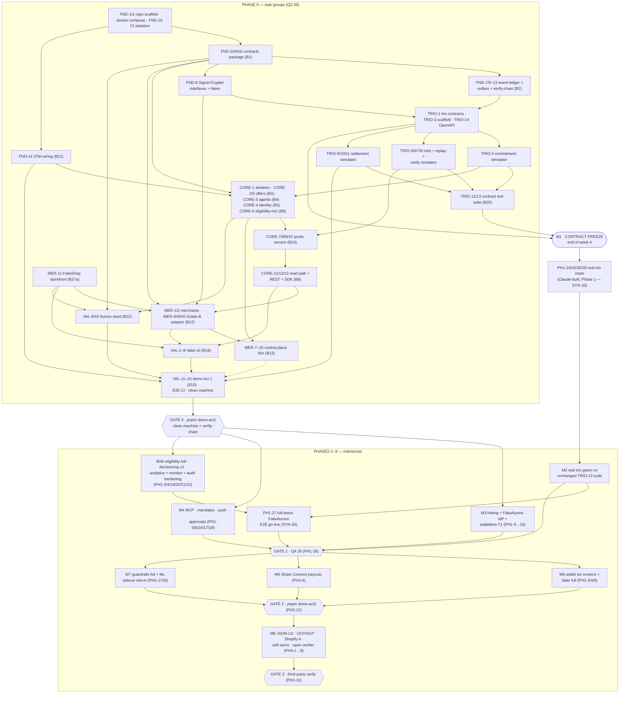

# Merited — Build Plan

**Version:** 1.1 · July 2026
**v1.1 changes:** solo build — no senior developer (SYN-32: Claude Code builds the trio's real implementations under high-scrutiny controls + an external security audit, LEAD-5); no design partner (SYN-33: Aurora Experiences/FakeAurora is the standing end-to-end test organisation; Gate 1 re-scoped).
**Status:** Proposed — living document (maintenance process in §8, XC-11)
**Companions:** `BUILD-SPEC.md` v1.1 (canonical build brief — when this plan conflicts with it, the spec wins) · `merited-platform-architecture.md` v1.1 (design rationale; its §0 principles P1–P5 decide anything both documents are silent on)
**Audience:** the primary builder working with Claude Code (solo build — SYN-32), and the external security reviewer engaged before production exposure (LEAD-5).

---

## 0. How to use this plan

1. **Execute in phase order** (BUILD-SPEC §9). Within Phase 0, follow the week-by-week calendar in §4.2; within a workstream, execute tasks top-to-bottom unless a parallel lane is named.
2. **Task IDs are the unit of work.** Every PR names exactly one primary task ID in its title and quotes the task's Accept clause (§8, XC.9). IDs are immutable; superseded tasks are struck through, never renumbered; new tasks append to their workstream table.
3. **Accept clauses are the contract.** Wherever the spec has an `Accept:` clause or a §9 gate criterion, the task's acceptance quotes it verbatim. A task is done when its Accept is green in CI, not when its code merges.
4. **The trio boundary is architectural, not a staffing rule** (v1.1, SYN-32). The trio keeps its own services, database, keys and signed interfaces (P3), and Phase 0 still builds simulators + the contract suite first — but Claude Code now also builds the real implementations in Phase 1 (PH1-24…26/30), file-for-file behind the *unchanged* suite, with library-only cryptography, the high-scrutiny controls of §8 (XC.7) and an external security audit (LEAD-5) before production exposure.
5. **The synthesis decision register (§3) is binding.** The eight workstream sections were drafted in parallel; §3 records every cross-workstream conflict found and how it was resolved. Where a section's prose disagrees with §3, §3 wins.
6. **Cross-references:** sections occasionally cite tasks by role (e.g. "the mint/verify simulator"); the authoritative ID map is §2. Any stale alias resolves through §2's key.

## 1. Executive summary

**What is being built.** A modular monolith ("Merited Core") plus three isolated security services (Commitment Signing, Conversion Verification, Net Settlement) over an append-only hash-chained event ledger, with a consumer wallet, an OAuth account-linking service, and Valet — a first-party commerce agent that is deliberately an ordinary client of the public APIs. The moat is the attribution-and-clearing spine: every offer read mints a signed, quote-bound attribution token, and no conversion clears without the full signature chain verifying (P1, P2).

**The shape of the build.** Four phases, gated (§9 of the spec, restated as checklists in §8/XC.5):

| Phase | Quarter | Payoff | Gate headline |
|---|---|---|---|
| **0 — Acquirable proof point** | Q3 26 | `pnpm demo:act1` — the walletless loop, recorded | Offer published with signed CPA bounty → quote-bound token → FakeShop checkout → verified claim → balanced ledger → statement; negatives (`TOKEN_REPLAYED`, `QUOTE_EXPIRED`) on camera; chain verifies |
| **1 — Harden & prove end-to-end** | Q4 26 | Real trio lands (Claude-built); full-dress FakeAurora E2E, both flows | Contract suite green against the **real** trio, unchanged; OAuth linking round-trip in CI; walletless-T1 proven; headless wallet-path E2E on real rails; mint-vs-claim monitor live on synthetic traffic |
| **2 — Optimiser & scale** | Q1 27 | `pnpm demo:act2` — the wallet act | Wallet loop end-to-end on real rails; Stripe Connect test-mode transfer; decisioner swap proves zero API changes |
| **3 — Interop & exit-ready** | Q2 27 | Open verification + self-serve | Third party verifies a conversion without Merited access; anonymous JSON-LD untokenised; merchant self-onboards |

**Phase 0 is planned at task resolution** across five workstreams — FND (foundations: monorepo, contracts, event ledger, signing fakes, observability, CI), TRIO (trio contracts + behaviourally faithful simulators + the contract test suite that later gates the real implementations), CORE (the canonical `readOffers()` path: offers, agents, identity, eligibility, quotes, REST + SDK), MER (Grade-B webhook adapter, thin control plane, FakeShop storefront), VAL (Valet v0, seed tooling, the Act 1 demo that doubles as the repo's single E2E CI test) — plus XC (cross-cutting: conventions, testing strategy, gates, risks, ownership). Phase 1 is planned at task resolution (PH1-1…30); Phases 2–3 at milestone resolution (PH2-*/PH3-* with long-lead items LEAD-1…4 that start earlier than their phase).

**The single most important scheduling event** is **M1 — contract freeze** at the end of Phase 0 week 4: the trio contract shapes + OpenAPI frozen and tagged with recorded sign-off (XC-7 change control), the contract suite green over commitment, mint/verify and settlement posting (TRIO-4…9; the clawback/netting/statement simulators TRIO-10/11 complete behind the frozen shapes in week 5). From that moment the trio's contract surface is under change control. Phase 0 deliberately ships on simulators (spec §9); the real implementations are Phase 1 work — Claude-built (SYN-32) — and the *unchanged* contract suite is their objective acceptance gate. By the end of Phase 1 the platform, the MCP surface, the agent (Valet) and the data wallet backend are all proven end-to-end against the fictional Aurora Experiences organisation, on real rails, in both the wallet and walletless flows (SYN-33).

**Critical path through Phase 0** (everything else interleaves around it):

> FND-1 scaffold → FND-3/4 contracts → FND-7/10 event ledger → TRIO-1 trio contracts → TRIO-3 scaffold → TRIO-5/6 mint + replay → TRIO-8 verify pipeline → CORE-10 quotes → CORE-11/12 read path + REST → MER-3/4 Grade-B adapter → VAL-6/7 Valet driver + CLI → VAL-12/13 demo Act 1 → **Gate 0**.

**Effort honesty.** The Phase 0 workstream estimates sum to roughly 60–70 Claude-Code-assisted builder-days against a nominal 8-week calendar — this only closes with sustained interleaving (the calendar in §4.2 assumes the builder runs the critical path while Claude Code executes filler-lane tasks in parallel) and it consumes buffer if velocity is lower. Q3 26 holds ~5 weeks of buffer after week 8; the weekly plan sweep (XC-11) is the tripwire, and the gate date — not the week map — is the commitment. v1.1: the real-trio implementations (formerly the senior developer's ~4 weeks) add ~15–20 builder-days to Phase 1; the removed partner-cutover work returns some of that. Phase 0 is unchanged.

---

## 2. Workstreams, task IDs, and cross-reference key

### 2.1 Workstream index

| Prefix | Workstream | Phase | Tasks | Plan section |
|---|---|---|---|---|
| **FND** | Foundations: monorepo scaffold, docker-compose, contracts (B1), event ledger (B2), signing interfaces + fakes, OTel (B21), CI, migrations policy | 0 | FND-1…16 | §5.1 |
| **TRIO** | Trio contracts, simulators, contract test suite (B20, spec §7) | 0 (+TRIO-17, PH1-2/22/23, PH1-24…26 in Phase 1) | TRIO-1…17 | §5.2 |
| **CORE** | Core monolith read path: offers (B3), agents (B4), identity (B5), eligibility (B6 min), quotes (B24), read path + REST + SDK (B9) | 0 | CORE-1…14 | §5.3 |
| **MER** | Merchant side: Grade-B adapter (B12), control plane (B13), FakeShop (B27 Ph-0 slice) | 0 | MER-1…12 | §5.4 |
| **VAL** | Valet v0 (B18), seed (B22), demo Act 1 + E2E CI | 0 | VAL-1…15 | §5.5 |
| **PH1** | Phase 1: B6 full, B7, B10, B14, B15, B19, B23, B25, B26, B27 completion, real trio (Claude-built — SYN-32), full-dress FakeAurora E2E (SYN-33) | 1 | PH1-1…30 | §6 |
| **PH2 / PH3 / LEAD** | Phases 2–3 at milestone resolution + long-lead items | 2–3 | PH2-1…12, PH3-1…10, LEAD-1…4 | §7 |
| **XC** | Cross-cutting: conventions, CI, gates, test kit, risk register, ownership | 0→1 | XC-1…13 | §8 |

### 2.2 Cross-reference key

The workstream sections were drafted in parallel, so prose occasionally refers to a task by *role*. This table is the authoritative resolution for every such reference; §3 records where the resolution required a decision.

| When a section says… | It means |
|---|---|
| "contracts package (B1)" | FND-3 (primitives) + FND-4 (§3 objects) + FND-5 (mechanics union) + FND-6 (ports) |
| "event ledger / outbox / verify-chain (B2)" | FND-7 (event schemas) + FND-9…13 (append core, outbox, projections, verify-chain CLI) |
| "signing package / FakeSigner / Crypter" | FND-8 (TRIO-2 is subsumed by it — see SYN-1) |
| "OTel wiring (B21)", "OBS-1" | FND-14 |
| "CI pipeline", "FND CI skeleton" | FND-16 (+ XC-2 rules, XC-8/XC-12 jobs) |
| "trio commitment simulator" | TRIO-4 (contract: TRIO-1) |
| "trio mint/verify simulator" | TRIO-5 (mint) + TRIO-6 (replay store) + TRIO-7 (directory port) + TRIO-8 (verify pipeline) |
| "trio settlement simulator" | TRIO-9 (posting) + TRIO-10 (clawback) + TRIO-11 (netting/statements) |
| "trio contract suite (B20)", "TRIO-5 suite" | TRIO-12 (trial-balance property) + TRIO-13 (consolidated suite) |
| "TRIO-R1/R2/R3", "senior-dev real trio", "TRIO-9 (real impls)" | PH1-24 (commitment) / PH1-25 (mint+verify) / PH1-26 (settlement) — Claude-built per SYN-32 |
| "offers module (B3)" | CORE-2 (storage/CRUD) + CORE-5 (publish/COR lifecycle) |
| "agent registry (B4)" | CORE-3 |
| "identity resolution (B5)" | CORE-4 (Phase 1 upgrade: PH1-15) |
| "eligibility minimal (B6)" | CORE-6 (full: PH1-3) |
| "quote service (B24)", "CORE-QS", "CORE-24" | CORE-10 (with CORE-8 pricing, CORE-9 token-client) |
| "read path + REST + SDK (B9)", "CORE-9 (B9)" | CORE-11 (pipeline) + CORE-12 (REST) + CORE-13 (SDK) |
| "SDK-1" | CORE-13 |
| "CTL-1 / merchants module" | MER-2 |
| "ADP-1 / CORE-ADP / Grade-B adapter (B12)", "CORE-12 (B12)" | MER-3 (webhook) + MER-4 (normalise/sign/submit) + MER-5 (claims API) |
| "control plane (B13)", "CORE-13 (B13)" | MER-7…10 |
| "FAK-1 / FakeShop (B27 Ph 0)" | MER-11 |
| "FakeAurora IdP + loyalty API (B27 completion)", "FAK-27" | PH1-10 + PH1-11 |
| "SEED-1 / DEMO-1 (seed, B22)", "DEMO-22" | VAL-9 (+VAL-10) |
| "DEMO-2 / demo act 1", "demo harness" | VAL-11…15 (VAL-12/13 script, VAL-14 E2E CI, VAL-15 clean machine) |
| "Valet v0 (B18)", "VAL-2", "VAL-18" | VAL-1…8 |
| "WAL-MND / mandates (B14)", "WAL-14" | PH1-16 |
| "WAL-APR / approvals (B26)", "WAL-26" | PH1-18 |
| "wallet backend (B15)", "WAL-15" | PH1-9 |
| "account linking (B23)", "WAL-23" | PH1-13 (+PH1-12 adapter, PH1-14 hosted fallback) |
| "push notifications (B25)", "WAL-25" | PH1-17 |
| "analytics (B19)", "CORE-19" | PH1-19 (+PH1-20 monitor) |
| "hash-head publication" | PH1-21 |
| "CORE-P1-1 / -2 / -3 / -4" (CORE §5.3 forward-look) | PH1-5 / PH1-3 / PH1-4 / Core side of PH1-18 |
| "CORE-P2-1" (guardrails full) | PH2-1 |
| "demo act 2" | PH2-11 |

---

## 3. Synthesis decision register

The workstream sections were drafted in parallel and each flagged the points where the spec was silent or where it had to assume another workstream's shape. This register resolves every such point. **These decisions are binding on the plan**; overturning one is a PR to this section first (and, where marked, a contracts-first PR per BUILD-SPEC §1). Rationale defaults to the architecture's principles P1–P5 and the spec's §0 rules.

| # | Decision | Resolution | Notes |
|---|---|---|---|
| SYN-1 | **`packages/signing` is built once, by FND-8.** | TRIO-2 is subsumed — do not build twice. TRIO contributes the key-hierarchy registry requirement (platform mint / per-merchant custodied / per-agent key refs, namespaced so cross-hierarchy signatures fail verification) and reviews FND-8 before simulator work begins. | Interface churn here is the most expensive kind; FND-8 is a high-scrutiny zone (XC.7) — checklist review before simulator work builds on it. |
| SYN-2 | **`packages/otel` is an approved deviation from the §1 layout.** | Ratified (FND D6). Contracts stays free of infrastructure/IO dependencies — it does carry pure runtime helpers (the §8 env loader, SYN-13 pricing, SYN-19 test kit); every app boots via `@merited/otel/register`. | Smallest possible deviation; relocatable while nothing depends on the path. |
| SYN-3 | **The event catalogue has 20 events: `CommitmentEnded` is added.** | The §3 catalogue omits an event for commitment termination; ending a COR is commercially meaningful and must be ledgered (P1). Added via contracts-first PR in FND-7; emitted by the trio's `POST /trio/commitments/:id/end` (TRIO-4). | FND-7's "exactly 19" meta-test becomes "exactly 20". |
| SYN-4 | **Thirteen ID prefixes, including `ern_` for Valet errands.** | `mer off com agt atk clm mnd usr evt qte apr lnk ern` (FND-3/D3; `ern_` ratified from VAL D1). | |
| SYN-5 | **Claims intake is owned end-to-end by MER.** | MER-3 (per-merchant webhook), MER-4 (normalise → sign → submit), MER-5 (`POST /v1/claims` + `GET /v1/claims/:id`) form a single funnel inside `apps/core/src/modules/adapters/`. CORE-12's route table lists the claims routes for completeness, but their handlers are MER deliverables; CORE-12 must not duplicate them. | Resolves the CORE/MER boundary overlap both sections flagged. |
| SYN-6 | **`ConversionClaimed` is emitted by the adapter intake (MER-4), never by the trio.** | The under-reporting numerator (architecture §5) must include claimed-but-rejected; a single emitter prevents double-counting. TRIO-8's pipeline emits only `ConversionVerified`/`ConversionRejected`. | Amended in TRIO-8. |
| SYN-7 | **The trio contract gains a commitment read endpoint.** | `GET /trio/commitments/:id` → `{status, conversions_used, max_conversions, budget_remaining}` (TRIO-4), consumed by eligibility's liveness+cap check (CORE-6). §7.1 listed only POSTs; the read is additive. | |
| SYN-8 | **The mint contract is extended beyond §7.2's literal input.** | Request adds a quote snapshot `{expires_at, mandate_ref: Id('mnd')\|null}` (enables the stage-4 `QUOTE_EXPIRED` check and the wallet-path `APPROVAL_MISSING` guard without a runtime call back into Core). Response is `{token, claims}` so downstream code and demos stay token-opaque. Contracts PR at TRIO-1; high-scrutiny sign-off at M1. | The wallet-path guard: minted snapshot carries `mandate_ref` but claim's `apr` is null → `APPROVAL_MISSING`. This deliberately refines §7.2's 'walletless claims skip approval checks' — the wallet path is defined by the mint snapshot, not by `apr` alone; the M1 freeze review is load-bearing (high-scrutiny checklist; flagged for LEAD-5). |
| SYN-9 | **Replay semantics: `jti` is consumed only on a `verified` verdict.** | A rejected claim does not burn the token; `TOKEN_REPLAYED` means a prior *verified* conversion exists for that `jti`. Additionally, one verified conversion per `qid` (unique index) — the approval re-mint shares `qid` with the original token, and a double conversion via both tokens is rejected as `TOKEN_REPLAYED` (no new reason code invented). | Matches demo Act 1 step 8 semantics. Both semantics appear verbatim in TRIO-14’s OpenAPI and TRIO-16’s handoff; the per-`qid` unique index is implemented in TRIO-6. |
| SYN-10 | **Clawback details.** | A reversal frees the `max_conversions` counter. A reversal after `clawback_window_s` is rejected reusing `WINDOW_EXPIRED` with a distinct message (the §3 reason-code enum stays closed). | Documented in TRIO-14's OpenAPI + TRIO-16 HANDOFF. |
| SYN-11 | **Per-month mandate spend tracking lives in the trio's Settlement counters** (TRIO-9), not the wallet. | Verification needs it synchronously at stage 6; Settlement already owns cross-claim counters (architecture §2.2). | |
| SYN-12 | **Commitment budgets:** optional `budget` on commitment create, stored in Settlement counters; the COR stays immutable. | Feeds `BUDGET_EXHAUSTED` at stage 5; seedable for tests. | |
| SYN-13 | **`applyMechanics` (pure pricing) lives at `packages/contracts/src/pricing.ts`.** | §5.6a requires it "shared with the wallet UI for display parity"; contracts is the only shared dependency-free package. Rounding rule: `floor(list × pct_bps / 10000)`, clamp at 0, integers only. | CORE-8. |
| SYN-14 | **`apps/core/src/modules/quotes/` is added to the §1 module list.** | The §1 folder list predates v1.1's Quote Service; same pattern as the other modules. | |
| SYN-15 | **`Mandate.pre_authorised_up_to: Money` is in contracts from day one** (FND-4). | §6.1 requires it, §3's schema omitted it. PH1-1 verifies rather than adds. | |
| SYN-16 | **`Crypter` + `FakeCrypter` land in Phase 0** (FND-8). | PH1-8 builds only the encrypted `link_tokens` store on top of them. | |
| SYN-17 | **Monorepo tooling: pnpm workspaces only — no Turborepo/Nx in Phase 0.** | FND D5 over XC D5's initial suggestion. Revisit only if CI times hurt. | |
| SYN-18 | **ULID library: `ulidx`** (monotonic factory, typed). | FND D3 over XC D2's plain `ulid`. Seeded factory in the test kit for determinism. | |
| SYN-19 | **The deterministic test kit lives at `packages/contracts/src/testing`** (`@merited/contracts/testing`): injectable `Clock`, seeded ULID factory, fixture loader, fast-check arbitraries. | XC-5/XC-6; contracts already hosts the typed env loader. No bare `Date.now()` outside adapters (lint rule). | |
| SYN-20 | **Demo-as-E2E asserts structured JSON artefacts + normalised snapshots, not raw stdout bytes.** | VAL-11's dual-mode harness emits machine-checkable artefacts per step; human copy can change without breaking CI. | |
| SYN-21 | **Valet's ledger mirror: direct append via `@merited/events` behind a `LedgerMirror` port in Phase 0.** | §6.6 bans private *Core* imports, not shared packages — but an unfenced append credential would be a P5 backdoor (Valet could write any catalogue event, and CORE-10 derives quote status from `ConversionVerified` events). Conditions: Valet’s DB role may append `ErrandStateChanged` only (dedicated role + emitter allow-list in `appendEvent`, tested in VAL-4); the fence is a high-scrutiny checklist item flagged for LEAD-5; the port isolates a Phase-2 switch to a public mirror endpoint — decide at Phase 2 hardening. | VAL D3. |
| SYN-22 | **Merchant keypair issuance is a trio-adjacent contract: `POST /trio/keys/merchant`** (MER-2), simulator-implemented, made real in the trio's Phase-1 pass (PH1-24) via TRIO-16's pack. | Key-generation authority stays inside the trio's blast radius (P3). | |
| SYN-23 | **Anonymous reads persist quotes too** (`token: null`, unpayable). | Keeps `quote_id` and `GET /v1/quotes/:id` always honest; the audit trail complete. | CORE-10. |
| SYN-24 | **Auth conventions (Phase 0).** Agents: `X-Merited-Agent-Key` — absent header = anonymous degraded read, present-but-invalid = 401; anonymous rate-limited by IP. Merchants: `X-Merited-Merchant-Key` on `/v1/claims`; HMAC (`X-Merited-Signature` + timestamp, ≤300s skew) on webhooks, enforced in every environment. Control plane: credential + TOTP. Core→trio: shared-secret header locally; mTLS/service tokens are PH1-25 hardening (architecture §6). | | |
| SYN-25 | **Phase 0 ships on simulators; the real trio is Phase 1 work.** | Spec §9 wins over architecture §7's "Trio v1" phrasing (spec §0: "when a decision here conflicts…the spec wins"). v1.1: with no senior developer (SYN-32) there is no parallel weeks-5–8 track — Claude Code builds PH1-24…26/30 as the opening acts of Phase 1, behind the M1-frozen contracts and the unchanged TRIO-13 suite. They may begin inside Phase 0 only if the gate work is done early. | XC resolution, re-ratified for the solo build. |
| SYN-26 | **`check_eligibility` (MCP) mints no tokens.** | P2's "every offer read mints" applies to responses containing payable offers; `check_eligibility` returns verdicts + exclusion reasons only. `search_offers`/`get_offer` return tokenised quotes. | PH1-6. The same reading covers CORE-9’s mint-failure degradation: a payable quote falls back to `token: null` (unpayable) rather than failing the read — P2’s invariant (no unattributed bounty) holds. |
| SYN-27 | **Exclusion reasons are a separate enum from the 12 claim-rejection codes.** | `ExclusionReason` (e.g. `STACKING_SUPPRESSED`, `MERCHANT_EXCLUDED`, `TIER_INELIGIBLE`, `OFFER_NOT_LIVE`) added in contracts for eligibility's `excluded[{offer, reason}]`; the §3 claim enum stays at exactly 12 (read-path surfacing of e.g. `BUDGET_EXHAUSTED` per §5.6 is name-twinning, not enum-sharing). Where Phase 0 CORE-6 text reuses §3 code names for exclusions, read them as the `ExclusionReason` equivalents. | PH1-1 lands the enum; CORE-6 adopts it. |
| SYN-28 | **The 27-mechanics enumeration (FND D10) is accepted as the working set, pending product sign-off in week 1.** | The 7 spec-named variants are fixed; the 20 proposed ones are cheap to swap pre-M1 (one file per variant). | Open question §9-1. |
| SYN-29 | **Calendar realism.** Workstream estimates sum to ~60–70 Claude-Code-assisted builder-days against the 8-week Phase 0 calendar; the plan holds only with sustained interleaving (§4.2). Q3 26 has ~5 weeks of buffer; the weekly plan sweep (XC-11) is the tripwire and the gate — not the week map — is the commitment. | | |
| SYN-30 | **Demo `QUOTE_EXPIRED` uses an env-gated TTL override** (`MERITED_QUOTE_TTL_S`, honoured only when `MERITED_ENV=dev\|test\|demo`; the env loader rejects it in prod). No test backdoors in the trio itself — all negative cases inducible from public inputs. | VAL D5 + TRIO-3's no-backdoor rule, jointly. | |
| SYN-31 | **Phase-column conflicts in §2.1/§2.2 resolve per §9’s ships lists** (the gates are the authority — the same rule as SYN-25). | B8 guardrails ("1→2" in §2.1): stub in Phase 0 (CORE-7), full in Phase 2 (PH2-1), no Phase-1 work — the Phase-1 gate ignores it. Shopify wire-up ("1–2" in §2.2 and architecture §5): Grade A ships Phase 3 (PH3-5) with LEAD-3 starting at Phase 2. Eagle Eye AIR wire-up ("1–2"): interface + both fakes in Phase 1 (PH1-11); real vendor wiring is partner-conditional and off the gate path (PH2-10). | Spec-internal conflicts, resolved once here. |
| SYN-32 | **Solo build (v1.1): the senior-developer staffing assumption is removed by the spec owner.** Claude Code builds everything, including the trio's real implementations (PH1-24…26/30). *Retained* from BUILD-SPEC §0.3/§7: the trio's architectural isolation (own services, own schema/DB, own keys — P3), simulator-first sequencing, the file-for-file replacement seam, and the unchanged contract suite as the objective acceptance gate. *Replacing* senior review: library-only cryptography (`paseto` for PASETO v4.public; Node/libsodium Ed25519 — never hand-rolled primitives); key custody = Ed25519 private keys envelope-encrypted at rest via KMS data keys, decrypted only inside the isolated trio process (recorded deviation from architecture §6's "never raw keys in process"; native-Ed25519 KMS, e.g. GCP Cloud KMS, is the upgrade path — LEAD-5 ratifies); high-scrutiny zones with a mandatory security self-review checklist per PR (XC.7/XC-3); the TRIO-16 implementation & audit pack; and the LEAD-5 external security audit, complete **before any real merchant, real agent money, or production exposure**. | Recorded override of the spec's staffing rule by the spec owner — §7's *engineering* discipline survives; the staffing does not. |
| SYN-33 | **No design partner (v1.1): Aurora Experiences is the standing end-to-end organisation.** FakeShop (storefront + Grade-B webhooks), FakeAurora (OIDC IdP + Aurora Club loyalty API) and the seeded members constitute the fictional org used for ALL end-to-end proof: Act 1 walletless (Phase 0, simulators) → full-dress on the real trio incl. a **headless wallet-path E2E** and failure-mode drills (Phase 1, PH1-27) → Act 2 wallet UI (Phase 2). Gate 1's "real design-partner webhook live" becomes "full-dress FakeAurora E2E live on real rails, both flows". Partner onboarding, when one exists, reuses the identical Grade-B path (config-per-merchant, not a fork) — §9 Q3 defers to that moment. | Platform, MCP surface, agent (Valet) and data wallet are all provable end-to-end, both flows, with no external counterparty. |
| SYN-34 | **Ending a commitment stops new mints, not in-flight tokens.** BUILD-SPEC §5.1 ("old tokens still verify against the first") and architecture §2.2 ("no retroactive repricing") govern over a literal reading of §7.2's stage-5 "commitment still live": `/end` gates the MINT (409), while stage 5's `COMMITMENT_ENDED` fires when the claim's `order.ts` falls outside the COR's own `valid_from`/`valid_until`. The ≤10-minute token is the tail of a promise made at read time. TRIO-8's matrix row corrected accordingly; both directions tested. | Resolves a spec-internal tension; the plan's original matrix inducement was wrong. |
| SYN-35 | **Reversal rejection codes (closed-enum reuse, extending SYN-10).** Double-reverse is rejected reusing `TOKEN_REPLAYED` (a reversal replay — the deterministic `set_rev_<claim_id>` entry-set PK is the concurrency arbiter, mirroring `consumed_jtis`). An unknown `claim_id`, a merchant mismatch against the COR, or a bad signature all reject as `SIG_INVALID` (the trio's own records are authoritative; absent = untrusted input — the same pattern as verify stage 1). The §3 reason-code enum stays closed. | SYN-10 named only the after-window code; the plan was silent on these two. Documented in TRIO-14's OpenAPI. |
| SYN-36 | **Settlement party ↔ account mapping.** Accounts are one-per-party by design (arch §2.5): `merchant_payable:<mer>` / `agent_receivable:<agt>` map to the id parties, `platform_revenue` to party `platform`, and `reserve:*` folds into the single holding party `reserve` — matching the demo's four-line print (Act 1 step 6). Signed convention: credit positive; balance ≥ 0 = receivable, < 0 = payable. Netting-run positions omit zero folds; positions across all parties always sum to zero (trial balance). `Statement` gained a `netting_events` array (contracts-first, pre-M1-freeze — the plan row required netting events in statement JSON but TRIO-1's shape lacked them; golden fixture updated in the same commit). | Wire-visible party strings (`GET /trio/positions/:party`) needed a recorded rule; TRIO-12's property suite and TRIO-14's OpenAPI inherit it. |
| SYN-37 | **Eligibility exclusion labels (read-path surface).** §5.4's excluded list reuses §3's first-class codes where one fits (`TIER_INELIGIBLE`, `COMMITMENT_ENDED`, `CAP_EXHAUSTED` — with `COMMITMENT_ENDED` covering offer/COR validity-window misses, the SYN-34 precedent); the two conditions with no §3 code get read-path-only literals in `EligibilityExclusionReason`: `OFFER_NOT_LIVE` (status ≠ live or outside the offer window) and `STACKING_DEDUPED` (stacking-group loser). The VERIFY rejection enum stays closed per SYN-10 — these literals never appear in a verify response. | §5.4 names no codes for stage 1/4 exclusions; plan and spec silent. Consumed by CORE-6/11; documented for TRIO-14's OpenAPI sibling docs when CORE-12's surface is specced. |
| SYN-38 | **Quote-time pricing semantics for the full 27-variant union.** `applyMechanics` prices what a SINGLE list price determines: percentage/fixed/threshold discounts (floor, clamp at 0; thresholds gate on `list ≥ min_spend` and add no label when unmet), price-setters `bundle`/`member_price` clamp at list (a mechanic never raises the quoted price), and money-denominated lifecycle rewards discount. Basket-dependent variants (`bogo`, `multibuy_price`, `free_shipping`, `free_gift`) and all points/tier/access benefits are PRICE-NEUTRAL at quote time — label appended, price unchanged; baskets do not exist on the read path. Invariant: `0 ≤ final ≤ list` for every variant. | §5.6a names only the percentage/fixed/points rules; the other 21 variants needed a recorded convention. Property-tested in contracts; the wallet UI shares the same function (SYN-13). |
| SYN-39 | **Webhook secrets are ENCRYPTED at rest via the Crypter port, not hashed.** MER-2's row says "hashed at rest", but HMAC verification (MER-3) requires the plaintext secret — a one-way hash cannot verify a signature. Resolution: webhook secrets encrypt via `Crypter` (FakeCrypter Phase 0; KMS envelope Phase 1) and decrypt only inside the verification path; API keys (verify-only credentials) stay hashed as written. Rotation is graceful: multiple live secrets until explicit revocation. | Spec-internal impossibility resolved once here; MER-3's verifier and the TRIO-16 threat notes inherit it. |
| SYN-40 | **Agent-side verdict discovery: `GET /v1/quotes/:id/claim`** (agent-required, quote-owner-only) returning the LATEST `claims_intake` row for the quote's qid as a `ClaimStatusResponse`; 404 until a claim arrives. | VAL-5's `VerdictPoller` polls `GET /v1/claims/:id`, but no surface ever tells the agent its claim id — the merchant creates it out of the agent's sight. The quote is the object the agent already owns, so its verdict hangs off the quote; latest-row semantics surface rejected replays. Uniform 401 for non-owners (no existence oracle). Spec §4's route table and the plan are silent; smallest addition that serves B18. |

---

## 4. Sequencing: dependency graph, critical path, Phase 0 calendar

### 4.1 Dependency graph

Phase 0 at task-group level; Phases 1–3 at milestone level. `M1 CONTRACT FREEZE` is the moment the trio's contract surface goes under change control (and the real-implementation work is unblocked).



**Critical path through Phase 0** (each item blocks the next — by build dependency or by the demo flow Gate 0 exercises):

> **FND-1 → FND-3/4 (contracts) → FND-7/10 (ledger) → TRIO-1 (trio contracts) → TRIO-3 (scaffold) → TRIO-5/6 (mint + replay) → TRIO-8 (verify pipeline) → CORE-10 (quotes) → CORE-11/12 (read path + REST) → MER-3/4 (Grade-B adapter) → VAL-6/7 (Valet driver + CLI) → VAL-12/13 (demo Act 1) → GATE 0.**

Everything else in Phase 0 is off the critical path and exists to be interleaved. TRIO-5/6/8 sit on the path because quote-bound minting (B24) cannot be exercised without them; TRIO-9/10/11 (settlement) are needed only by the demo's ledger/statement steps and can trail by a week. MER-11 (FakeShop) feeds MER-3/4 but is an M schedulable any time after MER-1's webhook contract exists.

**Parallel lanes for a single primary builder.** With one builder, "parallel" means interleaving: whenever the critical-path task is blocked on CI, review, or thought, pull from the filler lanes. Lanes that are genuinely independent once FND-3/4 land: (a) trio contracts + simulators; (b) the CORE-1/2/3/4/6 module lane; (c) the low-stakes lane — MER-7…10 control plane, FND-14 OTel, MER-11 FakeShop, VAL-9 seed, VAL-11 harness, and all XC tasks. In v1.1 (SYN-32) there is no second builder, so nothing runs in true parallel — instead **M1 CONTRACT FREEZE** fixes the contract surface so the real-trio work opening Phase 1 lands behind an *unchanged* suite. That is still the point of §7's "behaviourally faithful simulators": the real implementations' start date is decoupled from the demo's ship date.

### 4.2 Phase 0 week-by-week (one builder + Claude Code; 8 weeks, w/c 6 Jul → gate w/c 24 Aug 2026, ~5 weeks of Q3 buffer)

| Wk | Critical-path focus | Interleaved / filler | Exit criteria for the week |
|---|---|---|---|
| 1 | FND-1 scaffold + FND-2 compose; FND-3 contracts primitives; FND-4 §3 objects; FND-5 mechanics union started | XC-1 conventions, FND-16 CI skeleton + XC-2 lint rules started, XC-4 ADR log — **week-1 decisions D1–D8 (§8, XC.8) made and recorded**; FND-6 ports | CI green on the empty-but-compiling workspace; `docker compose up` clean; contracts parse all §3 examples |
| 2 | FND-7 event schemas + catalogue; FND-9 migrations; FND-10 append core + hash chain; FND-11 outbox; FND-13 verify-chain; FND-8 signing fakes | CORE-1 skeleton (FND-14 package bootstrap lands with it — lane E), CORE-2 offers storage, CORE-3 agent registry started; FND-12 projections; XC-5 test kit | B2 accept: chain verifies, tamper detected, REVOKE proven; B3/B4 schemas round-tripping |
| 3 | TRIO-1 trio contracts (high-scrutiny review); TRIO-3 scaffold; TRIO-4 commitment sim; TRIO-5 mint sim + TRIO-6 replay store | CORE-4 identity resolver, CORE-6 eligibility-min; MER-1 contracts + MER-2 merchants module; XC-6 property harness | Mint happy path green vs sim (the full verify pipeline lands week 4); identity precedence property tests green |
| 4 | TRIO-7 directory port; TRIO-8 verify pipeline (all 12 reason codes); TRIO-9 posting; TRIO-14 OpenAPI; TRIO-12/13 suite consolidation over TRIO-4…9 (clawback/netting generators extend in week 5); **XC-7 M1 CONTRACT FREEZE at week end** — tag `@merited/contracts@0.1.0` + trio OpenAPI, recorded high-scrutiny sign-off | CORE-2/3 finished to their Accepts; CORE-5 publish→COR flow; CORE-7 stubs + CORE-8 pricing; XC-3 CODEOWNERS live | Contract shapes + OpenAPI frozen and tagged; suite green over commitment/mint/verify + posting; trial balance zero over verify sequences; **real-trio work (PH1-24…26/30) unblocked for Phase 1** |
| 5 | CORE-9 token-client; CORE-10 quote service; CORE-11 pipeline assembly; CORE-12 REST surface | FND-14 end-to-end trace harness proof; VAL-9/10 seed (against MER-11’s SKU fixture module, which lands this week); TRIO-10 clawback + TRIO-11 netting/statements — full suite incl. settlement flows green by week end | B24 accept: every payable read persists exactly one quote; B4 accept: registered vs unregistered read behaviour |
| 6 | MER-11 FakeShop; MER-3 webhook endpoint; MER-4 normalise/sign/submit; MER-5 claims API; CORE-13 SDK; CORE-14 read-path e2e | MER-7/8/9 control plane; MER-6 under-reporting tests; XC-12 trio CI job; VAL-1…4 errand contracts/reducer/store/mirror; TRIO-15 negative fixtures | Checkout → claim → verified vs simulator with reason codes surfaced; MER-12 started |
| 7 | VAL-5 ports; VAL-6 driver; VAL-7 CLI; VAL-12 demo Act 1 steps 1–7 (grown incrementally behind the VAL-14 CI skeleton) | VAL-8 durability; VAL-11 harness (if not earlier); MER-10 claims viewer; MER-12 e2e joined; XC-8 demo-as-E2E job (grows step-by-step; completes with VAL-13 in week 8) | `pnpm demo:act1` steps 1–7 end-to-end locally; reducer transition tests exhaustive |
| 8 | VAL-13 negatives + trace/chain proof; VAL-14 E2E in CI; VAL-15 clean-machine bootstrap; **XC-9 `pnpm gate:0` green; record the demo** | Buffer — absorb overruns; TRIO-16 handoff pack review; XC-10 risk register live + review; BUILD-PLAN status sweep | **GATE 0 checklist (§8, XC.5) fully ticked; demo asset recorded** |
|  | *Real-trio note (v1.1, SYN-32):* with no second builder there is no parallel weeks-5–8 track. PH1-30 (real Signer/Crypter) → PH1-24 (commitment signing) → PH1-25 (PASETO mint + verification hardening) → PH1-26 (settlement hardening) open Phase 1 as Claude Code work, replacing `apps/trio/*/simulator.ts` file-for-file; acceptance = the **unchanged** TRIO-13 suite via XC-12 (`TRIO_TARGET=real`). The Phase 0 demo deliberately ships on simulators (SYN-25). If Phase 0 finishes inside week 8, this work may begin early against the frozen contracts. | | |

---

## 5. Phase 0 — workstream plans

Five workstreams, executed per the calendar in §4.2. Task tables are ordered by dependency; sizes are S ≤ half a day, M ≈ 1 day, L ≈ 2–3 days of Claude-Code-assisted work.

### 5.1 FND — Foundations & repo scaffold (B1 contracts · B2 event ledger · B21 observability · scaffold/CI)

FND turns the empty repo into the substrate every other workstream lands on: the pnpm/TypeScript monorepo exactly per BUILD-SPEC §1, local infrastructure (docker-compose), `packages/contracts` (B1), `packages/events` (B2), `packages/signing` (Signer/Crypter + fakes), OTel wiring (B21), the CI skeleton, the migrations policy, and the refresh-token lint rule (§6.3 accept). Nothing in FND implements trio cryptography or ledger-posting logic — the FakeSigner and the append-only event store are deliberately below the §7 trio boundary (real crypto is Phase 1 — SYN-32) ("storage + chaining logic is buildable; only *signing* is trio scope", §2.1 B2).

#### Binding decisions (cross-workstream items ratified in §3)

| # | Decision | Choice |
|---|---|---|
| D1 | **Canonical JSON** | RFC 8785 (JCS) via the `json-canonicalize` npm package, wrapped behind a single exported `canonicalJson(body)` in `packages/events/src/canonical-json.ts` so the implementation is swappable. Property tests pin key ordering, Unicode escaping and number serialisation. Event bodies must be Zod-validated before hashing; only integers allowed as numbers (integer-pence rule, §0.4), `undefined` and floats are rejected at append time. |
| D2 | **Genesis + hash formula** | `this_hash = sha256(prev_hash ‖ canonicalJson(body))` exactly as §3; hex-encoded lowercase; genesis `prev_hash` = 64 × `'0'`. The event **type and schema version live inside `body`** (`{ type, v: 1, data }`) so they are covered by the hash; the `type` column duplicates `body.type` for indexing, with a test asserting equality. Single global chain, appends serialised with `pg_advisory_xact_lock` (throughput is a non-issue at this scale; per-aggregate chains deferred). |
| D3 | **ULID library** | `ulidx` (maintained, typed, monotonic factory). IDs are `<prefix>_<26-char Crockford-uppercase ULID>`. `Id(prefix)` Zod helper validates with regex `^<prefix>_[0-9A-HJKMNP-TV-Z]{26}$`; `newId(prefix)` generates. Thirteen prefixes: `mer off com agt atk clm mnd usr evt qte apr lnk ern` (§3 list, the three v1.1 prefixes used by `OfferQuote`, `Approval`, `IdentityLink`, plus `ern` for Valet errands — SYN-4). |
| D4 | **Contracts internal versioning** | `@merited/contracts` is never published; all consumers use `workspace:*` and it stays at `0.0.0`. Compatibility is enforced structurally: CI type-checks the whole workspace (`tsc -b`) on every PR, and the §1 rule ("a contract change is a PR that touches `contracts` first") is enforced socially plus a CI check that any PR changing `packages/contracts` runs the full downstream test matrix. Runtime evolution: every event body carries `v: z.literal(1)`; bumping an event's shape means a new literal and a projection that handles both. |
| D5 | **Workspace tooling** | pnpm ≥ 10 pinned via `packageManager` + corepack; Node 22 pinned via `.nvmrc` + `engines`; ESM everywhere (`"type": "module"`); TypeScript ≥ 5.5 strict with `tsc -b` project references; `tsx` for dev execution; ESLint 9 flat config + typescript-eslint + one custom rule (FND-15); Prettier; Vitest workspace file at root. **No Turborepo/Nx in Phase 0** — pnpm recursive scripts are enough and one less config surface. |
| D6 | **Observability home** | §1 lists four packages and none fits shared OTel bootstrap; we add **`packages/otel`** (`@merited/otel`) as the smallest possible deviation (ratified — SYN-2). Contracts stays types-only; every app imports `@merited/otel` for SDK bootstrap, Fastify plugin and the pino logger factory. |
| D7 | **fake-kms image** | `nsmithuk/local-kms` in docker-compose. The in-process `FakeSigner`/`FakeCrypter` do **not** depend on it (unit tests must run docker-free); the container exists so the real KMS-backed `Signer` (PH1-30) has a local target, and for compose parity with prod. |
| D8 | **Migrations policy** | drizzle-kit-generated, numbered, forward-only SQL committed to each owning package/app (`drizzle/` dir + `drizzle.config.ts` per owner); hand-written SQL migrations permitted for roles/REVOKE/triggers. Root `pnpm db:migrate` = `pnpm -r --workspace-concurrency=1 db:migrate` in topological order (events first). Two DB roles: `merited_migrate` (DDL, used only by the migration runner) and `merited_app` (runtime; no DDL; `REVOKE UPDATE, DELETE` on ledger tables). CI checksums applied migrations — editing an applied migration fails the build. |
| D9 | **Event catalogue split** | §3 says the catalogue lives in `packages/events`, §1 says contracts is the only place types are defined. Reconciliation: the 20 event **body schemas** live in `packages/contracts/src/events/`; `packages/events/src/catalogue.ts` imports them and binds `name → schema` in a frozen registry. Both rules honoured. |
| D10 | **27-mechanics union strategy** | One `z.discriminatedUnion('type', …)` in `packages/contracts/src/offer/mechanics/`, one file per family, snake_case discriminants, every variant ≤ 5 fields (meta-test enforces), all numerics integers (`_bps`, `_x100`, `Money`). The spec names 7 variants and says "extend to the full 27"; the concrete enumeration below is FND's proposal (open question for product sign-off — changing a variant later is a contracts-first PR, cheap in Phase 0). |

**Proposed 27-mechanics enumeration** (7 spec-named variants marked ★):

| Family | Variants (discriminant → fields) |
|---|---|
| Price (10) | ★`percentage_off {pct_bps}` · ★`fixed_off {value:Money}` · `threshold_discount {min_spend:Money, value:Money}` · `threshold_percentage {min_spend:Money, pct_bps}` · ★`bundle {sku_refs:string[], value:Money}` · `bogo {buy_sku, get_sku, get_pct_bps}` · `multibuy_price {sku_ref, qty, total:Money}` · `member_price {sku_ref, price:Money}` · `free_shipping {min_spend:Money|null}` · `free_gift {gift_sku, min_spend:Money}` |
| Points (6) | ★`points_multiplier {multiplier_x100}` · ★`points_bonus {points}` · `points_threshold_bonus {min_spend:Money, points}` · `points_per_sku {sku_ref, points}` · `points_exchange_boost {rate_x100}` · `points_back_pct {pct_bps}` |
| Tier/status (3) | ★`tier_unlock {tier}` · `tier_accelerator {tier, multiplier_x100}` · `tier_gift {tier, gift_sku}` |
| Lifecycle (5) | ★`welcome_bonus {value:Money}` · `welcome_points {points}` · `winback {inactive_days, value:Money}` · `referral_reward {referrer_points, referee_value:Money}` · `birthday_reward {value:Money}` |
| Access (3) | `early_access {window_s}` · `experience_upgrade {from_sku, to_sku}` · `vip_event_invite {event_ref}` |

#### Task list (execute top-to-bottom; parallel lanes noted below)

| ID | Task | What to build (key paths) | Depends on | Acceptance | Size |
|---|---|---|---|---|---|
| **FND-1** — ✅ done 2026-07-04 | Monorepo scaffold & toolchain | Full §1 tree with placeholder `package.json`/`tsconfig.json` for every package and app (`packages/{contracts,events,signing,sdk}`, `apps/{core,trio,control-plane,wallet,valet,mcp-server,fake-aurora}`, `tools/{seed,demo}`). Root: `/package.json` (scripts: `build test lint typecheck db:migrate verify-chain projections:rebuild`), `/pnpm-workspace.yaml`, `/tsconfig.base.json` (strict, ESM, project refs), `/eslint.config.js`, `/.prettierrc`, `/vitest.workspace.ts`, `/.nvmrc`, `/.gitignore`, `/.editorconfig`. Package scope `@merited/*`, env prefix `MERITED_` (naming note, spec header). | — | On a clean machine with Node 22 + corepack: `pnpm i && pnpm -r build && pnpm -r test && pnpm lint` all green (empty-but-compiling workspace). `tsc -b` resolves the cross-package graph. Supports Phase 0 gate's "on a clean machine" clause (§9). | M |
| **FND-2** — ✅ done 2026-07-04 | Local infra: docker-compose | `/docker-compose.yml` per §1: `postgres:16` (init SQL creates `merited` DB, per-module schemas incl. a separate `trio` schema — "single instance, multiple schemas; the trio gets its own logical database in prod", §1 — and the D8 roles), `redis:7`, `nsmithuk/local-kms` (D7), `axllent/mailpit`. Healthchecks on all four. `/.env.example` with every `MERITED_*` var the env loader (FND-3) requires. | — (parallel with FND-1) | `docker compose up -d --wait` reports all services healthy on a clean machine; psql connects as both roles; local-kms and mailpit answer HTTP. | S |
| **FND-3** — ✅ done 2026-07-04 | Contracts primitives (B1 pt 1) | `packages/contracts/src/ids.ts` (`Id()`, `newId()`, 13 prefixes per D3), `money.ts` (§3 `Money`: `int`, `nonnegative`, literal `'GBP_pence'`), `reasons.ts` (`RejectionReasonCode` enum of exactly the 12 §3 codes: `SIG_INVALID TOKEN_REPLAYED WINDOW_EXPIRED COMMITMENT_ENDED CAP_EXHAUSTED TIER_INELIGIBLE BUDGET_EXHAUSTED MANDATE_REVOKED QUOTE_EXPIRED APPROVAL_MISSING APPROVAL_EXPIRED LIMIT_EXCEEDED`), `env.ts` typed env loader (`defineEnv(zodShape)`: reads `process.env`, coerces, aggregates ALL missing/invalid vars into one thrown report — §8 "typed env loader in `packages/contracts`; fail fast on missing vars"), `index.ts` barrel. | FND-1 | Unit tests: bad prefix/length/alphabet rejected; `Money` rejects floats, negatives, other currencies (§0.4 "integer pence, never floats"); env loader test proves fail-fast with a complete missing-var list; reason enum has exactly 12 members (meta-test so additions are deliberate). | M |
| **FND-4** — ✅ done 2026-07-04 | Contracts §3 object schemas (B1 pt 2) | `packages/contracts/src/`: `offer/offer.ts` (`Offer`), `commitment.ts` (`Commitment`), `token.ts` (`AttributionTokenClaims` incl. `qid`, nullable `apr`), `identity-link.ts` (`IdentityLink` — **no token fields**, per §3 NB), `quote.ts` (`OfferQuote` + refinement helper asserting `expires_at ≤` token `exp`), `approval.ts` (`Approval`), `claim.ts` (`ConversionClaim`), `mandate.ts` (`Mandate` incl. `pre_authorised_up_to: Money` per §6.1), `ctx.ts` (`AgentCtx`, `ConsumerCtx` — the `readOffers` §4 inputs), `order.ts` (`OrderConfirmed {order_ref_hash, gross_value, token?, ts}` per §5.8). All fields exactly as §3 code block. | FND-3 | Golden-fixture round-trip (parse → serialise → parse identical) for every object; `IdentityLink` schema provably contains no `refresh`/`access` token key (test + FND-15 lint, feeding §6.3 accept "refresh tokens never appear in … contract type"); `Mandate.limits`/`Approval.exp = quote.expires_at` semantics encoded as refinements with tests. | M |
| **FND-5** — ✅ done 2026-07-04 | Contracts: 27-mechanics union (B1 pt 3) | `packages/contracts/src/offer/mechanics/{price,points,tier,lifecycle,access}.ts` + `index.ts` composing `OfferMechanics` per D10 table (7 spec variants verbatim, 20 proposed). Fixture per variant in `packages/contracts/test/fixtures/mechanics/`. | FND-3 | Maps §5.1 accept: "all 27 mechanics round-trip through Zod" — exhaustiveness test asserts the union has exactly 27 discriminants, each fixture parses and re-serialises, unknown `type` rejected; meta-test enforces ≤ 5 fields per variant ("if a variant needs more, it's two variants", §3). | M |
| **FND-6** — ✅ done 2026-07-04 | Contracts: vendor port interfaces (§2.2) | `packages/contracts/src/ports/`: type-only interfaces for `ReplayCache`, `RateLimiter`, `Mailer`, `CommerceAdapter`, `IdentityProviderAdapter` (`authorize/exchange/refresh/userinfo/revoke`), `LoyaltyLookup`, `PayoutRail` (`createAccount/transfer/reverse`) — method shapes lifted from the §2.2 table. Implementations and fakes are CORE/WAL/TRIO scope; this task only gives them a single-source-of-truth home (§1 rule) so "every third-party dependency sits behind an adapter interface" (§0.2) is enforceable from day one. Semantics refined later via contracts-first PRs. | FND-3 | Types compile; each port has a doc-comment naming its fake and wire-up phase from §2.2; downstream workstreams (CORE-*, WAL-*, TRIO-*) import from here, never redeclare. | S |
| **FND-7** — ✅ done 2026-07-04 | Contracts: event body schemas + catalogue (B2 pt 1) | `packages/contracts/src/events/` — one Zod body schema per §3 catalogue event (all 20 — the §3 nineteen plus `CommitmentEnded`, SYN-3: `CommitmentCreated, CommitmentEnded, QuoteIssued, TokenMinted, ApprovalGranted, ApprovalDeclined, ConversionClaimed, ConversionVerified, ConversionRejected{reason_code: RejectionReasonCode}, ConversionReversed, LedgerEntryPosted, SettlementNetted, MandateGranted, MandateRevoked, AccountLinked, AccountUnlinked, NotificationSent, OfferPublished, AgentRegistered, ErrandStateChanged`), each an envelope `{type: literal, v: literal(1), data}` (D2/D9). `packages/events/src/catalogue.ts`: frozen `name → schema` registry. | FND-4 | Registry covers exactly the 20 names (meta-test); every body validates its fixture; `ConversionRejected` requires a `reason_code` from the 12-code enum; append (FND-10) rejects unregistered types. | M |
| **FND-8** — ✅ done 2026-07-04 | Signing package: interfaces + fakes | `packages/signing/src/signer.ts` (`Signer`: `sign(keyRef, payload)`, `verify(keyRef, payload, sig)`, `getPublicKey(keyRef)` — §2.2 row 1), `fake-signer.ts` (`FakeSigner`: deterministic `fake-ed25519:<hmac-sha256(secret, keyRef‖payload)>` per §2.2/§7.1, secret from `MERITED_FAKE_SIGNER_SECRET`), `crypter.ts` (`Crypter`: `encrypt/decrypt` envelope interface — §6.2 "`Signer`-adjacent `Crypter` interface"), `fake-crypter.ts` (`FakeCrypter`: AES-256-GCM, ciphertexts prefixed `fake-kms:`), `index.ts`. Doc-comment on every interface: **real implementations land in Phase 1 as PH1-30 (SYN-32); no real crypto in Phase 0.** | FND-3 | Determinism test (same inputs → same sig — §0.3 "deterministic fake signatures"); verify accepts own sigs, rejects tampered payload/sig/keyRef; FakeCrypter round-trips and rejects tampered ciphertext; unit tests run with no docker (D7); grep-test asserts no raw secret/plaintext appears in thrown errors or logs. | M |
| **FND-9** — ✅ done 2026-07-04 | Drizzle setup + migrations policy (D8) | drizzle-orm + drizzle-kit wired in `packages/events` (first owner) with `drizzle.config.ts` + `drizzle/`; root `pnpm db:migrate` orchestration; `merited_migrate`/`merited_app` roles in compose init SQL (FND-2); migration-checksum guard script for CI; `docs/migrations.md` one-pager stating the §8 policy ("Drizzle migrations, forward-only"). | FND-1, FND-2 | From an empty DB: `pnpm db:migrate` applies cleanly; re-run is a no-op; mutating an applied migration file fails the checksum guard; runtime connections use `merited_app` only (asserted in integration test config). | M |
| **FND-10** — ✅ done 2026-07-04 | Events append core: table, hashing, chain (B2 pt 2) | `packages/events/src/`: `schema.ts` (Drizzle table exactly §3 row: `evt_id` text unique, `seq` bigserial PK, `type` text, `body` jsonb, `prev_hash` text, `this_hash` text, `created_at` timestamptz); `canonical-json.ts` (D1); `hash.ts` (D2); `append.ts` — `appendEvent(tx, name, data)`: validates against catalogue (FND-7), takes `pg_advisory_xact_lock`, reads chain head, computes `this_hash`, inserts **inside the caller's transaction** (transactional outbox). Migration `000X_ledger_permissions.sql`: `REVOKE UPDATE, DELETE ON events FROM merited_app;`. | FND-7, FND-9 | Property test of the §3 formula "`this_hash = sha256(prev_hash ‖ canonical_json(body))`"; genesis event hashes from 64×'0'; 32 concurrent appends yield a gapless, valid chain (integration test); `UPDATE`/`DELETE` as `merited_app` → Postgres `42501` — §8 "ledger tables get `REVOKE UPDATE, DELETE` at the DB role level (append-only enforced in Postgres, not just in code)"; unregistered event type rejected; float or `undefined` in `data` rejected pre-hash (D1). | L |
| **FND-11** — ✅ done 2026-07-04 | Outbox delivery: LISTEN/NOTIFY + subscriber | `packages/events/src/deliver/`: `notify.ts` (`pg_notify('merited_events', seq)` in the append tx — fires on commit); `subscriber.ts` — `subscribe(fromSeq, handler)`: LISTEN as wake-up only, authoritative delivery is a cursor-ordered poll over `seq` (missed notifications can never lose events), at-least-once semantics documented. | FND-10 | Integration tests: subscriber killed mid-stream resumes from cursor with no gaps; with NOTIFY artificially suppressed, poll still delivers within the poll interval; events delivered in strict `seq` order. Backbone of the §5.6 accept ("within one event-projection cycle") that CORE inherits. | M |
| **FND-12** — ✅ done 2026-07-04 | Projections framework + rebuild runner (B2 pt 3) | `packages/events/src/projections/`: `framework.ts` (`Projection = { name, handles: string[], apply(db, evt) }`), `cursors.ts` (`projection_cursors (projection_name pk, last_seq)` table + migration), `runner.ts` (live tailing via FND-11), `rebuild.ts` (truncate projection tables + replay from `seq = 0`); reference projection `events_by_type_day` as executable documentation. Root script `pnpm projections:rebuild` (B19's `pnpm analytics:rebuild` will alias this runner). | FND-11 | Framework-level version of §5.9 accept: wipe the projection schema, rebuild from `seq = 0`, reference projection is **byte-identical** to the incrementally-built copy (determinism test). Cursor persistence proven across process restart. | M |
| **FND-13** — ✅ done 2026-07-04 | verify-chain CLI (B2 pt 4) | `packages/events/src/cli/verify-chain.ts` + bin entry; root script `pnpm verify-chain`. Walks `seq` ascending, recomputes every hash, checks `prev_hash` linkage, prints event count + head hash; exit 1 with the first broken `seq` on failure. | FND-10 | Direct quote §3: "Hash-chain verification function + a `verify-chain` CLI command are part of B2's acceptance." Test tampers one `body` via superuser (bypassing REVOKE) → CLI exits non-zero naming the seq; clean DB → exit 0 + head hash. Feeds Phase 0 gate: "Chain verifies via `verify-chain`" (§9) and demo Act 1 step 9 (§10). | S |
| **FND-14** — ✅ done 2026-07-04 | Observability package (B21) | `packages/otel/src/`: `sdk.ts` (NodeSDK bootstrap: ConsoleSpanExporter by default, OTLP exporter env-gated per §2.2 "Axiom/Grafana … console exporter"; auto-instrumentation for http, fastify, pg, ioredis), `fastify-plugin.ts` (server spans + W3C `traceparent` propagation), `logger.ts` (pino factory injecting `trace_id`/`span_id` into every line, with redact paths pre-wired for FND-15), `with-span.ts` helper for the pipeline stages (§4); Sentry SDK wiring per §2.2 (standard SDK, env-gated DSN, disabled locally). Every app boots via `import '@merited/otel/register'` first. | FND-1 (lane parallel from FND-3 onward) | Harness test: two toy Fastify services where A calls B and B writes a DB row + appends an event — console exporter shows **one trace ID across all spans** (HTTP hop + pg spans). This is the FND-ownable slice of §8 "one trace ID from `readOffers` → mint → checkout webhook → verify → ledger entries"; the full-path assertion lands in the demo/E2E workstream (DEMO-*/CORE-*) which this harness de-risks. | M |
| **FND-15** — ✅ done 2026-07-04 | Secret-hygiene lint rule + redaction (§6.3 accept) | `/eslint.config.js` + `tools/lint-rules/no-refresh-token.js` (or `eslint-plugin-local`): ban identifiers, object keys and string-literal keys matching `/refresh_?token/i` (and `access_?token` outside `apps/wallet/src/modules/linking/**` storage internals) in `packages/contracts/**` and in any logger-call argument repo-wide. Pino defaults in `@merited/otel/logger`: `redact: ['*.refresh_token','*.access_token','req.headers.authorization']`. CI grep over built `contracts/dist/**.d.ts`. Negative fixtures under `tools/lint-rules/test/`. | FND-4, FND-14 | Direct quote §6.3 accept: "refresh tokens never appear in any API response, log line, or contract type (**lint rule + test**)". CI fails on a fixture adding `refresh_token` to a contract schema; logger unit test proves a `refresh_token` field logs as `[Redacted]`. (B23 in Phase 1 adds the API-response half; the rule ships now so `link_tokens` work lands on guarded rails.) | S |
| **FND-16** — ✅ done 2026-07-04 | CI pipeline skeleton | `/.github/workflows/ci.yml`: job 1 install+cache (corepack/pnpm); job 2 `typecheck` (`tsc -b`); job 3 `lint` (incl. FND-15 rule); job 4 `unit` (Vitest, docker-free — must stay < 5 min); job 5 `integration` (Postgres 16 + Redis service containers, `pnpm db:migrate`, events/projections/verify-chain integration suites); job 6 `hygiene` (migration checksums per D8, contracts d.ts grep per FND-15). Required checks on `main`. Placeholder job slots (commented) for `contract-suite` (TRIO-*) and `demo:act1` E2E (DEMO-*) so later workstreams append rather than restructure. | FND-1 (skeleton early); green requires FND-10, FND-13, FND-15 | Pipeline green on `main` with all six jobs; integration lane provably runs the FND-10..13 suites against real Postgres; a deliberately broken chain fixture turns job 5 red. Supports §8 testing bar and gives Phase 0's gate a place to hang `pnpm demo:act1`. | M |

**Total estimate:** ~13–15 Claude-Code-assisted working days serially; ~7–9 calendar days with the lanes below.

#### Parallelism & critical path

- **Lane A (critical path):** FND-1 → FND-3 → FND-4 → FND-7 → FND-10 → FND-11 → FND-12 → FND-16-green. FND-10 is the biggest single risk item (L) — start it the moment FND-7/9 land.
- **Lane B (infra):** FND-2 → FND-9 — runs beside Lane A from day one.
- **Lane C (contracts breadth):** FND-5, FND-6 — parallel to FND-4 after FND-3.
- **Lane D (signing):** FND-8 — parallel after FND-3; unblocks TRIO simulator work early (TRIO-* consumes `FakeSigner`).
- **Lane E (obs/CI):** FND-14 from FND-1; FND-15 once FND-4 exists; FND-16 skeleton on day 1, finalised last.
- FND-13 (verify-chain) is S and can interleave anywhere after FND-10.

#### What other workstreams take from FND (hand-off contract)

- **TRIO-*** (simulators, B20): `@merited/contracts` (Commitment, AttributionTokenClaims, ConversionClaim, reason codes), `@merited/signing` FakeSigner, `appendEvent` for `CommitmentCreated`/`ConversionVerified|Rejected`/`LedgerEntryPosted`/`SettlementNetted`. Blocked until FND-4, FND-7, FND-8, FND-10.
- **CORE-*** (B3–B6, B9, B12, B24): the full contracts surface, ports (FND-6), events append + projections, `@merited/otel`. Blocked until FND-4/5/7 + FND-10; analytics (B19) additionally on FND-12.
- **WAL-/VALET-/DEMO-***: env loader, compose (mailpit for `Mailer`, fake-kms), `FakeCrypter` for `link_tokens` (B23, Phase 1), verify-chain for demo step 9.
- Phase-gate ownership: FND directly satisfies the Phase 0 gate clauses "on a clean machine" (FND-1/2/16) and "Chain verifies via `verify-chain`" (FND-13); every other Phase 0 clause consumes FND outputs.

#### Workstream exit criteria (Phase 0 gate contributions, §9)

1. Clean machine: `git clone && corepack enable && pnpm i && docker compose up -d --wait && pnpm db:migrate && pnpm test && pnpm lint` — all green.
2. `pnpm verify-chain` exits 0 and prints the head hash over a seeded event sequence; tampering test proves detection.
3. `UPDATE`/`DELETE` on `events` as the runtime role fails at the Postgres permission layer.
4. All 27 mechanics and all 20 event bodies round-trip through Zod; reason-code enum is exactly the 12 §3 codes.
5. CI fails if `refresh_token` is introduced into a contract type or logged unredacted.
6. A cross-service local trace shows one trace ID spanning HTTP + Postgres spans via the console exporter.

---

### 5.2 TRIO — Security-critical trio: contracts, simulators, contract test suite (B20 · spec §7)

**Boundary (spec §0.3, §7, architecture P3).** Claude Code builds: TypeScript interfaces and Zod schemas in `packages/contracts`, the trio HTTP surface and OpenAPI docs, three behaviourally faithful simulators, the Postgres unique-`jti` replay logic (explicitly in scope — "build this properly, it's not crypto"), the real double-entry settlement arithmetic (explicitly in scope — "it's accounting, not crypto"), and the exhaustive contract test suite that later gates the real implementations. **v1.1 (SYN-32):** the real PASETO v4.public mint/verify, Ed25519 key operations, replay-store hardening and production posting hardening are now also Claude Code's — but as *Phase 1* work (PH1-24…26/30), never Phase 0: simulators are replaced **file-for-file** at `apps/trio/*/simulator.ts` behind the unchanged contract suite, with library-only cryptography and the XC.7 high-scrutiny controls; everything else in `apps/trio` (routes, DB schema, replay store, posting arithmetic, tests) is retained. The boundary survives as sequencing and audit discipline, not staffing.

##### Repo layout owned by this workstream

```
packages/contracts/src/trio/       ← Commitment, mint req/resp, verify req/resp, ReasonCode,
                                     entries/positions/netting/statement schemas, service interfaces
packages/signing/                  ← FND-8’s deliverable (SYN-1) — shown for orientation only
apps/trio/
├── openapi.yaml                   ← generated from Zod route schemas; committed; CI drift check
├── contract-tests/                ← Vitest suite; targets TRIO_TARGET_URL (sim in-process by default)
│   ├── harness.ts  fixtures/
│   ├── commitments.spec.ts  mint.spec.ts  verify.pipeline.spec.ts  verify.reasons.spec.ts
│   ├── settlement.spec.ts  trial-balance.property.spec.ts  idempotency.spec.ts
├── shared/                        ← Fastify bootstrap, Drizzle schema + migrations (trio's own
│                                    Postgres schema; own logical DB in prod), OTel, service auth,
│                                    Clock port, TrioDirectory port, event emission via packages/events
├── commitment/{routes.ts, simulator.ts}
├── verification/{routes.ts, replay-store.ts, simulator.ts}
└── settlement/{routes.ts, posting.ts, statements.ts, simulator.ts}
```

Convention (enforced in CI, task TRIO-13): each `simulator.ts` default-exports an implementation of its `packages/contracts` service interface (`CommitmentSigningService`, `TokenMintService` + `ConversionVerificationService`, `SettlementService`); `routes.ts` imports **only the interface type**. The real-implementation replacement (PH1-24…26) is therefore a one-file swap per service with zero route/test churn.

External task references resolve through §2's cross-reference key.

##### Task list — contracts & scaffold

| ID | Task | Deliverables (paths) | Deps | Accept | Size |
|---|---|---|---|---|---|
| TRIO-1 — ✅ done 2026-07-04 | **Trio contract schemas.** All trio wire types in `packages/contracts/src/trio/`: `Commitment` (COR, per spec §3), commitment-create draft (unsigned) + optional `budget: Money` (counters live in Settlement per arch §2.2, never in the immutable COR), `POST /trio/commitments/:id/end` req/resp, mint request `{cid, qid, aid, tier, session_nonce, apr?, quote: {expires_at, mandate_ref: Id('mnd')|null}}` (snapshot fields — SYN-8), mint response `{token: string, claims: AttributionTokenClaims}`, `ConversionClaim`, verify response `{verdict: 'verified'\|'rejected', reason_code?, entries_preview: EntrySet}`, `RejectionReasonCode` reused from FND-3 (defined once — never redefined here), `EntrySet`/`EntryLine` (integer-pence `Money`, dr/cr), `Position`, `NettingRunResult`, `Statement`, reverse-claim req/resp, and the three service interfaces. The trio-emitted event body schemas are FND-7 deliverables in the §3 catalogue — TRIO-1 references them and never redefines. | FND-3 | Zod round-trip tests for every type; `RejectionReasonCode` exhaustively matches §3's list (compile-time exhaustiveness test); no float anywhere (`amount: int` pence only); contracts build is the first PR per §1's rule. | M |
| TRIO-2 — ✅ subsumed by FND-8 (SYN-1) | **`packages/signing` — `Signer` interface + `FakeSigner`** per §2.2: `sign(key_id, msg)`, `verify(key_id, msg, sig)`, `getPublicKey(key_id)`; `FakeSigner` emits deterministic `fake-ed25519:<hmac-sha256(key_id, msg)>` tags (spec §7.1); key registry supporting the arch §6 hierarchy (platform mint key, per-merchant custodied keys, per-agent keys) keyed by `key_id`. The real KMS-backed impl is PH1-30 (Phase 1) — this package ships interface + fake only in Phase 0, with a README stating so. **Subsumed by FND-8 (SYN-1)** — do not build twice; TRIO contributes the key-hierarchy registry requirement stated here and reviews FND-8 before simulator work starts. | FND-3 | Same input → same signature (determinism test); `verify` rejects tampered payloads; fake sigs are visually distinguishable from real (`fake-` prefix) so they can never be mistaken for production signatures. | S |
| TRIO-3 — ✅ done 2026-07-04 | **`apps/trio` scaffold.** Fastify app (`shared/server.ts`) hosting all three services as one Phase-0 deploy unit; Drizzle migrations creating the trio's own Postgres schema (`trio`) — forward-only, with `REVOKE UPDATE, DELETE` on `commitments`, `consumed_jtis`, `entry_sets`, `entry_lines` at the DB role level (§8); OTel wiring joining inbound `traceparent` (B21); Core→trio service auth stub (shared-secret header locally; real mTLS/signed service tokens land with PH1-25 — arch §6); event emission into the hash-chained ledger via `packages/events` outbox; `Clock` port (system clock in prod; **no test backdoors** — all negative cases must be inducible from public inputs, see TRIO-13); `TrioDirectory` port stub. | TRIO-1, FND-2, FND-7/FND-10 | App boots against docker-compose Postgres on a clean machine; migration applies; an `UPDATE` attempt on `trio.commitments` as the app role fails (append-only proved in Postgres, not code); a request produces a trace span parented to the caller's. | M |

##### Task list — §7.1 Commitment Signing

| ID | Task | Deliverables | Deps | Accept | Size |
|---|---|---|---|---|---|
| TRIO-4 — ✅ done 2026-07-04 | **Commitment Signing simulator.** `POST /trio/commitments` (unsigned draft in → COR out with `merchant_sig` + `platform_sig` via `FakeSigner`, persisted, `CommitmentCreated` emitted); `POST /trio/commitments/:id/end` (records termination in append-only sidecar `commitment_terminations` — the COR row itself is never updated); `GET /trio/commitments/:id` (COR + live status + remaining cap/budget from Settlement counters — consumed by Eligibility's commitment-liveness check, spec §5.4). Optional `budget` on create is forwarded into Settlement counters (TRIO-9). Immutability: no update path exists in code **and** DB role revokes UPDATE. | TRIO-2, TRIO-3 | Contract tests: created COR validates against `Commitment` schema; both sigs verify via `FakeSigner.verify`; re-POST of an ended commitment's id returns 409; ended commitment fails liveness; supports spec §5.1's accept "bounty edit produces a second COR and old tokens still verify against the first" (fixture used by CORE-5 tests); `CommitmentCreated` appears in the hash-chained ledger. Feeds demo Act 1 step 2 ("COR created and countersigned → print commitment JSON + signatures"). | M |

##### Task list — §7.2 Token Mint + Conversion Verification

| ID | Task | Deliverables | Deps | Accept | Size |
|---|---|---|---|---|---|
| TRIO-5 — ✅ done 2026-07-04 | **Token Mint simulator.** `POST /trio/tokens/mint`: validates `cid` live, stamps `jti` (fresh `atk_` ULID), `iat`/`exp` (TTL = min(10 min default, attribution window); quote `expires_at` ≤ token `exp` enforced), `sid = sha256(session_nonce)`; persists a `minted_tokens` row incl. the quote snapshot (`quote_expires_at`, `mandate_ref`); returns `{token, claims}` where `token` is an opaque pseudo-PASETO `v4.public.fake.<base64url(canonical_json(claims))>.<FakeSigner sig>`; emits `TokenMinted`. **Re-mint semantics (B26):** request with `apr` set and an existing `qid` → same `qid`, **fresh `jti`**, `apr` claim set — spec §6.4/§7.2 verbatim. Walletless path: `apr` absent → claim `apr: null`. | TRIO-4 | Contract tests: mint → claims validate against `AttributionTokenClaims`; re-mint returns new `jti`, same `qid`, `apr` populated; token string is treated as opaque by every downstream test (claims only ever read from the mint response — this is what keeps the suite green against real PASETO later); `TokenMinted` in ledger. Feeds demo Act 1 step 3 ("print quote + token claims, `apr: null`") and Act 2 step 5 ("token re-minted with `apr` set"). | M |
| TRIO-6 — ✅ done 2026-07-04 | **Replay store — real Postgres unique-`jti` logic (kept file).** `verification/replay-store.ts`: `consumed_jtis(jti PK, claim_id, verdict, consumed_at)`; consumption is written **in the same transaction as the verified verdict**; replay check = existing consumed row for `jti`; concurrent duplicate resolves via unique-constraint conflict → exactly one `verified`, the loser gets `TOKEN_REPLAYED`. A second unique index enforces one verified conversion per `qid` (SYN-9 — closes the re-mint double-bounty path; surfaced as `TOKEN_REPLAYED`). Postgres is the source of truth; the Redis fast-path cache in front (arch §2.4) is PH1-25 hardening and is documented as such — never authoritative. | TRIO-3 | Concurrency test: N parallel claims on one `jti` → exactly 1 verified, N−1 `TOKEN_REPLAYED` (run with real Postgres, not mocks); sequential replay of a verified token → `TOKEN_REPLAYED` (demo Act 1 step 8). | M |
| TRIO-7 — ✅ done 2026-07-04 | **`TrioDirectory` port + fakes.** `shared/ports/directory.ts`: `getApproval(apr_id)`, `getMandate(mnd_id)` returning signed `Approval`/`Mandate` records whose attestations the trio verifies via `Signer` before trusting (P3: the trio never trusts monolith input without verifying signatures). Ships with an in-process fixture-seeded fake so the full step-6 pipeline is testable in Phase 0 before B14/B26 exist. Mandate status must be read live (B14: revocation checked live, not cached). | TRIO-1, TRIO-2 | Fake round-trips fixture approvals/mandates; tampered attestation → lookup treated as invalid (feeds `SIG_INVALID`/`APPROVAL_MISSING` paths). | S |
| TRIO-8 — ✅ done 2026-07-04 | **Conversion Verification simulator — the pipeline, in the spec's exact order.** `POST /trio/claims/verify` (accepts `Idempotency-Key`, §8; `ConversionClaimed` is emitted upstream by the adapter intake MER-4, never here — SYN-6): first-failure-wins through: **(1) signature chain** — merchant sig on claim → platform (fake) sig on token → merchant+platform sigs on the referenced COR → `SIG_INVALID`; **(2) replay** — TRIO-6 → `TOKEN_REPLAYED`; **(3) window** — `order.ts` within `iat + terms.attribution_window_s` → `WINDOW_EXPIRED`; **(4) quote liveness** — `order.ts` ≤ minted `quote_expires_at` → `QUOTE_EXPIRED`; **(5) commitment terms** — not ended/out of validity → `COMMITMENT_ENDED`; verified count < `max_conversions` → `CAP_EXHAUSTED`; token `tier` ∈ `eligible_identity_tiers` → `TIER_INELIGIBLE`; budget counter available → `BUDGET_EXHAUSTED`; **(6) approval checks, only when `apr` present** — approval exists and `approval.quote_id === token.qid` → `APPROVAL_MISSING`; `order.ts` ≤ approval `exp` (= quote expiry) → `APPROVAL_EXPIRED`; mandate live via TRIO-7 → `MANDATE_REVOKED`; `order.gross_value` ≤ `mandate.limits.per_txn` and cumulative month spend ≤ `per_month` → `LIMIT_EXCEEDED`. Wallet-path guard: if the minted quote snapshot carries a `mandate_ref` but the token's `apr` is null → `APPROVAL_MISSING` (this is how B26's "execute-without-approval on a wallet-path claim" accept is enforceable at verification). **Walletless claims (`apr: null`, no `mandate_ref`) skip step 6 by design.** On verified: compute the split (TRIO-9's `posting.ts`), return `entries_preview`, post the entry set to Settlement in the same transaction as `jti` consumption, emit `ConversionVerified`; on rejection emit `ConversionRejected{reason_code}`. Idempotent replays of the same `Idempotency-Key`/`claim_id` return the original verdict — deliberately distinct from `TOKEN_REPLAYED` (different claim, same `jti`). | TRIO-4, TRIO-5, TRIO-6, TRIO-7, TRIO-9 | Contract tests hit **all 12 reason codes** via public inputs only (table below); order-of-checks test: a claim failing multiple stages returns the earliest stage's code; `entries_preview` on a verified response is line-for-line identical to the entry set Settlement persisted; idempotent replay returns byte-identical response; every verdict lands in the hash-chained ledger. Feeds demo Act 1 step 5 ("each check passing: sig chain ✓ replay ✓ window ✓ quote ✓ terms ✓") and Act 2 step 6 ("approval ✓ mandate limits ✓"). | L |

**Reason-code coverage matrix (normative; every row is a contract test in `verify.reasons.spec.ts`, induced without test hooks):**

| Code | Stage | Induced by | Demo appearance |
|---|---|---|---|
| `SIG_INVALID` | 1 | claim with tampered `merchant_sig` / forged token / COR sig mismatch | — |
| `TOKEN_REPLAYED` | 2 | second claim carrying an already-verified token | **Act 1 step 8** |
| `WINDOW_EXPIRED` | 3 | fixture COR with tiny `attribution_window_s`; claim `order.ts` beyond it | — |
| `QUOTE_EXPIRED` | 4 | claim whose `order.ts` post-dates the minted quote's `expires_at` | **Act 1 step 8** |
| `COMMITMENT_ENDED` | 5 | claim whose `order.ts` falls outside the COR's own validity window (SYN-34; `/end` after mint does NOT reject in-flight tokens — that is the §5.1 no-retroactive-repricing test) | — |
| `CAP_EXHAUSTED` | 5 | COR with `max_conversions: 1`; verify twice with distinct tokens | — |
| `TIER_INELIGIBLE` | 5 | T3 token vs COR restricted to `["T1"]` | — |
| `BUDGET_EXHAUSTED` | 5 | commitment budget counter drained by prior verifications | — |
| `APPROVAL_MISSING` | 6 | wallet-path token (`mandate_ref` set) with `apr: null`, or `apr` not matching `qid` | **Act 2 / B26 accept** |
| `APPROVAL_EXPIRED` | 6 | approval whose `exp` (= quote expiry) predates `order.ts` | B26 accept |
| `MANDATE_REVOKED` | 6 | directory returns `status: 'revoked'` (live check) | **Act 2 step 8** |
| `LIMIT_EXCEEDED` | 6 | `gross_value` > mandate `per_txn` (and a `per_month` cumulative case) | **Act 2 / B26 accept** |

##### Task list — §7.3 Net Settlement (real arithmetic — retained into production)

| ID | Task | Deliverables | Deps | Accept | Size |
|---|---|---|---|---|---|
| TRIO-9 — ✅ done 2026-07-04 | **Double-entry posting engine.** `settlement/posting.ts` (pure) + `POST /trio/entries` (internal, called by verification): accounts per party per currency (`merchant_payable[mer]`, `agent_receivable[agt]`, `platform_revenue`, `reserve[mer]`); balanced entry set per `ConversionVerified` with the **deterministic integer-pence split rule**: `platform = floor(bounty × take_rate_bps / 10000)`, `agent = floor(bounty × agent_commission_bps / 10000)`, `reserve = bounty − platform − agent` (balances by construction; for `pct_of_order` bounties, `bounty = floor(gross_value × pct_bps / 10000)`); `Σ debits = Σ credits` enforced by a transactional check at insert; commitment counters (`max_conversions` used, budget spend, per-mandate month spend) maintained here per arch §2.2. Emits `LedgerEntryPosted`. | TRIO-3 | Unit tests on `posting.ts` as a pure function; the demo's canonical numbers reproduce exactly: bounty 1200p, take 2000 bps, commission 6000 bps → Dr `merchant_payable` 1200 / Cr `agent_receivable` 720 / Cr `platform_revenue` 240 / Cr `reserve` 240 (Act 1 step 6, trial balance zero); unbalanced insert attempt fails at the DB. | M |
| TRIO-10 — ✅ done 2026-07-04 | **Clawback reversals.** `POST /trio/claims/reverse`: signed `ConversionReversed` claim, accepted only within the COR's `clawback_window_s`; posts exact reversing entries against the reserve account (arch §2.5) — history is never edited, only appended; reversal of an already-netted conversion posts into the open period; counters decremented where the spec's semantics require (cap freed on reversal — SYN-10). Emits `ConversionReversed`. | TRIO-9 | Reverse-within-window → balanced reversing set, net effect zero for the conversion; reverse-after-window → rejected; double-reverse → rejected; ledger rows remain append-only. | M |
| TRIO-11 — ✅ done 2026-07-04 | **Netting, positions, statements.** `POST /trio/netting/run` folds all un-netted entries per counterparty into net positions, emits `SettlementNetted`, marks entries netted (append-only marker table); `GET /trio/positions/:party` (live net position = Σ account lines); `GET /trio/statements/:party/:period` → statement JSON (opening balance, entry lines, netting events, closing balance) + rendered PDF via the Playwright/Chromium path. Payout instructions are **out of scope** (SimulatedPayouts/statements-only *is* the Phase 1 behaviour, §2.2; Stripe Connect is Phase 2, different workstream). | TRIO-9, TRIO-10 | Netting run over the Act-1 fixture yields the expected net positions; positions endpoint agrees with statement closing balance; statement JSON is snapshot-tested, PDF smoke-tested (exists, non-empty, contains party name — no byte-snapshotting, keeps CI stable). Feeds demo Act 1 step 7 ("netting preview + statement PDF") — Phase 0 gate's "statement preview". | L |
| TRIO-12 — ✅ done 2026-07-04 | **Trial-balance-zero property test** (spec §7.3 accept, verbatim): fast-check generator producing arbitrary interleaved sequences of commitment-create / mint / verify / reverse / netting-run operations (valid and invalid); after **any** sequence, Σ(debits) − Σ(credits) across all accounts = 0 and every party's position equals the sum of its lines. Runs against the HTTP surface so the same property gates the real implementation. | TRIO-8–11 | Property suite green at ≥ 500 generated sequences in CI; shrunk counter-examples are reported as fixtures. | M |

##### Task list — test suite, docs, handoff

| ID | Task | Deliverables | Deps | Accept | Size |
|---|---|---|---|---|---|
| TRIO-13 — ✅ done 2026-07-04 | **Exhaustive contract test suite + harness (the acceptance gate for the real implementations).** `apps/trio/contract-tests/`: Vitest suite driven by `TRIO_TARGET_URL` (defaults to booting the simulators in-process against docker-compose Postgres). Rules enforced by the harness and a lint check: tests never import from `apps/trio/*/simulator.ts`; tokens are opaque strings (claims only from mint responses); all negative cases induced via public inputs (fixture merchant keys sign crafted claims — no clock or DB backdoors). Consolidates and gap-sweeps everything from TRIO-4..12 plus: immutability suite, re-mint suite, walletless-vs-wallet path suite (same claim shape, `apr: null` skips step 6; `apr` set exercises it), idempotency suite, event-emission assertions. CI guard that `routes.ts` files import only the contracts interface (the file-for-file seam). `pnpm trio:contract-test` script. | TRIO-4–12 | Spec §7 accept, verbatim: "the contract test suite passes against the simulator; the same suite is the senior dev's acceptance gate against the real implementation" — i.e. **Phase 1 gate: contract suite green against real trio with zero test edits**, only `TRIO_TARGET_URL` changes. Suite covers all 12 reason codes, both paths, pipeline ordering, preview/posted equality, trial balance. | L |
| TRIO-14 — ✅ done 2026-07-04 | **OpenAPI docs.** Generate `apps/trio/openapi.yaml` from the Zod route schemas (zod-to-openapi); documents every endpoint, the normative six-stage pipeline order, first-failure-wins semantics, all 12 reason codes with trigger conditions, and idempotency behaviour. Committed; CI fails on drift from the Zod source. | TRIO-8, TRIO-11 | `openapi.yaml` regenerates byte-identical in CI; every `RejectionReasonCode` enum member appears in the verify response schema docs. | S |
| TRIO-15 — ✅ done 2026-07-04 | **Demo negative-case fixture kit.** `apps/trio/contract-tests/fixtures/demo/` exported for `tools/demo`: pre-wired scenarios for the five demo negatives (three on camera; `APPROVAL_MISSING`/`LIMIT_EXCEEDED` run as scripted accept-checks) — `TOKEN_REPLAYED` (re-submit Act 1's verified token), `QUOTE_EXPIRED` (short-TTL quote + post-expiry order ts), `APPROVAL_MISSING`, `LIMIT_EXCEEDED` (£84.50 quote vs £50 pre-auth / crafted per-txn breach), `MANDATE_REVOKED` (revocation mid-errand via directory) — all data-driven, reusable verbatim in Act 1 step 8 and Act 2 step 8. | TRIO-13 | VAL-12/13/PH2-11 consume these fixtures without redefining them; each fixture provokes exactly its intended code. | S |
| TRIO-16 | **Implementation & audit pack** (formerly the senior-dev handoff). `apps/trio/HANDOFF.md` + `docs/trio-threat-notes.md`: (a) the file-for-file replacement convention — exactly three files to replace (`commitment/simulator.ts`, `verification/simulator.ts`, `settlement/simulator.ts`), what each must keep behaviourally identical, and the retained modules (`replay-store.ts`, `posting.ts`, `statements.ts`, all routes, all migrations, the whole test suite); (b) fake-vs-real ledger per service (fake: sigs, token format; real and retained: replay logic, window/quote/terms/approval checks, all settlement arithmetic); (c) key-management requirements — PASETO v4.public, Ed25519 with private keys envelope-encrypted via KMS data keys and held only in trio process memory (SYN-32 custody model; native-Ed25519 KMS is the upgrade path), key hierarchy (platform mint / per-merchant custodied / per-agent), rotation as a Phase 1 work item (arch §6); (d) threat notes — replay races, algorithm confusion (why PASETO), monolith-compromise blast radius (P3: verify signatures on all Core input incl. directory records), merchant under-reporting (arch §5), custodied-key handover path (arch §2.2); (e) how to run TRIO-13 against the real implementation; (f) decisions inherited (SYN-8/9/10/11/12/22/32). It is the brief for Phase 1’s real-implementation tasks (PH1-24…26/30) and the map handed to the LEAD-5 external auditor. | TRIO-13, TRIO-14 | A reader new to the repo can state, from the pack alone, exactly which files get replaced and which suite must pass; the LEAD-5 auditor receives it as their starting map. | M — ✅ done 2026-07-04 |
| TRIO-17 | **Phase 1: live directory wiring.** Replace the fixture `TrioDirectory` fake with the HTTP client hitting the wallet backend's approval/mandate lookup endpoints (still verifying attestations via `Signer` before trust). No pipeline changes — the port was designed for this swap. | TRIO-7, PH1-16, PH1-18 | B14/B26 accepts pass end-to-end via the trio: mid-session revocation → `MANDATE_REVOKED` on the next claim; live check, no cache window. *(Phase 1 task; everything above is Phase 0.)* | S |

##### Sequencing & parallelism

Critical path: TRIO-1 → TRIO-3 → TRIO-5/6 → TRIO-8 → TRIO-12/13. After TRIO-3, three tracks run in parallel: **(A)** TRIO-4 commitments, **(B)** TRIO-5 + TRIO-6 mint/replay, **(C)** TRIO-9 settlement posting (TRIO-7 fits in any gap). TRIO-8 is the convergence point. TRIO-10/11 parallel with TRIO-13's early specs. Contract tests are written **alongside** each service task (the accepts above are the tests), with TRIO-13 as the consolidating harness + gap sweep. TRIO-1 should land as early as its FND dependencies allow (week 3 in §4.2's calendar) — CORE-5, CORE-10, MER-3/4 and the SDK all block on these types.

##### Phase-gate mapping (§9)

| Gate criterion | Satisfied by |
|---|---|
| Phase 0: "offer published with signed CPA bounty" → COR countersigned | TRIO-4 (called by CORE-5) |
| Phase 0: "quote-bound token minted" | TRIO-5 (called by CORE-10 via `token-client`) |
| Phase 0: claim → "verified" with each check printed | TRIO-8 (fed by MER-3/4) |
| Phase 0: "balanced ledger entries" / "statement preview" | TRIO-9, TRIO-11 |
| Phase 0: on-camera `TOKEN_REPLAYED` + `QUOTE_EXPIRED` | TRIO-15 |
| Phase 1: "contract suite green against **real** trio" | TRIO-13 (run unchanged against PH1-24…26, zero edits) |
| Phase 2: Act 2 approval ✓ / mandate-limit ✓ / `MANDATE_REVOKED` on camera | TRIO-8 + TRIO-17 + TRIO-15 |

---

### 5.3 CORE — Core monolith read path (B3 offers · B4 agents · B5 identity · B6 eligibility · B24 quotes · B9 read path/REST/SDK)

**Mission.** Build the read path that makes P2 true: *every* offer read funnels through one internal `readOffers()` and every payable response carries a quote-bound attribution token. Everything here is deterministic, testable against the trio **simulators** (never real crypto — §7 boundary), typed exclusively from `@merited/contracts`, priced in integer pence, and copy in UK English. The pipeline ships Phase 0 with its full six-stage shape — decisioning and guardrails present as stubs — so B7/B8 land in Phase 1–2 as file swaps, not re-plumbing (P4).

**Pipeline (fixed shape from day one, §4):**

```
readOffers(agent, consumer?, query)
  → resolveIdentity(consumer)          identity module   (CORE-4)
  → filterEligibility(offers, tier)    eligibility       (CORE-6)
  → decisioning.rank(eligible, ctx)    STUB in Ph0       (CORE-7)
  → guardrails.apply(ranked)           STUB in Ph0       (CORE-7)
  → quote(final, ctx)                  quotes module     (CORE-10)
  → mintTokens(quotes, agent, tier)    token-client      (CORE-9, called from quote stage)
  → OfferQuote[]
```

Every stage is a pure module with its own tests (§4); the clock and all external lookups are injected inputs — **no `Date.now()` or ambient IO inside stage functions** (this is what makes §5.4's byte-identical accept passable).

##### Task list

| ID | Task | Spec | Deps | Size |
|---|---|---|---|---|
| CORE-1 — ✅ done 2026-07-04 | Core app skeleton: Fastify boot, module tree, Drizzle, RateLimiter adapter+fake | §1, §2.2, §8 | FND-3/4/5, FND-1/2, FND-14 | M |
| CORE-2 — ✅ done 2026-07-04 | Offers storage + CRUD service: `offers`, `offer_counters`, COR history link | B3, §5.1 | CORE-1 | M |
| CORE-3 — ✅ done 2026-07-04 | Agent Registry: `agt_` IDs, hashed keys, register route, auth plugin, per-agent limits | B4, §5.2 | CORE-1 | M |
| CORE-4 — ✅ done 2026-07-04 | Identity Resolution: pure `resolve()`, seeded Aurora Club table, `soft_identities`, segments | B5, §5.3 | CORE-1 | M |
| CORE-5 — ✅ done 2026-07-04 | Offer publish flow + bounty-edit COR lifecycle (calls trio commitments) | B3, §5.1 | CORE-2, MER-2, TRIO-1/4, FND-7/10/11 | M |
| CORE-6 — ✅ done 2026-07-04 | Eligibility minimal (Ph0): liveness → tier → commitment+cap → stacking dedupe | B6, §5.4 | CORE-2, CORE-4, TRIO-1/4 | M |
| CORE-7 — ✅ done 2026-07-04 | Decisioning Slot + Guardrails stubs: interfaces in contracts, Passthrough/Noop impls | B7/B8, §5.5/§5.6 | CORE-1, FND-3/4/5 | S |
| CORE-8 — ✅ done 2026-07-04 | `applyMechanics` pure pricing function in `packages/contracts` | B24, §5.6a | FND-3/4/5 | S |
| CORE-9 — ✅ done 2026-07-04 | token-client module: typed mint client against trio contract | §1, §7.2 | FND-3/4/5, TRIO-5/8 | S |
| CORE-10 — ✅ done 2026-07-04 | Quote Service: `quotes` table, pricing+persist+mint, status incl. converted | B24, §5.6a | CORE-2, CORE-4, CORE-8, CORE-9, FND-7/10/11 | L |
| CORE-11 — ✅ done 2026-07-04 | `readOffers()` pipeline assembly + per-stage OTel spans | B9, §4, §8 | CORE-4, CORE-6, CORE-7, CORE-10, FND-14 | M |
| CORE-12 — ✅ done 2026-07-04 (claims routes land with MER-3/4/5 per SYN-5) | REST surface: all Phase 0 routes from §4, merchant auth, Idempotency-Key | B9, §4, §8 | CORE-3, CORE-11, MER-2, TRIO-5/8 | M |
| CORE-13 — ✅ done 2026-07-04 | `packages/sdk` typed public-API client | B9 | CORE-12 | M |
| CORE-14 — ✅ done 2026-07-04 | Read-path e2e: Phase 0 gate slice (publish→quote→token→claim→verdict + negatives) | §9 Ph0 gate, §10 Act 1 | CORE-12, CORE-13, TRIO-5/8, TRIO-9/11, VAL-9 | M |

**Parallelism.** After CORE-1: {CORE-2, CORE-3, CORE-4, CORE-7, CORE-8} run in parallel; CORE-9 starts as soon as TRIO-5/8's contract file merges (simulator can lag slightly). CORE-5 and CORE-6 parallel once CORE-2 lands. Critical path: FND-3/4/5 → CORE-1 → CORE-2 → CORE-10 → CORE-11 → CORE-12 → CORE-14.

---

##### CORE-1 — Core app skeleton (M)

**Build.** `apps/core/` per §1: `src/server.ts` (Fastify, Zod type-provider, structured error envelope `{error: {code, message, reason_code?}}`), `src/db.ts` + `drizzle.config.ts` (Postgres 16, schema-per-module), `src/plugins/` (request validation, OTel registration from FND-14), `GET /healthz`. Create the **full module folder tree now** — `src/modules/{offers,identity,eligibility,decisioning,guardrails,agents,merchants,adapters,analytics,token-client,quotes}/` — with `index.ts` stubs so the layout is frozen day one (`quotes/` added for B24 — SYN-14). Config via the typed env loader in `packages/contracts` (`MERITED_` prefix, fail-fast — §8). In `src/modules/adapters/rate-limiter/`: `RedisRateLimiter` implementing the `RateLimiter` interface from contracts (§2.2) + `InMemoryRateLimiter` fake for unit tests; docker-compose Redis is never source of truth.

**Accept.** `pnpm --filter @merited/core dev` boots clean against docker-compose; `/healthz` 200; a schema-invalid request returns structured 400 with a Zod issue list; missing env var fails boot with the var named (§8 config rule).

##### CORE-2 — Offers storage + CRUD service (B3, M)

**Build.** Migrations in `apps/core/drizzle/`: 

- `offers` — **one table**: `offer_id` (pk, `off_` ULID), `merchant_id`, `title`, `description`, `mechanics jsonb`, `sku_scope jsonb`, `identity_tiers text[]`, `stacking_group text null`, `status` (`draft|live|paused|ended`), `valid_from/valid_until timestamptz`, `current_commitment_id text null`, timestamps. **Do not build 27 tables** (§5.1); `mechanics` is validated at every write boundary by the contracts `OfferMechanics` discriminated union.
- `offer_counters` — `offer_id` pk, `redeem_count int default 0`, `updated_at`. Counters live **outside** the immutable COR (§5.1); this is a read-model updated from `ConversionVerified` projections, never the enforcement point (caps enforce at verification, §4).
- `offer_commitments` — history link: `offer_id`, `commitment_id`, `created_at`, `ended_at null` ("history preserved", §5.1).

Module `apps/core/src/modules/offers/`: `repository.ts`, `service.ts` (create/update draft, pause, end, list, get). No HTTP here — the control plane (B13) consumes the service; the read path consumes the repository.

**Accept (§5.1, quoted).** *"all 27 mechanics round-trip through Zod"* — one fixture per union variant: insert → select → `Offer.parse` → deep-equal. Runs only after FND-5 lands the full 27-variant union (each variant ≤ 5 fields, §3).

##### CORE-3 — Agent Registry (B4, M)

**Build.** Tables `agents` (`agent_id` `agt_` ULID, `name`, `contact`, `status`, `created_at`) and `agent_keys` (`key_id`, `agent_id`, `key_hash` = SHA-256 of a high-entropy secret with prefix `mak_` and stored last-4 for display, `alg text default 'api_key'`, `public_key text null`, `created_at`, `revoked_at null`). Module `apps/core/src/modules/agents/`:

- `POST /v1/agents/register` → `{agent_id, api_key}` — key returned exactly once, never stored in clear; emits `AgentRegistered` (FND-7/10/11 outbox). Open route, IP-rate-limited.
- `auth.ts` Fastify plugin: header `X-Merited-Agent-Key` → constant-time hash compare → `AgentCtx {agent_id}`. **Absent header = anonymous ctx** (degraded read, not 401); present-but-invalid = 401. This split is what makes the B4 accept clause expressible.
- Per-agent rate limits via the `RateLimiter` interface (CORE-1); anonymous requests keyed by IP (§8 requires per-agent and per-merchant limits; IP-keying for anonymous is a documented decision).
- **Ph1 upgrade path, built-not-implemented now:** `alg`/`public_key` columns and a reserved `POST /v1/agents/register` field for an Ed25519 public key. Verification of signed requests via `packages/signing`'s `Signer` interface arrives as CORE-P1-1 — **no signing code in Phase 0** (§2.1 B4 "Key-signed requests upgrade in Ph 1").

**Accept (§5.2, quoted).** *"unregistered request to `/v1/offers` returns offers with `token: null` and a `register_to_earn` hint; registered request returns tokens"* — asserted end-to-end in CORE-14; unit tests here cover hashing, constant-time compare, revocation, and rate-limit 429s.

##### CORE-4 — Identity Resolution (B5, M)

**Build.** `apps/core/src/modules/identity/`:

- `resolve.ts` — **pure function** `resolve(consumer: ConsumerCtx | undefined, lookups: IdentityLookupResults, clock: Clock) → {tier, identity_ref, segment}`. All IO (DB lookups) happens in `store.ts` and is passed in as data, so the function is property-testable.
- Precedence: active link/member match (via `consumer_ref`, agent-supplied `sub_hash`, or `member_ref`) → **T1** with loyalty tier attached; else hashed-email match in `soft_identities` → **T2**; else **T3** (acquisition). **Link beats hash**: if both a member match and a hashed-email match exist, T1 wins.
- Ph0 T1 stand-in: seeded `aurora_club_members` table (`member_ref`, `sub_hash`, `loyalty_tier` `Member|Gold`, `status` `active|revoked`, `consumer_ref null`) — the schema CORE owns, the rows VAL-9 owns. A `status='revoked'` row must NOT resolve T1 (rehearses B23's live-downgrade semantics). `soft_identities` table: `hash`, `first_seen_at`, `last_seen_at`.
- Segment assignment (**categorisation**, §5.3): deterministic `segmentFor(tier, loyaltyTier, newVsReturning)` → a **frozen enum of segment names in contracts** (e.g. `t1-gold-returning`, `t1-member-new`, `t2-returning`, `t3-acquisition`), consumed later by decisioning (B7) and stamped on every quote.

**Accept (§5.3, quoted).** *"property tests over precedence (link beats hash); revoked link or mandate downgrades immediately; same input → same segment (determinism)"* — fast-check property suites: (1) any input containing an active member match resolves T1 regardless of what else is present; (2) flipping the member row to `revoked` in the lookup results downgrades the same input to T2/T3; (3) `resolve` is referentially transparent (same inputs, 1000 runs, one distinct output).

##### CORE-5 — Offer publish flow + COR lifecycle (B3, M)

**Build.** In `offers/service.ts`:

- `publish(offer_id)`: validate publishable → if bounty-bearing, assemble an unsigned commitment draft from the offer + the merchant's commercial config (take-rate, commission split, windows — from MER-2's merchants module) → `POST /trio/commitments` (TRIO-1/4; simulator in Ph0) → store returned `commitment_id` on the offer row, append to `offer_commitments` → set `status='live'` → emit `OfferPublished` via the outbox (FND-7/10/11). `CommitmentCreated` is emitted by the trio, not by Core (§7.1).
- `editBounty(offer_id, newBounty)`: `POST /trio/commitments/:id/end` on the current COR → create the new commitment → repoint `current_commitment_id`; the old `offer_commitments` row gets `ended_at`. Offers themselves stay freely editable; **only bounty changes cycle the COR** (architecture §2.2: "no retroactive repricing").

**Accept (§5.1, quoted).** *"publishing emits `OfferPublished` + `CommitmentCreated`; bounty edit produces a second COR and old tokens still verify against the first (test via simulator)"* — integration test: publish → capture COR-1 → mint a token against COR-1 (via CORE-9) → edit bounty → COR-2 exists, offer points at COR-2, COR-1 row has `ended_at` → verify the COR-1 token through the simulator: still verifies (within its window).

##### CORE-6 — Eligibility, Phase 0 minimal (B6, M)

**Build.** `apps/core/src/modules/eligibility/filter.ts` — deterministic filters in **fixed order** (§5.4):

1. Offer liveness: `status='live'` and injected `clock.now()` within `[valid_from, valid_until]`.
2. Tier: `tier ∈ offer.identity_tiers` → else exclude `TIER_INELIGIBLE`.
3. Commitment liveness + cap: batched query to the trio's commitment-status read endpoint (simulator in Ph0) → exclude `COMMITMENT_ENDED` / `CAP_EXHAUSTED`. **Dependency flag:** §7.1 lists no read endpoint; TRIO-1/4 must add `GET /trio/commitments/:id` → `{status, conversions_used, max_conversions, budget_remaining}` (resolved — SYN-7: TRIO-4 provides it).
4. Stacking-group dedupe: one offer per non-null `stacking_group`; Ph0 winner = lowest `offer_id` (stable, deterministic); Ph1's stacking rules replace this policy inside the same step.

Returns `{eligible: EligibleOffer[], excluded: [{offer_id, reason}]}` using §3's first-class reason codes. **Ph1 (deferred, do not build now):** merchant exclusion rules, richer stacking/composition, consent checks — see CORE-P1-2.

**Accept (§5.4, quoted).** *"given a seeded fixture set, output is byte-identical across runs (determinism test)"* — fixture: 8 offers covering all four filter outcomes; frozen clock; simulator seeded to a fixed state; run the filter three times, serialise with canonical JSON, byte-compare.

##### CORE-7 — Decisioning Slot + Guardrails stubs (B7/B8 positions, S)

The pipeline must have its final shape in Phase 0 even though B7/B8 are Phase 1–2 scope, so the later drops are file swaps (P4).

**Build.**

- Contracts PR (types live ONLY in `packages/contracts`): `interface Decisioner { rank(eligible: EligibleOffer[], ctx: DecisionCtx): Promise<RankedOffer[]> }` (§5.5 verbatim), plus `DecisionCtx`, `RankedOffer`, `EligibleOffer`, and `interface Guardrails { apply(ranked: RankedOffer[], ctx: GuardrailCtx): {passed: RankedOffer[], suppressed: [{offer_id, reason}]} }`.
- `apps/core/src/modules/decisioning/`: `PassthroughDecisioner` (stable sort by `offer_id` — the Ph0 production decisioner) and `RandomDecisioner` (seeded PRNG, test-only), selected by DI at pipeline construction.
- `apps/core/src/modules/guardrails/`: `NoopGuardrails` (identity pass, empty `suppressed`). The `BUDGET_EXHAUSTED` reason code already exists in contracts (§3) — B8's real implementation (margin floor, budget-pacing λ, brand rules) slots in at CORE-P2-1 with zero pipeline changes.

**Accept (maps §5.5).** *"swapping `RulesDecisioner` for a `RandomDecisioner` in tests changes ranking only — no schema/API diffs"* — staged now as Passthrough↔Random: a snapshot test of the `GET /v1/offers` response schema (not values) passes identically under both decisioners. This exact test becomes B7's Phase 1 gate when `RulesDecisioner` lands.

##### CORE-8 — `applyMechanics` pure pricing function (B24, S)

**Build.** `packages/contracts/src/pricing.ts`: `applyMechanics(list: Money, mechanics: OfferMechanics): {final: Money, mechanics_applied: string[]}`. Placed in contracts because §5.6a requires the function be *"shared with the wallet UI for display parity"* and contracts is the only shared dependency-free package (SYN-13). Rules: integer-pence arithmetic only; `percentage_off` discount = `floor(list.amount × pct_bps / 10000)`; `fixed_off` clamps final at 0; points-denominated variants (`points_multiplier`, `points_bonus`) leave price unchanged but append their label to `mechanics_applied`; exhaustive `switch` over the union with a compile-time exhaustiveness check so any future 28th variant breaks the build until priced.

**Accept.** Table-driven unit tests per variant including rounding edges (1p, odd bps); property test: `0 ≤ final.amount ≤ list.amount` for all discount variants; currency is always `GBP_pence` (never floats — §0.4).

##### CORE-9 — token-client module (S)

**Build.** `apps/core/src/modules/token-client/`: typed client for the trio mint contract (§7.2). `mint({cid, qid, aid, tier, session_nonce, apr?, quote: {expires_at, mandate_ref}}) → {token: string, claims: AttributionTokenClaims}` (quote snapshot per SYN-8) against `POST /trio/tokens/mint` at `MERITED_TRIO_URL`; propagates W3C `traceparent` (§8 one-trace requirement); 2s timeout; **no retries** — a retried mint would create an orphan `jti`; on failure the quote stays unpayable (`token: null`) rather than risking duplicates. Trio error bodies map to typed errors from contracts. The `apr` parameter exists in the signature now (contract-complete) but is only exercised from Ph1's approval re-mint (B26).

**Accept.** Contract tests against the TRIO-5/8 simulator: minted token's decoded claims echo `cid/qid/aid/tier`, `exp > iat`, fresh `jti` per call; re-mint with `apr` set returns same `qid`, fresh `jti` (staged as `.skip` until B26). Timeout/failure path returns typed error, never throws raw.

##### CORE-10 — Quote Service (B24, L)

**Build.** Migration: `quotes` — `quote_id` (pk, `qte_` ULID), `offer_id`, `commitment_id`, `agent_id`, `consumer_ref null`, `tier`, `segment`, `list_amount int`, `final_amount int`, `currency`, `mechanics_applied jsonb`, `token_jti text null`, `expires_at timestamptz`, `created_at`, `inputs_snapshot jsonb` (the resolved inputs: offer version + mechanics, identity result, eligibility state — this is what makes the eventual claim auditable back to *"the exact price and reasoning the agent was shown"*, §4).

Module `apps/core/src/modules/quotes/`:

- `issueQuotes(final: RankedOffer[], ctx) → OfferQuote[]`: per offer — price via `applyMechanics` (CORE-8; T1 member pricing is mechanics applied against the seeded list price) → stamp `segment` from the identity result → insert quote row with provisional `expires_at = created_at + MERITED_QUOTE_TTL_S` (default 900) → **if agent is verified**: mint via token-client with `qid` → clamp `expires_at = min(provisional, claims.exp)` (invariant: *"always ≤ token exp"*, §3) and attach token; anonymous reads persist the quote with `token: null` (decision: persist all quotes so `quote_id` and `GET /v1/quotes/:id` are always honest) → emit `QuoteIssued` (FND-7/10/11).
- `getQuoteStatus(id) → 'live' | 'expired' | 'converted'`: `converted` = a `ConversionVerified` ledger event whose body references this `qid`, found via the `packages/events` ledger reader with a jsonb index (Ph0 volume makes a projection unnecessary; analytics B19 adds one in Ph1). `expired` = `now > expires_at` and not converted. Quotes are **priced promises, not reservations** — no inventory holds anywhere (§4).

**Accept (§5.6a, quoted — all four clauses).** *"every payable read persists exactly one quote per returned offer"* (count assert in pipeline test); *"token `qid` always resolves"* (decode every returned token, `GET /v1/quotes/:qid` is 200); *"expired quote + fresh claim → `QUOTE_EXPIRED` from verification (tested via simulator)"* (freeze clock past `expires_at`, submit claim, assert reason code); *"price shown at quote time equals price in the verified claim's audit view"* (verify a claim, read the quote row + `inputs_snapshot`, assert `final_amount` matches what the read returned). Plus property test: `expires_at ≤ claims.exp` on every payable quote.

##### CORE-11 — `readOffers()` pipeline assembly (B9, M)

**Build.** `apps/core/src/modules/offers/read-offers.ts` — **the one internal function every surface wraps** (§4 signature verbatim: `{agent: AgentCtx, consumer?: ConsumerCtx, query} → Promise<OfferQuote[]>`). Composes the six stages via constructor DI (decisioner, guardrails, clock, stores, token-client) so tests swap parts freely. Behaviour:

- Candidate fetch from the offers repository by `merchant_id/category/sku/text` filters (Ph0: SQL `ILIKE` on title/description for `text`; no search infra — §11 restraint).
- Stage order exactly: `resolveIdentity → filterEligibility → decisioning.rank → guardrails.apply → quote` (mint inside the quote stage per CORE-10).
- Anonymous agent ⇒ quotes with `token: null` and the response-level `register_to_earn` hint (contract type `OfferReadResponse` in FND-3/4/5: `{quotes: OfferQuote[], hint?: {register_to_earn: true, register_url: '/v1/agents/register'}}`) — "visible but not payable" is the adoption incentive (architecture §2.3, P2).
- One OTel span per stage, all children of one trace (FND-14); excluded/suppressed offers logged with reason codes for analytics (B19 consumes later).

**Accept.** Maps §4's *"each stage a pure module with its own tests"*: every stage already unit-tested in its own task; here, an integration test over seeded fixtures asserts (1) verified agent → all payable quotes carry tokens, (2) anonymous → `token: null` + hint, (3) exactly one trace ID spans resolve→…→mint (§8: *"one trace ID from `readOffers` → mint"* — the demo asset's backbone, B21).

##### CORE-12 — REST surface (B9, M)

**Build.** `apps/core/src/routes/v1/` — all Phase 0 routes from §4, every route authenticated or explicitly anonymous-degraded, request/response schemas from contracts only:

| Route | Behaviour |
|---|---|
| `POST /v1/agents/register` | CORE-3; returns `{agent_id, api_key}` |
| `GET /v1/offers?merchant_id&category&sku&text` | `readOffers()`; `X-Merited-Agent-Key` optional; per-agent (or per-IP) rate limit; returns `OfferQuote[]` + hint when anonymous |
| `GET /v1/offers/:id` | Single-offer quote with **fresh token** — a full single-offer `readOffers()` pass issuing a new quote every call (no caching; quotes are cheap promises) |
| `GET /v1/quotes/:id` | `{status: live\|expired\|converted, quote}` (CORE-10) |
| `POST /v1/claims` | Grade-B claim intake: per-merchant shared-secret auth (MER-2) → validate `ConversionClaim` → **`Idempotency-Key` handling** (§8): `idempotency_keys` table keyed (merchant, key), replay returns the stored original response byte-identically → forward to `POST /trio/claims/verify` → persist thin `claims_intake` row (claim_id, verdict, reason_code) → return `{verdict, reason_code?}` with §3 reason codes verbatim (*"both sides must see why"*) |
| `GET /v1/claims/:id` | claim status + verdict + `reason_code` from `claims_intake` |

Ph1 routes (`POST /v1/quotes/:id/approve`, `POST/GET /v1/links/*`) are **reserved in the OpenAPI document only** — no handlers (§9 phase order; approve belongs to B26/wallet workstream, Core hosts the route then). Boundary (SYN-5): claims intake (`POST /v1/claims`, `GET /v1/claims/:id`, the webhook, idempotency, merchant auth) is owned end-to-end by MER-3/4/5 inside `apps/core/src/modules/adapters/`; CORE-12 lists the routes for completeness and must not duplicate the handlers.

**Accept.** Route tests: B4's accept clause asserted at HTTP level (anonymous vs registered `GET /v1/offers`); invalid key → 401, absent key → 200-degraded; idempotent claim replay returns the identical body and does not re-hit the trio (call-count spy); rate-limit breach → 429; parameterised SQL only + authn on every route (§8 security hygiene — checked by route audit test enumerating the Fastify route table).

##### CORE-13 — `packages/sdk` typed client (B9, M)

**Build.** `packages/sdk/src/index.ts`: `MeritedClient({baseUrl, apiKey?})` exposing `register()`, `readOffers(query)`, `getOffer(id)`, `getQuote(id)`, `submitClaim(claim, {idempotencyKey})`, `getClaim(id)`. Fetch-based, zero runtime deps beyond `@merited/contracts`; responses parsed **and validated** with contracts Zod schemas (an SDK consumer can trust the types at runtime); typed errors carrying §3 reason codes; `traceparent` propagation. **No type may be defined in this package** — lint rule enforcing imports from contracts only (§1 rule: contracts is the single source of types). Consumers: Valet v0 (VAL workstream — an *ordinary* registered agent per P5, so the SDK is exactly what it should use), demo scripts (VAL-12), and FakeShop's checkout hand-off.

**Accept.** Integration test: the SDK performs the full Act-1 call sequence (register → readOffers → getQuote → submitClaim → getClaim) against a running core + simulators; `tsc` + lint prove zero locally-defined exported types.

##### CORE-14 — Read-path e2e: Phase 0 gate slice (M)

**Build.** `apps/core/test/e2e/read-path.e2e.test.ts`, and wire the same flow into the repo-level demo-in-CI test (§8: *"one end-to-end test that is literally the demo script"* — DEMO workstream owns the wrapper; this task owns the CORE slice). Scenario, mapping §10 Act 1 steps 2–3 and 8 and the §9 gate:

1. VAL-9 fixtures → `publish` the £12.00 fixed-CPA offer → COR countersigned by the simulator.
2. Register an agent via SDK → `readOffers` → **OfferQuote with quote-bound token**; decode claims: `qid` resolves via `GET /v1/quotes/:id`, `apr: null` (walletless), `tier` as resolved.
3. Anonymous `readOffers` → `token: null` + `register_to_earn` (B4 accept, asserted at the gate level).
4. Submit a valid claim through `POST /v1/claims` → `verified`; `GET /v1/quotes/:id` now → `converted` (via `ConversionVerified`, §5.6a).
5. Negatives on the same rails: replay the same token → `TOKEN_REPLAYED`; claim against an expired quote (clock advanced) → `QUOTE_EXPIRED` (§10 step 8 — *"prove the negative cases on camera"*).
6. Assert one trace ID spans read → mint → verify (§8/B21).

**Accept.** The §9 Phase 0 gate fragment this workstream owns, quoted: *"offer published with signed CPA bounty → Valet v0 reads → quote issued, quote-bound token minted → FakeShop checkout → claim → verified"* — CORE-14 proves everything up to and including claim intake and verdict surfacing; FakeShop checkout and the ledger/statement tail are asserted by the DEMO/TRIO slices of the same gate. This test must pass against **simulators only** — it is later rerun unchanged against the real trio as part of the Phase 1 gate (*"contract suite green against real trio"*).

---

##### Phase 1+ forward-look (noted, not built in Phase 0 — §9 phase order is binding)

| ID | Task | Spec | Trigger | Size |
|---|---|---|---|---|
| CORE-P1-1 (= PH1-5) | Ed25519 request signing for agents: verify via `packages/signing` `Signer`; `agent_keys.alg='ed25519'`; API-key auth retained for grandfathered agents | B4 Ph1 | Ph1 start; needs FND-8 FakeSigner | M |
| CORE-P1-2 (= PH1-3) | Eligibility full: merchant exclusion rules, stacking/composition rules replacing the Ph0 dedupe policy, consent checks | B6 Ph1, §5.4 | Ph1; same `filter.ts` step slots | L |
| CORE-P1-3 (= PH1-4) | `RulesDecisioner`: merchant priority → margin-aware sort → tie-break stable by `offer_id`; passes the CORE-7 swap test unchanged | B7, §5.5 | Ph1; zero API diffs (P4) | M |
| CORE-P1-4 (= Core side of PH1-18) | Host `POST /v1/quotes/:id/approve` route: wallet-session auth → B26 approval service → re-mint via token-client with `apr` (same `qid`, fresh `jti`) | §4, B26 | Ph1 with wallet workstream; Core hosts, wallet owns approval logic | S (Core side) |
| CORE-P2-1 (= PH2-1) | Guardrails full: margin floor, budget-pacing λ (prefer points-denominated mechanics when λ < threshold), brand denylists — replaces `NoopGuardrails` file-for-file. Accept (§5.6, quoted): *"budget exhaustion flips reads to `no_offer` with `BUDGET_EXHAUSTED` visible in analytics within one event-projection cycle"* | B8 | Ph1→2 | L |

**Standing rules for every CORE task:** UK English in all copy; money as integer pence (`GBP_pence`) end-to-end — a lint rule bans `number` arithmetic on floats in pricing paths; all types from `@merited/contracts` (a contract change is a PR touching contracts first, §1); no production cryptography anywhere in this workstream — everything signature-shaped goes through trio contracts/simulators or the `Signer` interface (§7 boundary); no scope from §11 (no payments, no card storage, no ML before Phase 2, no self-serve onboarding).

---

### 5.4 MER — Merchant-side integration + demo storefront (B12 Grade-B adapter · B13 control plane · B27 FakeShop slice)

**Covers:** B12 (Grade-B webhook adapter), B13 (thin Merchant Control Plane), B27 Phase-0 slice (FakeShop storefront only). **Explicitly out of scope here:** the FakeAurora OIDC IdP and loyalty API (B27's Phase-1 slice, lands with B23 account linking — a separate workstream section), Grade-A Shopify app (Ph 1–2), Grade-C batch reconciliation (Ph 2), Stripe Connect payouts (Ph 2), self-serve merchant signup (§11 non-goal until Ph 3). All merchant-side types are defined in `packages/contracts` first (§1 rule); all money is integer pence `GBP_pence`; all UI copy is UK English.

External task references resolve through §2's cross-reference key.

##### The conversion flow this workstream owns (Act 1, steps 4–6 + 8)

```
Valet v0 / scripted agent                          (traceparent T continues throughout)
  │  POST /checkout {sku, attribution_token}            [FakeShop, apps/fake-aurora]
  ▼
FakeShop: create order (native payload: raw order id, line items, totals in pence)
  │  POST per-merchant webhook URL
  │    headers: X-Merited-Signature (HMAC-SHA256 over raw body, per-merchant secret),
  │             X-Merited-Timestamp, Idempotency-Key (= order id), traceparent: T
  ▼
Grade-B adapter [apps/core/src/modules/adapters/grade-b/]
  1. resolve merchant from URL slug → 404 unknown           (structured log, NOT ledger)
  2. verify HMAC + timestamp skew ≤ 300 s — EVEN IN DEV     (reject → structured log)
  3. idempotency check (postgres) — replay returns stored original response verbatim
  4. normalise → OrderConfirmed {order_ref_hash: sha256(raw ref), gross_value: Money,
     token, ts}   ← basket contents dropped HERE (data minimisation, arch §2.4)
  5. build ConversionClaim {clm_…} → merchant_sig via Signer(custodied merchant key ref)
  6. emit ConversionClaimed → outbox → ledger              (the under-reporting numerator)
  7. POST /trio/claims/verify  ───────────────▶  trio simulator [TRIO-5/6/8]
                                                  sig chain → replay(jti) → window →
                                                  quote liveness → terms
                                                  emits ConversionVerified | ConversionRejected{reason_code}
                                                  verified → TRIO-9/11 posts balanced entries
                                                  → LedgerEntryPosted
  8. persist verdict + reason_code on claim row; respond to webhook caller
  ▼
GET /v1/claims/:id  → status + verdict + reason_code       [agents & merchants both see WHY]
Control-plane claims viewer reads the same rows            [apps/control-plane]
```

One trace ID spans read→mint→checkout→webhook→verdict→ledger (§8): FakeShop **must** forward the inbound `traceparent` onto its webhook call — this trace is the demo asset.

##### Under-reporting: what gets logged now (architecture §5)

The merchant-side failure mode is a token going in and no claim coming out. The Phase-1 monitor (`mint_vs_claim_by_merchant_day`, B19) must be buildable as a **pure projection over Phase-0 events with zero new instrumentation**. MER therefore commits to, from day one:

1. **Numerator completeness** — `ConversionClaimed` is emitted for *every accepted intake, before the verdict*, so "claimed-but-rejected" (integration bug) is distinguishable from "never claimed" (under-reporting signal). The event body carries `merchant_id, jti, qid, cid, order_ref_hash, gross_value` — everything B19 needs.
2. **Denominator untouched** — `TokenMinted` (trio) and `QuoteIssued` (core) already carry `merchant_id` via `cid`/`qid`; MER's contract work (MER-1) asserts this linkage in a test so the join can never silently break.
3. **Rejected deliveries are ops data, not ledger data** — bad-signature/malformed/unknown-merchant webhooks are structured-logged with merchant slug + reason but never enter the hash chain (unverified input must not be ledgered).
4. **Rehearsal hook** — FakeShop ships `FAKESHOP_DROP_WEBHOOK_PCT` (default `0`) so Phase 1 can demonstrate the monitor detecting a synthetic under-reporter without new code.

##### Task list

| ID | Task | Size | Depends on | Parallel lane |
|---|---|---|---|---|
| MER-1 — ✅ done 2026-07-04 | Merchant-side contracts in `packages/contracts` | S | FND-3/4/5 | — (blocks all MER) |
| MER-2 — ✅ done 2026-07-04 | Merchants module: CRUD, webhook secrets, custodied-key issuance | M | MER-1, FND-7/10/11, FND-8, TRIO-1/4 | A |
| MER-3 — ✅ done 2026-07-04 | Grade-B webhook endpoint: per-merchant auth, HMAC verification, idempotency | M | MER-2, FND-6/CORE-1 | A |
| MER-4 — ✅ done 2026-07-04 | Normalisation → claim build → custodied signing → trio verify POST | M | MER-3, TRIO-5/6/8, FND-8 | A |
| MER-5 — ✅ done 2026-07-04 | Claims API: `POST /v1/claims` (merchant auth) + `GET /v1/claims/:id` | S | MER-4 | A |
| MER-6 — ✅ done 2026-07-04 | Under-reporting event-completeness tests + structured rejection logging | S | MER-4 | A |
| MER-7 — ✅ done 2026-07-04 | Control-plane scaffold: Next.js 15, credential + TOTP auth, session | M | FND-1/2, FND-3 | B (parallel to A from MER-2 onward) |
| MER-8 — ✅ done 2026-07-04 | Control plane: merchant CRUD + keypair issuance screens | M | MER-7, MER-2 | B |
| MER-9 — ✅ done 2026-07-04 | Control plane: offer authoring (mechanics union) + commercial config | L | MER-7, CORE-2/5 | B |
| MER-10 | Control plane: claims/rejections viewer with reason codes | M | MER-7, MER-5 | B — ✅ done 2026-07-04 |
| MER-11 — ✅ done 2026-07-04 | FakeShop storefront in `apps/fake-aurora` | M | MER-1, MER-3 (URL/signature contract only) | C (parallel to A/B) |
| MER-12 — ✅ done 2026-07-04 | End-to-end conversion-flow integration test (CI) | M | MER-4, MER-5, MER-11, TRIO-5/6/8, TRIO-9/11, CORE-3, CORE-10/11/12 | gate task |

Lanes A (adapter), B (control plane) and C (FakeShop) run in parallel after MER-1/MER-2; MER-12 is the join point and the workstream's phase-gate evidence.

##### Task detail

**MER-1 — Merchant-side contracts** · S
Add to `packages/contracts/src/`: `merchant.ts` (`Merchant {merchant_id: Id('mer'), name, status, commercial: {take_rate_bps, agent_commission_bps, budgets}, signing_key_ref, created_at}`), `commerce.ts` (`OrderConfirmed {order_ref_hash, gross_value: Money, token: z.string().nullable(), ts}` and the `CommerceAdapter` interface type per §5.8), `webhooks.ts` (inbound envelope, `X-Merited-Signature`/`X-Merited-Timestamp` header names as constants, `Idempotency-Key` semantics, FakeShop's *native* order payload schema — deliberately shaped differently from `OrderConfirmed` so the normaliser is genuinely exercised), plus control-plane auth types. Reuse `ConversionClaim` and the reason-code enum from FND-3/4/5 — do not redefine.
*Accept:* all new schemas round-trip through Zod; a test asserts `TokenMinted`/`QuoteIssued` event bodies join to `merchant_id` (under-reporting denominator, point 2 above); no type for merchant-side objects exists outside `packages/contracts` (grep-based lint check).

**MER-2 — Merchants module** · M
`apps/core/src/modules/merchants/`: Drizzle tables `merchants`, `merchant_webhook_secrets` (rotatable, hashed at rest), `merchant_api_keys` (hashed — parallel to agent keys, used for `POST /v1/claims` auth), `merchant_signing_keys` (key **references** only — private material lives behind KMS/`FakeSigner`, never in this schema). Service functions: create/update merchant, issue webhook secret, request custodied keypair. Keypair issuance calls a trio-adjacent endpoint `POST /trio/keys/merchant` (contract added here since §7 omits it; simulator implements via `FakeSigner.getPublicKey`; made real in the trio’s Phase-1 pass (PH1-24) — SYN-22). Emits nothing to the ledger except via CORE-2/5's publish flow.
*Accept:* keypair issuance returns a public key + `signing_key_ref`; private key material is unreachable from any core query path (test asserts the module's exported surface); merchant CRUD is fully unit-tested; secrets never appear in logs (redaction test).

**MER-3 — Grade-B webhook endpoint** · M
`apps/core/src/modules/adapters/grade-b/routes.ts`: `POST /v1/merchants/:merchant_slug/webhooks/order-confirmed` (Fastify, raw-body capture for HMAC). Pipeline: merchant resolution → HMAC-SHA256 signature verification over the raw body with the per-merchant secret + timestamp-skew check (≤ 300 s) — **enforced in every environment including dev/CI (§8: "webhook signature verification even in dev")** → per-merchant rate limit via `RateLimiter` (FND-6/CORE-1) → idempotency: `adapters/idempotency.ts` with Postgres table `idempotency_keys (merchant_id, key, request_hash, response_status, response_body, created_at)`; a replayed `Idempotency-Key` returns the stored original response verbatim; the same key with a *different* body returns `422 IDEMPOTENCY_CONFLICT`. Redis is never the source of truth for idempotency (spec §1: Redis never source of truth).
*Accept:* unsigned/badly-signed/stale-timestamp requests → `401` and a structured log line, never a ledger event; duplicate delivery with same key → byte-identical response, exactly one claim submitted to trio (asserted in MER-12 too); rate-limit breach → `429`.

**MER-4 — Normalise, build, sign, submit** · M
`adapters/grade-b/normalise.ts`: native payload → `OrderConfirmed` — `sha256` the raw order ref (basket contents dropped at this boundary; only hash + money numbers persist, per architecture §2.4 data minimisation), amounts validated as integer pence. `adapters/grade-b/claim-builder.ts`: `OrderConfirmed` → `ConversionClaim {clm_…}`; `merchant_sig` produced by `Signer.sign(signing_key_ref, canonical_json(claim))` — custodied key, `FakeSigner` in Phase 0, **no cryptography implemented in this workstream** (§7 boundary: MER calls the `Signer` interface and the trio's HTTP contract as black boxes). Emit `ConversionClaimed` via the FND-10/11 outbox, then `POST /trio/claims/verify`; persist claim row + verdict + `reason_code` in the `claims_intake` table (one name across the plan — SYN-5). Missing/absent token in the order → **no claim** (P2: no token, no bounty; `ConversionClaim.attribution_token` is non-nullable in §3): the adapter drops the order with a structured log (`merchant_slug`, `order_ref_hash`, reason `TOKEN_ABSENT`) and no ledger event — token-less orders are ordinary non-agent commerce, not rejected conversions.
*Accept:* maps directly onto §10 Act 1 step 5 — verification prints each check passing for the happy path; `FakeSigner` signatures are namespaced to the *merchant* key hierarchy (test asserts a claim signed with the platform key ref fails trio verification with `SIG_INVALID` via simulator); `ConversionClaimed` body contains `merchant_id, jti, qid, cid, order_ref_hash, gross_value`.

**MER-5 — Claims API surface** · S
`POST /v1/claims` (spec §4): Grade-B intake for a *formed* `ConversionClaim`, authenticated with `X-Merited-Merchant-Key` (hashed key from MER-2); accepts `Idempotency-Key` with the same semantics as MER-3 (§8 applies to "claim intake and webhook endpoints"); forwards through the same MER-4 submit path (single funnel — P2 thinking applied to the write side). `GET /v1/claims/:id` → `{status, verdict, reason_code?}` readable by the claiming merchant and the token's agent.
*Accept:* unauthenticated request → `401` (§8: authn on every route); replayed `Idempotency-Key` returns the original result; `GET` surfaces every reason code in the §3 enum verbatim.

**MER-6 — Under-reporting instrumentation tests** · S
Codify the four commitments in the under-reporting section above as tests: (a) accepted intake always emits `ConversionClaimed` even when the verdict is `rejected`; (b) a simulated Phase-1-style query — `SELECT` mints minus claims per merchant per day over the ledger — is computable from existing events alone (this test is the executable promise to B19); (c) signature-rejected deliveries produce structured logs with `merchant_slug`, `reason`, `traceparent` and **no** ledger row.
*Accept:* the three tests above green; documented in `apps/core/src/modules/adapters/README.md` as the mint-vs-claim data contract that B19 (Phase 1) builds on.

**MER-7 — Control-plane scaffold + auth** · M
`apps/control-plane/`: Next.js 15 app router. Internal single-team auth per §5.7 — no Clerk: `control_plane_users` table (argon2id password hash + TOTP secret via `otplib`), login screen, TOTP challenge, httpOnly session cookie, middleware guarding every route. Admin user seeded via VAL-9. UK English copy throughout.
*Accept:* no route renders without a valid session; wrong TOTP → rejected; session fixation test; secrets absent from client bundles (build-output grep).

**MER-8 — Merchant CRUD + keypair screens** · M
`apps/control-plane/src/app/merchants/` (+ `[id]/`): create/edit merchant, issue/rotate webhook secret (shown once), request keypair (calls MER-2, displays public key + `signing_key_ref`), commercial config form (take-rate bps, commission split bps, budgets — integers only, pence and bps; no float ever crosses the wire). Hand-onboarding is the intended workflow (§5.7: "thin; hand-onboarding is fine") — no invitation/self-serve flows (§11).
*Accept:* full onboarding of "Aurora Experiences" achievable through the UI alone in < 5 minutes; webhook secret displayed exactly once and never retrievable again; keypair issuance round-trips against the trio simulator.

**MER-9 — Offer authoring + commercial config** · L
`apps/control-plane/src/app/offers/`: offer list, create/edit. The authoring form is **generated from the `OfferMechanics` discriminated union in `packages/contracts`** (variant picker → per-variant fields introspected from the Zod schema) so the UI can never drift from the 27 mechanics — adding a variant to contracts automatically surfaces it. SKU scope, identity tiers, stacking group, validity window, status transitions. Publish calls CORE-2/5, which owns the trio commitment call; the UI displays the returned `commitment_id` and both signatures (demo Act 1 step 2's "print commitment JSON + signatures" gets its visual counterpart here). Bounty edit on a live offer surfaces CORE-2/5's end-old/create-new commitment behaviour (§5.1) with the COR history visible.
*Accept:* maps to §5.1 Accept — all mechanics variants round-trip through the form; publishing a bounty-bearing offer shows `OfferPublished` + `CommitmentCreated` landed (read back from ledger); editing a live bounty shows two CORs with the offer pointing at the current one.

**MER-10 — Claims/rejections viewer** · M
`apps/control-plane/src/app/claims/`: per-merchant claim list (status, verdict, `reason_code`, gross value, timestamps), filterable by reason code; detail view shows the audit path `claim → token (jti) → quote (qid) → commitment (cid)` and the quote-time price (B24's audit promise made visible to merchant ops). Every §3 reason code renders with a one-line UK-English explanation (e.g. `TOKEN_REPLAYED` — "this attribution token has already been redeemed").
*Accept:* seeding one verified + one `TOKEN_REPLAYED` + one `QUOTE_EXPIRED` claim shows all three with correct codes; spec §3's requirement that "merchants … see why" is demonstrably met from this screen alone.

**MER-11 — FakeShop storefront** · M
`apps/fake-aurora/src/shop/` (structured so `src/idp/` and `src/loyalty/` can land beside it in Phase 1 without a move): tiny Fastify app per §5.8. `catalogue.ts` — **5 seeded SKUs** (Aurora Experiences: spa day £84.50 among them, matching §10 Act 1's £84.50 order), exported as fixtures for VAL-9. `GET /skus`, `POST /checkout` accepting `{sku, attribution_token}` → creates an order row (native shape: raw order id, line items, totals in integer pence), returns confirmation, and emits the order-confirmed webhook to the configured per-merchant adapter URL — HMAC-signed with the shared webhook secret, `Idempotency-Key` = order id, **`traceparent` forwarded from the checkout request** (the §8 single-trace requirement). Retries with backoff on non-2xx (same idempotency key — exercising MER-3's replay path for real). `FAKESHOP_DROP_WEBHOOK_PCT` env flag (default 0) for Phase-1 under-reporting rehearsal. FakeShop doubles as the `CommerceAdapter` fake for the eventual Shopify wire-up (§2.2) — keep it dumb and merchant-shaped; it must not import from core.
*Accept:* checkout with a token yields exactly one signed webhook delivery observed by a test double; checkout without a token still completes and emits (token-less orders exist in reality — the adapter, not the shop, decides claim-worthiness); FakeShop has zero imports from `apps/core` or the trio (P5 discipline applied merchant-side: the "merchant" only knows the webhook contract).

**MER-12 — End-to-end conversion-flow test** · M
`apps/core/test/e2e/conversion-flow.test.ts` (or repo-level e2e package per FND layout): with docker-compose services, the trio simulators, CORE-3 (agents), CORE-10/11/12 (quotes + read path) and FakeShop running — a scripted agent registers → reads offers → receives an `OfferQuote` + quote-bound token → FakeShop `/checkout` with the token → webhook → adapter → signed claim → **verified** verdict → balanced ledger entries visible via TRIO-9/11 → `GET /v1/claims/:id` shows `verified`. Then the negative cases from §10 Act 1 step 8: replay the same token → `TOKEN_REPLAYED`; claim against an expired quote → `QUOTE_EXPIRED`; tampered webhook signature → `401`, no ledger event; duplicate webhook delivery → one claim, one verdict. Assert a single trace ID spans read→mint→checkout→webhook→verdict→ledger (B21), and that `verify-chain` (FND-7/10/13) passes over the produced ledger. This test is the MER slice of §8's "one end-to-end test that is literally the demo script" — VAL-12–15 wraps the same path with Valet v0 and pretty printing.
*Accept:* the Phase-0 gate criteria (§9) attributable to MER pass in CI on a clean machine: checkout → claim → verified → balanced entries; replay and quote-expiry rejections proven; chain verifies.

##### Phase-gate mapping (§9, Phase 0)

| Gate clause | Evidenced by |
|---|---|
| "FakeShop checkout → claim → verified" | MER-11 + MER-3/4, proven in MER-12 |
| "balanced ledger entries → statement preview" | MER-4 submit path feeding TRIO-9/11 (statement itself is TRIO/DEMO scope) |
| Replay → `TOKEN_REPLAYED`, expired quote → `QUOTE_EXPIRED` on camera | MER-12 negative cases; MER-10 shows them merchant-side |
| "Chain verifies via `verify-chain`" | MER-12 final assertion over MER-emitted events |
| Offer published with signed CPA bounty (demo step 2) | MER-9 UI over CORE-2/5 |

##### Parallelism summary

MER-1 → MER-2 is the only strictly serial prefix. Then: **Lane A** (MER-3→4→5→6, adapter) ∥ **Lane B** (MER-7→8/9/10, control plane) ∥ **Lane C** (MER-11, FakeShop — only needs MER-1's webhook contract and MER-3's URL/signature convention, stub the receiver). MER-9 additionally waits on CORE-2/5; MER-4 additionally waits on TRIO-5/6/8 — until TRIO-5/6/8 lands, code MER-4 against the §7.2 contract with an HTTP-stubbed trio (msw/nock) so the lane never idles. MER-12 joins everything and is the last Phase-0 MER task.

---

### 5.5 VAL — Valet v0, seed tooling, demo Act 1 (B18 · B22 · §10 Act 1)

This workstream delivers the three things Phase 0 is *for*: **B18** (Valet v0 in `apps/valet`), **B22** (seed tooling in `tools/seed`), and the **Act 1 demo** in `tools/demo` — which is simultaneously the repo's single E2E CI test (§8 testing bar) and the §9 Phase 0 gate artefact (`pnpm demo:act1` on a clean machine). Everything here is a *client* of the platform: Valet is an ordinary registered agent (`agt_valet_*`, P5), the demo drives only public surfaces plus the trio **simulators** (B20) — never real crypto (§7).

##### Standing decisions for this workstream (spec-silent points, resolved via §0 principles)

| # | Decision | Rationale |
|---|---|---|
| D1 | **Errand ID prefix `ern_`** (prefixed ULID), added to `packages/contracts` alongside the §3 canonical prefixes. | Spec defines no errand prefix; follows the existing convention. |
| D2 | **Errand persistence in Ph 0 lives in a Valet-owned Postgres schema `valet`** (same docker-compose instance), with a table shaped identically to the future wallet-backend `errands` table (B15, Ph 1). | The wallet backend doesn't exist in Ph 0; architecture §4.3 says errand state is "Valet's own". Shape-compatibility means Ph 2 re-points the store, no re-model. |
| D3 | **Ledger mirroring goes through a `LedgerMirror` port** in `apps/valet`; the Ph 0 implementation appends via the shared `@merited/events` outbox writer. | §6.6 bans *private Core imports*, not shared `packages/*`. P5 purism would prefer a public mirror endpoint — the port isolates that decision so Ph 2 can swap the transport in one file. Ratified with a fence — Valet's DB role may append `ErrandStateChanged` only (SYN-21); revisit at Phase 2 hardening (§9 Q9). |
| D4 | **Approval auto-skip = `APPROVAL_SKIPPED {reason}` event taking QUOTED → APPROVED**, then `EXECUTION_STARTED` → EXECUTING. Every errand passes through APPROVED with a recorded reason (`walletless` in Ph 0; `pre_authorised` in Ph 2). | Keeps the full state set live and auditable (§6.6: "wallet states auto-skip", not "removed"); Act 2's implicit pre-authorised approvals reuse the identical shape (B26). |
| D5 | **On-camera `QUOTE_EXPIRED`** uses an env-gated short quote TTL (`MERITED_QUOTE_TTL_S`, honoured only when `MERITED_ENV=dev|test|demo`; the typed env loader rejects it in prod). The demo mints a throwaway 2-second quote, waits, then claims against it. | §10 Act 1 step 8 must show the negative case without a 15-minute wait; env-gating avoids leaking test surface into the product API. Needs CORE (quote service) + TRIO (verification sim) cooperation — named as dependencies. |
| D6 | **All seeded entities use fixed, hand-written ULIDs** in a fixture module — no random IDs in seed data. | Demo output must be stable across runs (recorded asset; §5.4-style determinism); byte-stable output also makes the E2E assertions cheap. |
| D7 | **Money arithmetic check baked into fixtures:** bounty 1200 pence; commission 6000 bps → 720; take 2000 bps → 240; reserve 240; order gross 8450 pence. All integer pence, UK English copy throughout. | §10 Act 1 steps 1, 4, 6 verbatim. |

##### Group 1 — B18 · Valet v0 (`apps/valet`)

| ID | Size | Build | Depends on | Accept |
|---|---|---|---|---|
| **VAL-1** — ✅ done 2026-07-04 | S | **Errand contracts.** `packages/contracts/src/valet/errand.ts`: `ErrandState` enum — the FULL set `BRIEFED, SEARCHING, QUOTED, AWAITING_APPROVAL, APPROVED, EXECUTING, CONFIRMED, FAILED, DECLINED, EXPIRED`; `ErrandEvent` discriminated union (`SEARCH_STARTED`, `QUOTE_RECEIVED{quote_id,token}`, `APPROVAL_REQUESTED`, `APPROVAL_GRANTED{approval_id,mode}`, `APPROVAL_SKIPPED{reason}`, `APPROVAL_DECLINED`, `EXECUTION_STARTED`, `CLAIM_VERIFIED{claim_id}`, `CLAIM_REJECTED{reason_code}`, `TIMED_OUT{cause}`, `RETRY`, `SEARCH_FAILED`); `Errand` record (Zod, `ern_` ULID, `brief`, nullable `mandate_id`/`approval_id`/`consumer_ref`/`sub_hash`, `quote_id`, `token` (opaque string), `claim_id`, timestamps). Reference `ErrandStateChanged`’s body schema from the catalogue (the schema itself is FND-7’s deliverable). | FND-3/4 (contracts scaffold), FND-7 (events catalogue) | Zod round-trip tests for every event variant; `packages/contracts` is the ONLY definition site (repo-wide grep in CI: no local errand type declarations elsewhere). |
| **VAL-2** — ✅ done 2026-07-04 | M | **Pure reducer.** `apps/valet/src/errand/reducer.ts`: `transition(state: ErrandState, event: ErrandEvent) → { next: ErrandState } \| { error: 'INVALID_TRANSITION' }`. No I/O, no clock, no randomness — timeouts arrive as `TIMED_OUT` events from the driver. Transition table per architecture §4.3 diagram, incl. `FAILED --RETRY--> EXECUTING` (retryable) and D4's skip path. **Exhaustive tests** `apps/valet/src/errand/reducer.test.ts`: assert the complete `states × events` matrix — every cell either a defined transition or an explicit rejection; property test that the reducer is total and pure (same input → same output, no mutation). | VAL-1 | §6.6 Accept quoted: "the state machine is a pure reducer with exhaustive transition tests". Matrix coverage = 100% of pairs, enforced by generating the matrix from the enum, not hand-listing. |
| **VAL-3** — ✅ done 2026-07-04 | M | **Errand store.** `apps/valet/src/errand/store.ts` + Drizzle migrations `apps/valet/drizzle/`: table `valet.errands` (per D2) persisting `Errand` + current state + event log (append-only `valet.errand_events` for replay/debug); every accepted transition is `persist-then-side-effect` so a crash never loses an acknowledged state. `loadOpenErrands()` for resume. | VAL-1, FND-1/2/9 (docker-compose Postgres, migration tooling) | Store round-trips an errand through all states; restart of the process rehydrates identical state from Postgres (unit-level; full kill test is VAL-8). |
| **VAL-4** — ✅ done 2026-07-04 | S | **Ledger mirror.** `apps/valet/src/errand/ledger-mirror.ts`: `LedgerMirror` interface + `EventsPackageMirror` impl (D3). Emits `ErrandStateChanged` **only for transitions whose target state is QUOTED or later** (QUOTED, AWAITING_APPROVAL, APPROVED, EXECUTING, CONFIRMED, FAILED, DECLINED, EXPIRED); BRIEFED/SEARCHING are wallet-DB-only per §3. | VAL-1, VAL-3, FND-7/10 (outbox writer + hash chain) | Unit test: BRIEFED→SEARCHING mirrors nothing; SEARCHING→QUOTED and beyond each append exactly one `ErrandStateChanged`; appended events extend the hash chain (`verify-chain` passes over a generated errand's events); a Valet-role attempt to append any event other than `ErrandStateChanged` fails at the fence (SYN-21 — dedicated DB role + emitter allow-list; high-scrutiny checklist item, flagged for LEAD-5). §6.6 Accept quoted: "every transition from QUOTED onward emits `ErrandStateChanged` mirrored to the ledger". |
| **VAL-5** — ✅ done 2026-07-04 | M | **Platform client ports.** `apps/valet/src/ports/`: `QuoteClient` (register via `POST /v1/agents/register` → persist `agt_valet_*` + API key locally; `GET /v1/offers` with optional `sub_hash` for seeded-T1; `GET /v1/quotes/:id`), `CheckoutRail` (`FakeShopRail`: `POST /checkout {sku, attribution_token}` on the FakeShop storefront, `Idempotency-Key: ern_<id>` per §8 so resume never double-buys), `VerdictPoller` (`GET /v1/claims/:id` with agent key until verified/rejected, capped backoff), `ApprovalGate` (Ph 0: `AutoSkipGate` returns `APPROVAL_SKIPPED{reason:'walletless'}`). All calls via `@merited/sdk` — **zero imports from `apps/core`**, enforced by an ESLint `no-restricted-imports` / dependency-cruiser rule fencing `apps/valet` to `@merited/{contracts,sdk,events}`. | CORE-13 (`packages/sdk`), CORE-3 (agent registry B4), CORE-12 (REST API B9), CORE-10 (quote service B24), MER-11 (FakeShop, B27 Ph 0 slice), MER-5 (claims API — `VerdictPoller` polls `GET /v1/claims/:id`) | Contract tests against a locally-run Core + FakeShop: registered read returns tokens, unregistered returns `token: null` + `register_to_earn` (§5.2 Accept, exercised from the client side); lint fence fails the build on a `apps/core` import. |
| **VAL-6** — ✅ done 2026-07-04 | M | **Errand driver.** `apps/valet/src/errand/driver.ts`: orchestrates side effects per state — BRIEFED→dispatch `SEARCH_STARTED`; SEARCHING→`QuoteClient.readOffers(brief)`, pick top quote, `QUOTE_RECEIVED`; QUOTED→consult `ApprovalGate` (Ph 0 skips per D4); APPROVED→`EXECUTION_STARTED`; EXECUTING→`CheckoutRail.checkout` then `VerdictPoller` → `CLAIM_VERIFIED`/`CLAIM_REJECTED`; quote-expiry watchdog dispatches `TIMED_OUT`. Every dispatch: reducer → store persist → ledger mirror → side effect (in that order). Resume: `loadOpenErrands()` re-enters the current state's side effect idempotently. | VAL-2, VAL-3, VAL-4, VAL-5 | Integration test against sims+FakeShop: one brief runs BRIEFED→…→CONFIRMED; a `CLAIM_REJECTED` path lands FAILED; ledger contains the mirrored trail from QUOTED onward. |
| **VAL-7** — ✅ done 2026-07-04 | S | **CLI.** `apps/valet/src/cli.ts` (bin `valet`): `valet brief "<text>" [--sub-hash <hash>] [--max-pence <n>]`, `valet resume <ern_id>`, `valet status <ern_id>`. Prints, in order: the OfferQuote (list/final price in pence + formatted £, expiry), decoded token claims (`jti,cid,qid,aid,tier,sid,apr:null`), state transitions live, verdict, and **settlement lines** from the verdict's `entries_preview` (merchant −£12.00 / agent +£7.20 / Merited +£2.40 / reserve £2.40). UK English copy. Brief accepted as a `Brief` contract object so Ph 2 wallet-originated briefs reuse it. | VAL-6 | B18 clause covered end-to-end: "CLI brief → REST quote → FakeShop checkout with token → poll verdict → print settlement lines". Snapshot test of CLI output with volatile fields normalised. |
| **VAL-8** — ✅ done 2026-07-04 | M | **Durability test.** `apps/valet/test/durability.e2e.test.ts`: spawn the driver as a child process with `VALET_PAUSE_AT=EXECUTING` (deterministic pause hook — no racy kill timing), `SIGKILL` it, restart with `valet resume`, assert: errand completes CONFIRMED; FakeShop received exactly one order (idempotency key held); ledger event trail has no duplicates; no state regression. Repeat paused at QUOTED. | VAL-6, VAL-7, MER-11 (Idempotency-Key honoured per §8) | §6.6 Accept quoted: "killing and restarting Valet mid-errand resumes from persisted state (durability test)". Runs in CI as part of the Valet package suite. |

##### Group 2 — B22 · Seed tooling (`tools/seed`)

| ID | Size | Build | Depends on | Accept |
|---|---|---|---|---|
| **VAL-9** — ✅ done 2026-07-04 | M | **Seed package.** `tools/seed/src/fixtures/aurora.ts` (fixed ULIDs per D6) + `tools/seed/src/index.ts` (`pnpm seed`). Creates: merchant **Aurora Experiences** (`mer_…`, commercial config: 20% take / 60% commission); **Aurora Club members** across Member + Gold tiers written to the **static membership table** the identity resolver reads in Ph 0 (§5.3 "Ph 0 uses a static membership table (seeded)") incl. each member's `sub_hash` so seeded-T1 via `sub_hash` works from Valet; **6 offers** spanning ≥4 distinct `OfferMechanics` variants, exactly one carrying a **fixed CPA bounty of 1200 pence** with `take_rate_bps: 2000`, `agent_commission_bps: 6000` (the "spa day" offer); offer `sku_scope` aligned to FakeShop's seeded SKU IDs, with the spa-day SKU priced so the quoted **final** price is 8450 pence (list + mechanics pairing fixed in the fixture, D7). Publishing the bounty offer goes through the Offer Service publish path → trio commitment simulator → stored `commitment_id` (i.e. seed exercises B3's real publish flow, no back-door inserts). | FND-3/4, CORE-2/5 (offers B3), CORE-4 (identity/membership table B5), TRIO-4 (commitment sim §7.1), MER-11 (SKU fixture IDs only — the catalogue fixture module lands ahead of the storefront) | All fixtures Zod-parse from `@merited/contracts`; publish emits `OfferPublished` + `CommitmentCreated` (§5.1 Accept); seeded bounty numbers match §10 step 1 verbatim (£12.00 / 20% / 60%). |
| **VAL-10** — ✅ done 2026-07-04 | S | **Seed idempotency + reset.** `pnpm seed` re-run on a seeded DB is a no-op (upsert on fixed IDs, zero duplicates); `pnpm seed --reset` truncates non-ledger seed targets and reseeds. Never touches ledger tables (append-only, `REVOKE UPDATE, DELETE` per §8). | VAL-9 | Test: seed twice → row counts identical; `--reset` then seed → byte-identical fixture rows; ledger untouched (chain still verifies). |

##### Group 3 — Demo Act 1, E2E CI, clean machine (`tools/demo`)

| ID | Size | Build | Depends on | Accept |
|---|---|---|---|---|
| **VAL-11** — ✅ done 2026-07-04 | M | **Demo harness.** `tools/demo/src/harness.ts`: a step runner where each step = `{ number, narrative (UK English, printed on camera), run(): artefacts, assert(): machine checks }`. Dual-mode: human mode (paced, formatted, colour) and CI mode (fast, assertions only) from ONE step list — this is what makes the demo literally be the E2E test. Artefact dir `tools/demo/out/act1/` (JSON dumps, PDF, trace URL, chain head). Harness is act-agnostic: `runAct(steps)` so Act 2 (Ph 2) reuses it unchanged. | FND-1/2/9 | Harness unit tests: a failing `assert()` fails the run with the step number; artefacts written per step. |
| **VAL-12** — ✅ done 2026-07-04 | L | **Act 1 steps 1–7 (happy path).** `tools/demo/src/act1.ts`, mapping §10 Act 1 one-to-one: **(1)** invoke `tools/seed` (Aurora Experiences, members, 6 offers, £12.00 CPA bounty); **(2)** publish → print commitment JSON + `merchant_sig`/`platform_sig` (sim fake-ed25519); **(3)** Valet v0 registers as ordinary agent, self-briefs "spa day under £120" → print OfferQuote (T3 acquisition, final price, expiry) + decoded token claims with `apr: null`; **(4)** FakeShop checkout carrying the token, order 8450 pence; **(5)** webhook → Grade-B adapter → signed Conversion Claim → print each verification check passing: sig chain ✓ replay ✓ window ✓ quote ✓ terms ✓; **(6)** ledger entries printed: merchant −£12.00 · agent +£7.20 · Merited +£2.40 · reserve £2.40 — assert trial balance zero; **(7)** netting preview + statement fetch `GET /trio/statements/:party/:period` → write `out/act1/statement-aurora.pdf`. | VAL-7, VAL-9, VAL-11, TRIO-4–11 (all three sims incl. statement PDF), CORE-12 (REST), CORE-10 (quotes), MER-3/4 (Grade-B adapter B12), MER-11, FND-14 (trace propagation live end-to-end) | §9 Phase 0 gate quoted: "offer published with signed CPA bounty → Valet v0 reads → quote issued, quote-bound token minted → FakeShop checkout → claim → verified → balanced ledger entries → statement preview". Every printed number machine-asserted (D7). Step 5's five ticks asserted from the verify response, not just printed. |
| **VAL-13** — ✅ done 2026-07-04 | M | **Act 1 steps 8–9 (negatives + proof).** **(8a)** resubmit the SAME token → assert verdict `rejected`, `reason_code: TOKEN_REPLAYED`; **(8b)** mint a 2-second quote via `MERITED_QUOTE_TTL_S` (D5), wait, claim → assert `QUOTE_EXPIRED` — both printed with their reason codes on camera (§3 reason codes are first-class); **(9)** print the single end-to-end trace URL (one trace ID spanning read→mint→checkout→webhook→verify→ledger, §8) and run `verify-chain` → print the verified head hash. | VAL-12, TRIO-5/6/8 (real replay logic + quote-liveness check — no trio test hooks, SYN-30: the short TTL comes from Core’s env-gated `MERITED_QUOTE_TTL_S`), CORE-10 (env-gated quote TTL), FND-13 (`verify-chain` CLI, B2), FND-14 (trace URL template) | §10 steps 8–9 verbatim; §9 gate: "Chain verifies via `verify-chain`". Assert the trace ID in the claim-verdict ledger event equals the one from the initial `readOffers` call. |
| **VAL-14** — ✅ done 2026-07-04 | M | **The repo's single E2E CI test.** `tools/demo/test/act1.e2e.test.ts` — a Vitest test that calls the SAME `runAct(act1Steps)` in CI mode against docker-compose Postgres/Redis + trio simulators + Core + FakeAurora FakeShop. CI workflow job: compose up → migrate → build → run test → compose down. This is the only repo-level E2E by design (§8: "one end-to-end test that is literally the demo script in CI against simulators + FakeShop"); everything else is module-level. **Land a skeleton of this job as soon as VAL-12's first steps exist** and grow it step-by-step — it is the integration heartbeat for every Phase 0 workstream. | VAL-12, VAL-13, FND-16 (CI pipeline) | Green CI run executes all 9 steps' assertions; test is quarantine-proof (fixed IDs, injected TTL, no sleeps except the 2-second quote wait). |
| **VAL-15** — ✅ done 2026-07-04 | M | **Clean-machine bootstrap.** `tools/demo/src/bootstrap.ts` wired into the root `package.json` script `demo:act1`: preflight (Node 22, pnpm, Docker daemon, free ports) with actionable UK-English error messages → `docker compose up -d` (postgres, redis, fake-kms, mailpit) → run all Drizzle migrations → start Core + trio sims + fake-aurora + demo in-process or via a tiny proc manager → `runAct(act1Steps)` in human mode → summary + artefact paths. Zero manual steps between `git clone` and a completed Act 1. Root README "Run the demo" section (three lines: clone, pnpm install, `pnpm demo:act1`). | VAL-12, VAL-13, FND-1/2/9 (docker-compose per §1 layout) | §9 Phase 0 gate quoted: "`pnpm demo:act1` runs the walletless loop on a clean machine … Recorded as the demo asset." Verified by a dedicated CI job that starts from a bare checkout (no cached state, no pre-started containers) and runs only `pnpm install && pnpm demo:act1`. |

##### Execution order and parallelism

Critical path: **VAL-1 → VAL-2/3/4 (parallel) → VAL-5 → VAL-6 → VAL-7 → VAL-12 → VAL-13 → VAL-14/15**. Independently parallel lanes from day one: **VAL-9/10** (seed — needs CORE-2/5, CORE-4, TRIO-4 and MER-11’s SKU fixture module) and **VAL-11** (harness — needs only the repo scaffold). VAL-8 (durability) runs parallel to VAL-12. Total ≈ 13–15 Claude-Code days; the long pole is VAL-12 because it integrates five other workstreams — start it as soon as steps 1–2 dependencies exist and grow it incrementally behind the VAL-14 CI skeleton rather than waiting for a "big bang" integration.

##### Act 2 corner-avoidance (build now, pay off in Phase 2)

- **Reducer is already complete:** AWAITING_APPROVAL/APPROVED/DECLINED/EXPIRED transitions are implemented and exhaustively tested in VAL-2, not stubbed — Ph 2 adds zero reducer changes, only a real `ApprovalGate` (push → approval screen → `APPROVAL_GRANTED{mode:'explicit'|'pre_authorised'}` per B26).
- **Ports, not calls:** `QuoteClient`, `CheckoutRail`, `ApprovalGate`, `LedgerMirror`, and a reserved `BriefInterpreter` port (Ph 0: identity/scripted; Ph 2: Anthropic API behind `VALET_DETERMINISTIC=1` scripted fallback per B17) mean Act 2 swaps implementations, never the driver.
- **Errand schema carries Ph 2 columns from day one:** nullable `mandate_id`, `approval_id`, `consumer_ref` (VAL-1/VAL-3), so the wallet path is a data fill-in, not a migration break; the `valet` schema table is shape-identical to B15's `errands` table for a clean re-point.
- **Demo harness is act-agnostic** (VAL-11) and the quote formatter is shared, so Act 2 step 4's side-by-side T1-vs-T3 quote print reuses Act 1's formatter; `pnpm demo:act2` is a second step list on the same runner.
- **`Brief` is a contract type**, so wallet-originated briefs (B17) and CLI briefs are the same object; `--sub-hash` in VAL-7 already exercises the walletless-T1 path Phase 1's gate requires proven.

---

## 6. Phase 1 — Harden & first partners (Q4 26)

Phase 1 turns the Phase 0 proof point into a platform a real partner could run against — proven end-to-end against the fictional Aurora Experiences organisation (SYN-33): full deterministic eligibility, the pluggable Decisioning Slot, the MCP agent surface, the consent/identity layer (mandates, account linking, FakeAurora IdP, push + approvals), the mint-vs-claim monitor, audit-trail hardening, and — the phase's defining event — the real trio implementations (Claude-built, SYN-32) replacing the simulators file-for-file with the existing contract suite as the acceptance gate.

**Exit criteria — the §9 Phase-1 gate, verbatim:**

> Contract suite green against **real** trio; mint-vs-claim monitor live; MCP server passes inspector; mandate + approval property tests green; **OAuth linking round-trip in CI; walletless-T1 via `sub_hash` proven**.

Ships (§9, as amended by v1.1): *B6 full, B7, B10, B14, B15, B19, B23 (linking + FakeAurora IdP), B25 (push), B26 (approvals); real trio implementations land (Claude-built — SYN-32); full-dress FakeAurora E2E live on real rails, both flows (SYN-33 — stands in for "real design-partner webhook live" until a partner exists); LEAD-5 external security audit commissioned.*

**Entry conditions (spec §0 rule 1 — do not start until the Phase-0 gate passes):** `pnpm demo:act1` green on a clean machine; `verify-chain` passes; trio simulators + contract suites (B20) in place at `apps/trio/*/simulator.ts`; contracts (B1), events/ledger (B2), read path + SDK (B9), Quote Service (B24), agent registry (B4 Ph 0), identity resolution v0 (B5), minimal eligibility (B6 Ph 0), Grade-B adapter (B12), thin control plane (B13), FakeShop storefront (B27 Ph 0), seed tooling (B22), OTel (B21), docker-compose with `mailpit` and `fake-kms`.

All types added or changed in this phase land in `packages/contracts` first (repo rule §1); all new vendor touchpoints get adapter + fake (§2.2); the trio remains contract-only for Claude Code (§7) — every trio-adjacent task below builds against the simulators and the `Signer`/`Crypter` interfaces, never against real key material. Amounts are integer pence throughout; all user-facing copy (magic-link emails, consent screens, push payloads, approval screens) in UK English.

---

##### Track A — Contracts delta & core hardening

| ID | Task | Build (exact paths) | Depends on | Accept | Size |
|---|---|---|---|---|---|
| **PH1-1** | **Contracts delta for Phase 1.** Add to `packages/contracts`: `pre_authorised_up_to: Money` on `Mandate` (already present from FND-4 — SYN-15; verify rather than add); `EligibilityRule` + `MerchantExclusion` schemas and an `ExclusionReason` enum (distinct from the §3 claim rejection codes) for `(eligible[], excluded[{offer, reason}])`; `Decisioner` types (`EligibleOffer`, `RankedOffer`, `DecisionCtx`); MCP tool I/O schemas (`SearchOffersInput/Output`, `GetOfferInput`, `CheckEligibilityInput/Output`); agent request-signing header/canonical-string schema; `LinkStartRequest/Response`, `LinkCallbackParams`, hosted-linking DTOs; `PushSubscription`, `NotificationPayload` (quote summary + deep link); `HeadPublication` record (date, seq, head_hash); typed env additions (`MERITED_VAPID_*`, `MERITED_RESEND_*`, `MERITED_IDP_*`, `MERITED_HEADS_BUCKET`) in the typed env loader (§8). Extend FND-15’s Phase-0 lint rule + test to cover route response schemas (§6.3) — the rule itself ships in Phase 0. | `packages/contracts/src/*` | FND-3/4/5 (B1), TRIO-1/2/3 contracts | All new schemas round-trip through Zod; `Mandate` parses with `pre_authorised_up_to`; lint rule fails the build if a `refresh_token`-named field appears in contracts or route response schemas; env loader fails fast on missing Phase-1 vars. | M |
| **PH1-2** | **Trio contract-suite + simulator extension for approvals, limits, re-mint (contract-only, §7).** Extend `apps/trio` simulators and contract tests to fully exercise the v1.1 wallet-path semantics: mint accepts `apr?`; **re-mint = same `qid`, fresh `jti`, `apr` set** (§7.2); verification check order incl. quote liveness (`QUOTE_EXPIRED`) and, when `apr` present: approval exists / unexpired / quote-matched, order value within mandate limits → `APPROVAL_MISSING`, `APPROVAL_EXPIRED`, `LIMIT_EXCEEDED`; walletless claims (`apr: null`) skip approval checks by design. No real crypto — fake sigs only. (Most of this coverage already lands in Phase 0 via TRIO-5/8/13 — PH1-2 is the gap-sweep and change-controlled extension per XC-7, not a rebuild.) | `apps/trio/*/simulator.ts`, `apps/trio/*/contract-tests/*` | PH1-1, TRIO-13 (B20 suite) | §7 Accept: "the contract test suite passes against the simulator; the same suite is the senior dev's acceptance gate against the real implementation." New cases cover every §3 approval/limit reason code; walletless claims never touch approval checks (test). | M |
| **PH1-3** | **B6 full eligibility — rules, stacking, merchant exclusions.** Implement the full §5.4 fixed-order filter chain: liveness → tier ∈ `identity_tiers` → commitment liveness + cap (query trio simulator) → **stacking-group dedupe** (deterministic winner per `stacking_group`: best consumer value, tie-break stable by `offer_id`) → **merchant exclusion rules** (per-merchant deny rules over agents, tiers/segments, categories/SKUs; stored in a new `eligibility_rules` table). Return `(eligible[], excluded[{offer, reason}])` with `ExclusionReason` populated. Thin control-plane authoring screen for exclusion rules (B13 0→1 continuation). | `apps/core/src/modules/eligibility/{pipeline,stacking,exclusions}.ts`, migration for `eligibility_rules`, `apps/control-plane/src/app/merchants/[id]/rules/*` | CORE-6 (B6 Ph 0), PH1-1, TRIO-4 sim | §5.4 Accept: "given a seeded fixture set, output is byte-identical across runs (determinism test)." Plus: every excluded offer carries a machine-readable reason; stacking fixture with two live offers in one group returns exactly one eligible. | L |
| **PH1-4** | **B7 Decisioning Slot.** `Decisioner` interface exactly as §5.5 (`rank(eligible, ctx): Promise<RankedOffer[]>`; types from contracts). `RulesDecisioner` v1: merchant priority → margin-aware sort → tie-break stable by `offer_id`. `RandomDecisioner` reused from CORE-7 (already built) as the test double. Wire into the read pipeline slot between eligibility and guardrails (§4). **No ML anywhere else in the codebase** (§5.5); the v2 sidecar later implements the same interface over HTTP — leave a config-selected registry (`MERITED_DECISIONER=rules`). | `apps/core/src/modules/decisioning/{decisioner.ts,rules-decisioner.ts,random-decisioner.ts,registry.ts}` | PH1-1, PH1-3, CORE-11/12/13 (B9 pipeline) | §5.5 Accept: "swapping `RulesDecisioner` for a `RandomDecisioner` in tests changes ranking only — no schema/API diffs." Implement as a CI snapshot test: run `readOffers` under both decisioners, assert the response JSON schema and every non-ordering field are identical, only order differs. (This same test is re-used verbatim at the Phase-2 gate.) | M |
| **PH1-5** | **B4 upgrade — Ed25519 agent request signing.** Agents register public keys against `agent_keys`; requests carry `X-Merited-Agent-Id`, `X-Merited-Timestamp`, `X-Merited-Nonce`, `X-Merited-Signature` over a canonical string (method ‖ path ‖ sha256(body) ‖ ts ‖ nonce). Verify via the `Signer.verify` interface (`packages/signing`) — FakeSigner locally, KMS-backed impl is PH1-30; replay-defend nonces via `ReplayCache` (Redis, never authoritative) + timestamp skew window. API-key auth (Ph 0) remains as the fallback tier; SDK (`packages/sdk`) gains a signing client. **High-scrutiny zone (XC.7)**: checklist review on canonicalisation + verification code; LEAD-5 audit item. | `apps/core/src/modules/agents/{request-signing.ts,auth-middleware.ts}`, `packages/sdk/src/signed-client.ts`, `packages/signing` | CORE-3 (B4 Ph 0), FND-8 (Signer/FakeSigner), PH1-1 | Signed request from SDK verifies end-to-end; tampered body/path/ts → 401; replayed nonce → 401; §5.2 Ph 0 Accept still holds (unregistered request gets `token: null` + `register_to_earn` hint). Rate limiting per agent via `RateLimiter` unchanged. | M |
| **PH1-6** | **B10 MCP server.** `apps/mcp-server`: implements the MCP spec (protocol, not adapter — §2.2) with tools `search_offers`, `get_offer`, `check_eligibility` as thin wrappers over the canonical read path, calling it **through `packages/sdk` as an ordinary registered agent** (P5 — no private imports from Core). Tool JSON Schemas generated from the contracts Zod schemas. `search_offers`/`get_offer` return `OfferQuote`s with tokens (P2 — every payable read mints); `check_eligibility` returns per-offer verdicts + `ExclusionReason`s, no tokens (nothing payable is returned). Agent credentials via env; stdio + streamable-HTTP transports. | `apps/mcp-server/src/{server.ts,tools/*.ts}` | PH1-1, PH1-5, CORE-11/12/13, CORE-10 (B24) | §9 gate: "MCP server passes inspector" — scripted CI check driving `@modelcontextprotocol/inspector` (local, per §2.2) over all three tools: schema validation, happy path, and an ineligible-offer case surfacing the exclusion reason. | M |

##### Track B — Identity, wallet, consent (the consumer-side spine)

| ID | Task | Build (exact paths) | Depends on | Accept | Size |
|---|---|---|---|---|---|
| **PH1-7** | **`Mailer` adapter + Resend wire-up (§2.2, wire phase 1).** `Mailer` interface (types in `packages/contracts`), `ResendMailer` + `SmtpMailer` (mailpit fake, already in docker-compose) implementations. Used by magic-link auth (PH1-9) and hosted linking (PH1-14). | `packages/contracts/src/adapters/mailer.ts`, `apps/wallet/src/lib/mailer/{resend.ts,smtp.ts}` | FND-3/4/5, docker-compose (Ph 0) | Local dev sends land in mailpit; contract test runs against both impls; no email content contains tokens/credentials beyond the single-use magic link. | S |
| **PH1-8** | **Encrypted refresh-token store** (the `Crypter`/`FakeCrypter` interfaces land in Phase 0 as FND-8 — SYN-16; do not re-declare them). Uses FND-8’s `Crypter`/`FakeCrypter` as-is (the real KMS implementation is PH1-30). `link_tokens` table: encrypted refresh tokens keyed by `link_id`, never serialised into contracts or API responses (§3 NB). | wallet migration `link_tokens` (+ store module) | FND-8, PH1-1 | Round-trip encrypt/decrypt property test; ciphertext at rest (raw table read shows no plaintext); PH1-1's lint rule + a log-scrubbing test prove tokens absent from responses and log lines (§6.3 Accept). **High-scrutiny zone: token storage (B23 note); LEAD-5 audit item.** | M |
| **PH1-9** | **B15 wallet backend.** Wallet API scaffold in `apps/wallet` (Fastify routes + Next.js app shell; UI screens are Phase 2/B16 — backend only here). Migrations for §6.2 tables: `consumers`, `identity_links`, `link_tokens` (PH1-8), `pd_store`, `errands` (schema only — Valet full is Ph 2), `push_subscriptions`, points read models. **Magic-link auth via `Mailer`**: request → single-use signed link → wallet session cookie. Minimal `pd_store` CRUD (consented key-values, mandate-gated reads). | `apps/wallet/src/modules/{pd-store}/*`, `apps/wallet/src/auth/magic-link.ts`, `apps/wallet/drizzle/*` | PH1-1, PH1-7, PH1-8 | Magic-link round-trip test via mailpit in CI (request → extract link → session established); links single-use + expiring; all tables migrate forward-only (§8); authn on every route (§8 hygiene). | L |
| **PH1-10** | **B27 completion (1/2) — FakeAurora OIDC IdP.** Standards-compliant-enough OIDC provider inside `apps/fake-aurora`: discovery document, `authorize` (login + scope-consent screens for `profile`/`balance`/`tier` — this is on camera in Act 2), `token` (code exchange, **PKCE S256 enforced**), `userinfo`, `revocation`, JWKS. Stable `sub` per seeded member. Seeded Aurora Club members (Member/Gold) via `tools/seed`. | `apps/fake-aurora/src/idp/*`, `tools/seed/src/aurora-members.ts` | B27 Ph 0 app shell, VAL-9 (B22) | A generic OIDC client library completes code+PKCE against it in a test; missing/wrong `code_verifier` → error per RFC; consent screen lists exactly the requested scopes; revocation endpoint invalidates refresh tokens. | L |
| **PH1-11** | **B27 completion (2/2) — FakeAurora loyalty API + `LoyaltyLookup` impl.** Loyalty API: member lookup, tier, balance, **points-credit** endpoint (used by Act 2 step 6). Implement the `LoyaltyLookup` adapter interface (§2.2 Eagle Eye row) backed by it; the Ph 0 static membership table becomes one more `LoyaltyLookup` impl behind the same interface. | `apps/fake-aurora/src/loyalty/*`, `apps/core/src/modules/adapters/loyalty/{fake-aurora.ts,static-table.ts}` | PH1-10, PH1-1 | Adapter contract test passes against both impls; points-credit is idempotent per order ref; balances update visibly for the seeded Gold member. | M |
| **PH1-12** | **`IdentityProviderAdapter`.** Interface exactly per §2.2: `authorize`, `exchange`, `refresh`, `userinfo`, `revoke`; FakeAurora-backed implementation; per-programme adapter registry (config maps `programme` → adapter) so Auth0/Cognito/merchant-native slot in later without contract change. Brand-initiated revocation surface: optional inbound revocation webhook + poll fallback on the adapter. | `apps/core/src/modules/adapters/idp/{interface → contracts, fake-aurora.ts, registry.ts}` (interface types in `packages/contracts`) | PH1-1, PH1-10 | Adapter contract-test suite (drives all five methods + revocation notification) passes against the FakeAurora impl; registry resolves `aurora-club` → FakeAurora adapter from config. | M |
| **PH1-13** | **B23 Account Linking core.** `apps/wallet/src/modules/linking`: `POST /v1/links/start` (wallet session → authorize URL + `state`, PKCE verifier stored server-side) → `GET /v1/links/callback` (state check, code exchange via adapter, **tokenise member reference**, compute `sub_hash = sha256(idp_sub)`, write `IdentityLink`, store refresh token via PH1-8, emit `AccountLinked`) → `POST /v1/links/:id/revoke` (wallet side: flip status, call adapter `revoke`, emit `AccountUnlinked`; brand side: revocation webhook/poll from PH1-12 does the same). Wire the three routes into the public surface per §4. | `apps/wallet/src/modules/linking/*`, routes per §4 | PH1-9, PH1-8, PH1-12, PH1-10 | §6.3 Accept, verbatim targets: "full linking round-trip against FakeAurora in CI"; "revoked link → next quote resolves T2/T3 (live check, no cache window > 5s)"; "refresh tokens never appear in any API response, log line, or contract type (lint rule + test)". Both `AccountLinked`/`AccountUnlinked` appear in the hash-chained ledger. **Maps to gate: "OAuth linking round-trip in CI."** | L |
| **PH1-14** | **B23 hosted-linking fallback.** For IdP-less programmes: member-number entry + **verification-email loop** via `Mailer` producing the *same* `IdentityLink` record — **never credential capture** (§6.3; architecture §8 Q7 names verification-email as the safe default). Single-use, expiring verification codes. | `apps/wallet/src/modules/linking/hosted/*` | PH1-13, PH1-7, PH1-11 | Hosted flow yields an `IdentityLink` byte-compatible with the OAuth flow's (same schema, same T1 behaviour); no password/credential field exists anywhere in the flow (test asserts form schema); unverified email → no link. | M |
| **PH1-15** | **B5 upgrade — T1 via `IdentityLink` + walletless-T1 proof.** `resolveIdentity` matches (a) wallet `consumer_ref` and (b) **agent-supplied `sub_hash`/member ref from a non-wallet context** to an *active* link → T1 + member tier + segment; the Ph 0 seeded table demotes to a `LoyaltyLookup` fallback. Live status check (revoked → immediate downgrade, ≤ 5s per §6.3). Precedence property tests stay green (link beats hash — §5.3). | `apps/core/src/modules/identity/resolve.ts` | CORE-4 (B5 Ph 0), PH1-13, PH1-11 | §6.3 Accept: "`sub_hash` matching from a *non-wallet* agent context resolves T1 (proves the walletless-T1 path)" — implemented as a CI test where a plain SDK agent (no wallet session) presents `sub_hash` and receives a T1 member-priced quote. **Maps to gate: "walletless-T1 via `sub_hash` proven."** §5.3 determinism + revocation-downgrade tests green. | M |
| **PH1-16** | **B14 Consent & Mandate service.** `apps/wallet/src/modules/mandates`: **grant** (consumer session; attestation signed via `Signer` — platform attests in Ph 1), **attenuate** (narrower child referencing parent; **widening is a validation error by construction** — validate every limit/scope/merchant/category ⊆ parent at schema level), **revoke** (immediate; emits `MandateRevoked`; eligibility + `checkout:execute` check **live status, not cached**). `pre_authorised_up_to: Money` honoured: quotes ≤ it record an implicit `Approval {mode:'pre_authorised'}` — nothing transacts without an approval object on the wallet path (§6.1). Emits `MandateGranted`/`MandateRevoked`. | `apps/wallet/src/modules/mandates/*` | PH1-9, PH1-1, FND-8 | §6.1 Accept, all three verbatim: "revocation mid-session causes Valet's next checkout attempt to fail with `MANDATE_REVOKED`" (tested with a stub agent in Ph 1; re-run with Valet in Ph 2); "attenuated mandate cannot exceed any parent limit (**property test**)" — fast-check generators over scopes/limits/categories/merchants; "a quote above `pre_authorised_up_to` without explicit approval → `APPROVAL_MISSING`". **Maps to gate: "mandate … property tests green."** | L |
| **PH1-17** | **B25 Web Push notifications.** VAPID keypair (env-configured), `web-push` lib, subscription registration into `push_subscriptions`, send-on-quote with payload = quote summary (offer title, final price in pence-formatted GBP, expiry countdown) + **deep link to the approval screen** (`/approve/:quote_id`); emit `NotificationSent`. First-party, no vendor (§2.2 has no push row — none needed); CI uses a fake push endpoint capturing payloads. | `apps/wallet/src/modules/notifications/{push.ts,vapid.ts,payloads.ts}` | PH1-9, PH1-1 | Payload validates against `NotificationPayload` contract; `NotificationSent` lands in the ledger; deep link resolves to the correct quote; CI captures and asserts payload without a real browser push service. | M |
| **PH1-18** | **B26 Approvals.** `POST /v1/quotes/:id/approve` (wallet-session auth, §4): checks quote liveness and mandate, issues **signed `Approval`** (attestation via `Signer`; `exp = quote.expires_at`; single-use; quote-bound; emits `ApprovalGranted` — the `pre_authorised` path emits it through the same code path), then requests **re-mint** from the trio mint — same `qid`, fresh `jti`, `apr` set (§6.4/§7.2) — and returns Approval + fresh token. `pre_authorised` path from PH1-16 records the implicit approval through the same code path. **Decline path:** emits `ApprovalDeclined` and expires the errand gracefully (§6.4); endpoint idempotent under `Idempotency-Key` (§8). | `apps/wallet/src/modules/notifications/approvals.ts`, route `POST /v1/quotes/:id/approve`, `apps/core/src/modules/token-client` (re-mint call) | PH1-16, PH1-17, PH1-2, CORE-10, TRIO-5/8 sim | §6.4 Accept, all four verbatim against the simulator: "approve-then-execute within quote TTL verifies end-to-end"; "execute-without-approval on a wallet-path claim → `APPROVAL_MISSING`"; "approval after quote expiry → `APPROVAL_EXPIRED`"; "order value above mandate limit with valid approval → `LIMIT_EXCEEDED`". Approval single-use: second claim on the same `apr` rejects; `ApprovalGranted`/`ApprovalDeclined` land in the hash-chained ledger (asserted). **Maps to gate: "… approval property tests green."** | L |

##### Track C — Analytics, monitoring, audit hardening

| ID | Task | Build (exact paths) | Depends on | Accept | Size |
|---|---|---|---|---|---|
| **PH1-19** | **B19 analytics projections.** Ledger-driven projections per §5.9: `conversions_by_agent_day`, `mint_vs_claim_by_merchant_day`, `rejections_by_reason_day`, `budget_burn` — rebuildable from `seq = 0`; projections disposable, ledger isn't. `pnpm analytics:rebuild` script. Rejection reasons surfaced per §3 ("both sides must see *why*"): reason breakdowns queryable per merchant and per agent. | `apps/core/src/modules/analytics/{projections/*.ts,rebuild.ts}`, root `package.json` script | FND-7–13 (B2 outbox/ledger reader) | §5.9 Accept: "`pnpm analytics:rebuild` from a wiped projection schema reproduces identical tables" (CI job: run demo flow → snapshot → wipe → rebuild → diff = ∅). §5.6 downstream Accept honoured: `BUDGET_EXHAUSTED` visible in analytics within one event-projection cycle. | M |
| **PH1-20** | **Mint-vs-claim monitor live.** On top of `mint_vs_claim_by_merchant_day`: per-merchant claim-rate computation, configurable floor + trailing window, alert emission (OTel metric + structured alert log → Axiom/Grafana per §2.2) and a control-plane badge on the merchant record (architecture §5: the under-reporting failure mode "deserves a line in the risk register"). Scheduled to run continuously against partner traffic. | `apps/core/src/modules/analytics/mint-vs-claim-monitor.ts`, `apps/control-plane/src/app/merchants/[id]/health/*` | PH1-19, MER-3/4/5 (B12) | **Maps to gate: "mint-vs-claim monitor live."** Synthetic test: mint N tokens, claim < floor% → alert fires within one projection cycle; healthy merchant → no alert; monitor visibly running against PH1-27’s synthetic FakeAurora traffic (incl. the under-reporting drill). | M |
| **PH1-21** | **Audit-trail hardening (1/2) — hash-head publication.** Daily job publishing the ledger head hash externally (architecture §2.6: "simplest credible option: a public S3 object + posted to the merchant's own systems; blockchain anchoring is unnecessary theatre"). Build an `ObjectStore` adapter (put/get, S3-backed) + `FakeObjectStore` (local filesystem) per the §2.2 adapter+fake rule; `HeadPublication` record from PH1-1; extend the B2 `verify-chain` CLI to cross-check the chain against published heads; optional per-merchant webhook posting the head. This is the concrete foundation for Phase 3's third-party verification — publish format is part of the future open spec, so keep it dumb and stable (JSON: `{date, seq, head_hash}`). **High-scrutiny zone (trio-adjacent); LEAD-5 audit item.** | `packages/events/src/{head-publisher.ts,object-store.ts,fake-object-store.ts}`, `packages/events/src/cli/verify-chain.ts` (extend), scheduled job in `apps/core` | FND-7–13 (B2 + verify-chain), PH1-1 | `verify-chain --against-heads <store>` passes on an intact ledger and **fails loudly** on a single mutated historic row; publication job idempotent per day; FakeObjectStore CI test + real S3 smoke test at go-live. | M |
| **PH1-22** | **Audit-trail hardening (2/2) — key-rotation runbook + rotation-tolerant tests.** Documented rotation procedure for the three key hierarchies (platform mint keys, per-merchant keys, per-agent keys — architecture §6 "Keys"; §7 Ph 1 work item). Claude Code writes the runbook skeleton, key-id conventions in signatures/tokens so old artefacts verify after rotation, and simulator-level tests that tokens/CORs minted under key N verify after rotation to N+1. **KMS specifics and the rotation rehearsal land with PH1-24/25/30 (SYN-32)**; the runbook is a LEAD-5 audit item. | `apps/trio/runbooks/key-rotation.md`, key-id conventions in `packages/signing` + `apps/trio/*/contract-tests` | FND-8, PH1-2, PH1-25 (rehearsal step only) | Rotation-tolerance contract test green against simulators; runbook rehearsed against the real trio before PH1-27 and reviewed in LEAD-5; runbook includes revocation/compromise path per hierarchy. | S |
| **PH1-29** | **`SimulatedPayouts` — the Phase-1 `PayoutRail` behaviour.** Implements FND-6’s `PayoutRail` interface as statements-only (§2.2: "this *is* the Ph 1 behaviour, not just a fake"): consumes `SettlementNetted` via the ledger reader, resolves net positions through TRIO-11’s positions/statements endpoints, and produces payout *statements* — money never moves. Ships the `PayoutRail` adapter contract test that PH2-6 later runs against both `SimulatedPayouts` and `StripeConnectPayouts`. | `apps/core/src/modules/adapters/payouts/{simulated.ts,contract-test.ts}` | PH1-19, TRIO-11, FND-6 | Netting run → statement artefacts with zero external calls; the shared adapter contract test passes (PH2-6 imports this same suite); no live-payment code path exists (§11). | S |

##### Track D — Real trio landing & full-dress FakeAurora go-live (SYN-32/33)

**v1.1 (SYN-32): the real trio is Claude Code work.** PH1-24…26/30 replace the simulators file-for-file behind the unchanged TRIO-13 suite (XC-12, `TRIO_TARGET=real`), under the XC.7 high-scrutiny controls: library-only cryptography (the `paseto` package for PASETO v4.public; Node/libsodium Ed25519 — no hand-rolled primitives), private keys envelope-encrypted at rest via KMS data keys and held only in trio process memory (SYN-32; native-Ed25519 KMS is the recorded upgrade path, LEAD-5 ratifies), and every task feeding the TRIO-16 audit pack. Build order: PH1-30 first — everything else consumes it.

| ID | Task | Build (exact paths) | Depends on | Accept | Size |
|---|---|---|---|---|---|
| **PH1-23** | **CI dual-target trio contract suite.** (Extends XC-12’s Phase-0 job — same workflow file, not a rebuild; XC-12 built the dual-target parameterisation, this task adds the staging-KMS config and the real-trio demo-e2e variant.) Parameterise the B20 contract suites to run against a target base URL: `TRIO_TARGET=simulator` (default, every PR) and `TRIO_TARGET=real` (real-implementation branches + release pipeline, real KMS via fake-kms locally/staging KMS in CI). One suite, two targets — the suite is the demarcation line made executable. Also: the Phase-0 e2e demo test (§8 testing bar) gains a real-trio variant. | `.github/workflows/trio-contract.yml`, `apps/trio/*/contract-tests/config.ts` | PH1-2, TRIO-13 (B20 suite) | Suite green vs simulator on every PR; the **same** suite runs unmodified against the real trio; any suite edit after the real-implementation work starts (PH1-24…26) goes through XC-7 change control and is logged in the audit pack (the unchanged suite is the acceptance gate — §7). | M |
| **PH1-24** | **Real Commitment Signing service** replaces `apps/trio/commitment/simulator.ts` file-for-file: Ed25519 countersigning through the real `Signer` (PH1-30), per-merchant custodied keys via the FND-8 key registry (incl. the `POST /trio/keys/merchant` issuance path, SYN-22), COR immutability unchanged. No new behaviour — the simulator’s semantics, now really signed. | `apps/trio/commitment/*` (in-place) | M1 freeze (XC-7) + the frozen TRIO-13 suite (run via `TRIO_TARGET_URL` until PH1-23’s CI job lands); PH1-30 | PH1-23 suite green vs real with zero test edits; §5.1 Accept re-verified (bounty edit → second COR; old tokens verify against the first); every signature verifies via `getPublicKey` round-trip. | M |
| **PH1-25** | **Real Token Mint + Conversion Verification**: PASETO v4.public mint/verify via the `paseto` library (XC.8 D6) with the platform mint key from PH1-30; the Phase-0 replay store (TRIO-6, Postgres-authoritative incl. the per-`qid` index) retained and fronted by a Redis fast-path cache (never authoritative — spec §1); full §7.2 check order incl. quote-liveness and approval/limit checks retained from TRIO-8; Core→trio auth hardened to signed service tokens (arch §6). | `apps/trio/verification/*` (in-place) | PH1-23, PH1-2, PH1-30 | PH1-23 suite green vs real with zero test edits, incl. all PH1-2 approval/limit/re-mint cases; demo negatives (`TOKEN_REPLAYED`, `QUOTE_EXPIRED`) reproduce against real PASETO tokens; load test — N concurrent claims on one `jti` still yield exactly one `verified`; a forged/`alg`-tampered token fails closed. | L |
| **PH1-26** | **Real Net Settlement**: replaces `settlement/simulator.ts` file-for-file — the Phase-0 `posting.ts` arithmetic and `statements.ts` are **retained** per TRIO-16 (§7.3: "it’s accounting, not crypto"); the remaining work is production hardening of transactional posting, counters, clawback reversals and netting runs (weekly cadence; Phase 1 = statements only — Stripe Connect is Phase 2, §2.2), plus concurrency tests on counter updates. | `apps/trio/settlement/*` (in-place) | PH1-23, PH1-25 | PH1-23 suite green vs real with zero test edits; §7 property test: "trial balance sums to zero after any generated sequence of verify/reverse/net operations" at ≥ 500 sequences; concurrent verifications never double-spend a cap or budget counter. | M |
| **PH1-30** | **Real KMS-backed `Signer` + `Crypter`** (build FIRST in this track — everything else consumes it) replacing `FakeSigner`/`FakeCrypter` via config in staging/production: Ed25519 via libsodium/node:crypto with private keys envelope-encrypted at rest under KMS data keys and decrypted only inside the trio process (SYN-32 custody model — recorded deviation from arch §6’s "never raw keys in process"; native-Ed25519 KMS is the upgrade path); `Crypter` = KMS-data-key AEAD for `link_tokens`. Used by agent request-signature verification (PH1-5), mandate/approval attestations (PH1-16/18), custodied claim signing (MER-4) and the `link_tokens` store (PH1-8). | `packages/signing/*` (impl), KMS config | PH1-23 (staging config), FND-8 | `fake-`-tagged signatures never appear outside dev/test (env guard); PH1-5/8/16/18 suites green against the real implementations; key material never logged/serialised (grep + redaction tests); required before PH1-27. | L |
| **PH1-27** | **Full-dress FakeAurora go-live (SYN-33 — stands in for the design-partner cutover).** Aurora Experiences becomes the standing end-to-end organisation on the **real** trio: **(a) walletless flow** — the Act-1 loop re-run end-to-end with real PASETO tokens and real signatures (Aurora onboarded through the control plane exactly like a real merchant: record, commercial config, custodied keypair via the real commitment service); **(b) headless wallet-path E2E** — link Aurora Club via FakeAurora OIDC → grant mandate → quote resolves T1 → captured push payload → approve → re-mint with `apr` → FakeShop checkout → verification passes approval + limit checks → settlement + Aurora Club points credit — driven programmatically in CI (the human-visible UI is Act 2, Phase 2); **(c) failure-mode rehearsal** — `FAKESHOP_DROP_WEBHOOK_PCT` under-reporting drill detected by PH1-20, webhook retry/idempotency replay, mid-flow mandate revocation → `MANDATE_REVOKED`; **(d)** environment checklist retained for any future cutover: managed-Postgres PITR/backup verification, Postgres RLS belt-and-braces (architecture §6). A real partner, when one exists, reuses this exact path — the Grade-B adapter is config-per-merchant, not a fork. | `apps/core/src/modules/adapters/grade-b/*` (config), `tools/demo/e2e-phase1.ts`, `apps/control-plane` onboarding flow | MER-3/4/5 (B12), PH1-13, PH1-16, PH1-17, PH1-18, PH1-24, PH1-25, PH1-26, PH1-30, PH1-20, PH1-21 | Both flows green in CI against the real trio on a clean machine; §6.1/§6.4 negative cases fire on real rails; the under-reporting drill alerts within one projection cycle; one trace ID spans each flow end-to-end. **Maps to the v1.1 gate: full-dress FakeAurora E2E live (SYN-33).** | L |
| **PH1-28** | **Phase-1 gate execution + evidence pack.** Run every gate criterion, capture evidence (CI links, inspector output, property-test reports, monitor screenshot, linking-round-trip trace), and record the walletless-T1 and approval flows as demo-adjacent assets. No new build — this is the phase's definition-of-done made into a task. | `tools/demo/phase1-gate.md` checklist + CI gate job | All PH1 tasks | Every row of the gate-mapping table below shows green evidence; Phase 2 work may not start while any row fails (§0 rule 1). | S |

---

##### Gate criterion → task mapping (§9 Phase-1, every criterion covered)

| Gate criterion (verbatim) | Proven by | Evidence |
|---|---|---|
| "Contract suite green against **real** trio" | PH1-2, PH1-23, PH1-24, PH1-25, PH1-26 | `TRIO_TARGET=real` CI run, unmodified suite |
| "mint-vs-claim monitor live" | PH1-19, PH1-20 | Monitor alerting job running against partner traffic; synthetic under-report test |
| "MCP server passes inspector" | PH1-6 | Scripted MCP-inspector CI check over all three tools |
| "mandate + approval property tests green" | PH1-16 (attenuation-never-escalation, revocation, `pre_authorised_up_to`), PH1-18 (single-use, quote-bound, `APPROVAL_*`/`LIMIT_EXCEEDED`), PH1-2 (verification-side cases) | fast-check property suites in CI |
| "OAuth linking round-trip in CI" | PH1-10, PH1-12, PH1-13 | CI job: wallet session → FakeAurora consent → callback → `IdentityLink` → T1 quote |
| "walletless-T1 via `sub_hash` proven" | PH1-15 | CI test: non-wallet SDK agent + `sub_hash` → T1 member-priced quote |
| §9 Ships (v1.1): real trio implementations land, Claude-built (SYN-32) | PH1-24, PH1-25, PH1-26, PH1-30 | Simulators replaced file-for-file; unchanged suite green |
| §9 Ships (v1.1): full-dress FakeAurora E2E on real rails, both flows (SYN-33) | PH1-27 | Both flows green in CI on the real trio; under-reporting drill detected |
| v1.1 addition: LEAD-5 external security audit commissioned | LEAD-5 | Engagement booked; findings tracked to close before real-money exposure |

##### Sequencing & parallelism

Four lanes run concurrently; within a lane, order is top-to-bottom as listed.

- **Lane 1 (core):** PH1-1 → {PH1-3, PH1-4, PH1-5} → PH1-6. PH1-1 blocks everything and lands first (contracts-first rule).
- **Lane 2 (identity/wallet):** PH1-7/PH1-8 → PH1-9; PH1-10 → {PH1-11, PH1-12} in parallel with PH1-9; then PH1-13 → {PH1-14, PH1-15} → PH1-16 → PH1-17 → PH1-18. FakeAurora (PH1-10/11) has no dependency on the wallet and can start day 1.
- **Lane 3 (analytics/audit):** PH1-19 → PH1-20; PH1-21, PH1-22 independent — all can start immediately after PH1-1.
- **Lane 4 (trio):** PH1-2’s gap-sweep + PH1-23 land in week 1 as change control (any suite edit goes through XC-7); then PH1-30 → PH1-24 → PH1-25 → PH1-26 (SYN-32 — begun inside Phase 0 only if the gate work finished early); PH1-27 is the last integration act; PH1-28 closes the phase.

Critical path: **PH1-1 → PH1-2 → PH1-23 → PH1-30 → PH1-25 → PH1-26 → PH1-27 → PH1-28** (single-builder throughput; the trio lane is the long pole). The identity/consent chain PH1-1 → PH1-9 → PH1-13 → PH1-16 → PH1-18 runs beside it and joins at PH1-27.

##### High-scrutiny register (beyond the trio itself)

Architecture §7’s review intent, adapted for the solo build (SYN-32): PH1-5 (request-signature canonicalisation/verification), PH1-8 + PH1-13 (refresh-token storage, `Crypter` usage), PH1-18 (re-mint call path into the mint), PH1-21 (head-publication format + verify-chain changes), PH1-22 (rotation runbook), and PH1-24…26/30 (the trio itself). Each gets the XC.7 security self-review checklist on its PRs and a line in the TRIO-16 audit pack; LEAD-5 reviews the whole set before production exposure.

---

## 7. Phases 2–3 — Optimiser & scale · Interop & exit-ready (Q1–Q2 27)

**Resolution note.** This section is planned at *roadmap* resolution: milestones and key tasks sized S/M/L, not fine-grained tickets. Each L here decomposes into 2–4 tickets at detailed planning (start of each phase). Upstream task references use the authoritative IDs (§2's key).

**Phase-order rule (spec §0.1).** No Phase 2 module starts while a Phase 1 acceptance test fails; no Phase 3 module while a Phase 2 test fails. **Interpretation:** the long-lead items below (vendor account setup, app-review submission, legal session) are the sanctioned exception and *must* start earlier than their phase. Two carry small builds — LEAD-3’s minimum reviewable app shell and LEAD-4’s synthetic-traffic generator — declared here and capped at the minimum needed to unblock the external clock. PH1-24…26/30 may begin against the frozen contracts if Phase 0 finishes early (SYN-25) — otherwise they open Phase 1.

---

#### Long-lead items — start before their phase

| ID | Item | Start by | Needed for | Notes |
|---|---|---|---|---|
| LEAD-1 | **Stripe Connect platform account, test mode.** Create platform account, complete platform profile/KYB questionnaire, decide account type for merchants & agents (Express recommended), obtain test-mode keys into the typed env loader (`packages/contracts` config, `MERITED_STRIPE_*`). | Mid Phase 1 (Nov 26) | PH2-6; Phase 2 gate clause "real Connect transfer in test mode" | Platform onboarding review can take weeks and is outside our control. No code depends on it until PH2-6 wiring — build against `SimulatedPayouts` regardless (§2.2). |
| LEAD-2 | **Payments-lawyer session** (architecture §8 Q4): 1-hour PSR/EMI perimeter review — agent commissions as marketing payments vs payment services; Connect merchant-of-record posture. | Book in Phase 1; complete before any **live-mode** transfer | Production payouts (post-gate); may reshape PH2-6 design | The Phase 2 *gate* needs only test mode, so the gate is not blocked — but real partner payouts in Phase 2 are. Written outcome filed in repo (`docs/decisions/`). |
| LEAD-3 | **Shopify Partner account + dev store + app review.** Partner account and dev store at the *start of Phase 2*; app skeleton and protected-customer-data access request submitted by end of Phase 2 so Shopify review runs concurrently with Phase 3 build. | Start of Phase 2 (Jan 27) | PH3-5; Phase 3 gate (self-serve via Shopify path) | Review timelines are external. Fallback: custom-app (single-store) distribution needs no review and covers design partners — see open question on distribution model. |
| LEAD-5 | **External security audit** (SYN-32’s substitute for senior-dev review): a short engagement (2–5 days) covering the trio implementations (PASETO/Ed25519 usage, SYN-32 key custody, replay store), OAuth token storage, mandate/approval attestations, and the Valet ledger fence — working from the TRIO-16 implementation & audit pack. | Commission during Phase 1; complete before any real merchant, real agent money, or production exposure | Gates real-money Phase 2 work (with LEAD-2), not the build | Findings tracked to close; contract + property suites re-run after any fix. |
| LEAD-4 | **ML training-data adequacy check.** Audit ledger-exhaust volume at end of Phase 1; if thin (likely pre-scale), stand up a synthetic/replayed traffic generator in `tools/seed/traffic/` so B19 projections carry enough rows to train on. | End of Phase 1 | PH2-7/PH2-8 | Architecture §3.4: the ML engine trains on ledger exhaust, and only ledger exhaust (P4). Gate risk is low — the gate proves the *swap*, not model quality. |

Also flag (not build tasks): **Valet naming clearance** (architecture §8 Q6) before Act 2 is recorded into investor materials; **UIP defensive watch** (architecture §8 Q5) — if UIP adds conversion-verification fields, pull PH3-7 (open spec) forward.

---

#### Phase 2 — Optimiser & scale (Q1 27)

**Ships (spec §9):** B8 full · B16 six-screen wallet UI · B17 Valet full · merchant dashboard over B19 · Stripe Connect payouts behind `PayoutRail` · ML sidecar slot-in · demo Act 2 · 1pd enrichment.

**Milestones**

| Milestone | Target | Contents |
|---|---|---|
| P2.M1 — Optimiser | end Jan 27 | PH2-1 guardrails full, PH2-2 merchant dashboard |
| P2.M2 — Money moves (test mode) | mid Feb 27 | PH2-6 Connect payouts |
| P2.M3 — Wallet product | end Feb 27 | PH2-3 wallet UI, PH2-4 Valet full, PH2-5 LLM interpreter, PH2-9 1pd, PH2-10 points credit |
| P2.M4 — ML slot-in | early Mar 27 | PH2-7, PH2-8 |
| P2.M5 — Act 2 + gate | end Mar 27 | PH2-11 demo, PH2-12 gate run |

**Key tasks** (ordered by dependency; M1/M2 tracks and the M3 track run in parallel; PH2-11 is the integrator)

| ID | Key task | What to build (paths) | Depends on | Acceptance | Size |
|---|---|---|---|---|---|
| PH2-1 | **B8 guardrails full** | `apps/core/src/modules/guardrails/`: margin floor (offer cost ≤ configured ceiling), budget pacing λ = f(remaining budget, remaining time), brand rules (denylist categories/terms), and **points-preference under low λ** — when λ < threshold, re-order to prefer points-denominated mechanics (spec §5.6: "points are the cheapest currency"). All deterministic, post-decision. Config via control-plane commercial config (B13). | CORE-7/PH1-4 guardrail stubs (Phase-0 baseline), CORE-10 (quotes), PH1-19 (projections) | Spec §5.6 Accept verbatim: "budget exhaustion flips reads to `no_offer` with `BUDGET_EXHAUSTED` visible in analytics within one event-projection cycle." Plus: λ-below-threshold fixture deterministically re-ranks points mechanics first; margin-floor breach excludes the offer with reason surfaced. | L |
| PH2-2 | **Merchant dashboard over B19** | `apps/control-plane/` (Next.js) dashboard pages reading only B19 projections: `mint_vs_claim_by_merchant_day` (under-reporting monitor), `rejections_by_reason_day`, `budget_burn`, `conversions_by_agent_day`. No new data collection (architecture §3.5). Rejection reason codes shown first-class (§3: "both sides must see *why*"). | PH1-19, MER-7–10 (B13 control plane) | Dashboard renders from projections alone; after `pnpm analytics:rebuild` from wiped schema the dashboard is identical (extends §5.9 Accept). `BUDGET_EXHAUSTED` from PH2-1 visible here (closes the §5.6 Accept loop). | M |
| PH2-6 | **Stripe Connect payouts behind `PayoutRail`** | `PayoutRail` interface (`createAccount`, `transfer`, `reverse`) already typed in `packages/contracts` with `SimulatedPayouts` as the Ph 1 *behaviour* (statements only — §2.2). Now: `apps/core/src/modules/adapters/payouts/stripe-connect.ts` + a payout worker consuming `SettlementNetted` via `packages/events` ledger reader → one test-mode transfer per net position. Trio stays payout-ignorant (P3: small blast radius; moving funds is a vendor call, not crypto). Contracts-first PR if a payout-execution event is added (open question). | LEAD-1, PH1-24–26 (real settlement + netting run), PH1-29 (SimulatedPayouts + the shared adapter contract test), the contracts-first process (XC.9) | **Phase 2 gate clause:** "netting run produces a real Connect transfer in test mode." Plus: `SimulatedPayouts` and `StripeConnectPayouts` pass the same adapter contract test; `reverse` maps clawback reversals; no live-mode key accepted while LEAD-2 or LEAD-5 is unresolved (env-loader guard). | L |
| PH2-4 | **B17 Valet full** | `apps/valet/`: the same errand reducer as B18 (`BRIEFED → SEARCHING → QUOTED → AWAITING_APPROVAL → APPROVED → EXECUTING → CONFIRMED | FAILED | DECLINED | EXPIRED`), now wallet-driven — briefs arrive from wallet UI, mandate ref travels in `consumer_ctx`, `AWAITING_APPROVAL` live (skipped only under `pre_authorised_up_to`, implicit Approval still recorded), notification/approval loop via PH1-17/PH1-18, re-minted `apr` token carried to checkout. Ordinary registered agent `agt_valet_*`, public APIs only (P5 — no private imports from Core). | VAL-1–8, PH1-16 (mandates), PH1-9, PH1-17, PH1-18 (approvals + `POST /v1/quotes/:id/approve`) | Spec §6.6 Accept: reducer with exhaustive transition tests; every transition from QUOTED onward emits `ErrandStateChanged` mirrored to ledger; kill/restart mid-errand resumes from persisted state. §6.1 Accept: mid-session revocation → next checkout fails `MANDATE_REVOKED`. §6.4 Accept: execute-without-approval → `APPROVAL_MISSING`; over-limit with valid approval → `LIMIT_EXCEEDED`. | L |
| PH2-3 | **B16 wallet UI — six screens** | `apps/wallet/` (Next.js, dark mode, green accent). Each screen exists to *prove* one thing on camera: **1. Home/balances** — linked programmes + points + merit summary render from wallet read models (proves the read models are real). **2. Linked accounts** — link Aurora Club via FakeAurora OIDC, scopes visible, revoke button live (proves the *identity* story; revoke → T2/T3 within 5 s per B23 Accept). **3. Valet mandate** — grant/attenuate/revoke with per-txn/per-month limits, category scopes, pre-authorisation threshold (proves the *consent* story; widening fails by construction). **4. Offers for you** — T1-personalised quote feed fetched via Valet's ordinary agent registration (proves P5: the wallet is a client, no backdoor). **5. Valet errand** — brief → live state-machine progress → push notification → approve/decline → deal done, points credited (proves the errand loop). **6. Activity & settlement** — the consumer-visible ledger tail: what Valet did, locked price, what it earned, what was credited (proves the ledger-is-the-product story reaches the consumer, P1). | PH1-9, PH1-13, PH1-17, PH1-18, PH2-4, PH1-10/11 | Every Act 2 on-screen step (§10) is performable through these screens with no CLI assistance except the demo driver; screen 2 exercises the B23 CI round-trip; screen 3 exercises the §6.1 property tests' UI path; screen 6 renders only from ledger projections. | L (largest UI item; expect 2–3 L slices at detailed planning) |
| PH2-5 | **Valet LLM brief-interpreter (optional) + deterministic fallback** | `apps/valet/src/interpreter/`: Anthropic-API interpreter mapping a natural-language errand to the structured brief schema (schema in `packages/contracts`), behind an interface with a scripted implementation selected by `VALET_DETERMINISTIC=1` (spec §6.6 names this flag literally). | PH2-4, contracts-first PR (brief schema) | With `VALET_DETERMINISTIC=1`, `pnpm demo:act2` runs byte-identically with no model network access (recorded demo never depends on model nondeterminism — §6.6). With the flag off, NL briefs parse to a valid brief object or fail closed to the scripted path. | M |
| PH2-9 | **1pd enrichment path** | Mandate-gated: `apps/wallet/src/modules/pd-store/` consented key-values flow into `consumer_ctx`/`DecisionCtx` on the read path **only** where `mandate.data_sharing` permits (architecture §4.1: "the one input merchant-side Talon.One structurally cannot have"). Enrichment assembly in `apps/core/src/modules/identity/` ctx-builder. | PH1-9 (pd-store), PH1-16, CORE-4/PH1-15 (B5), CORE-7/PH1-4 | 1pd fields present in `DecisionCtx` iff the active mandate's `data_sharing` flags allow; mandate revocation strips them on the next read (live check, no cache); no 1pd value ever appears in agent-facing API responses (test + lint rule, mirroring the B23 refresh-token discipline). | M |
| PH2-10 | **Loyalty points-credit flow** | On `ConversionVerified` for a wallet-path (T1, `apr`-bearing) claim: credit points via the `LoyaltyLookup` adapter (§2.2) — FakeAurora loyalty API implementation (PH1-10/11) on the demo path; Eagle Eye AIR wiring only if a real programme partner exists (off the gate path). Feeds wallet screens 1 and 6. | PH1-10/11, PH1-24–26 (verification events), PH1-9 read models | Act 2 step 6: "Aurora Club points credit via the loyalty adapter" lands on the activity screen; credit is idempotent per claim; walletless (`apr: null`) claims credit nothing. | M |
| PH2-8 | **Feature assembly + training pipeline** | `apps/ml-decisioner/training/` (Python enters the codebase here and only here — architecture §6): feature assembly reads exclusively from B19 ledger-derived read models; offline training of LightGBM/XGBoost propensity/ranking models; model artefact versioned and loaded by PH2-7. Synthetic-traffic generator from LEAD-4 if exhaust is thin. | PH1-19, LEAD-4 | Training runs end-to-end from a rebuilt projection schema (`pnpm analytics:rebuild` → train) — proves the "trained on ledger exhaust" claim structurally; no feature reads from anything but read models. | M |
| PH2-7 | **ML sidecar slot-in via `Decisioner`** | `apps/ml-decisioner/` (Python sidecar, HTTP; approved repo-layout addition) serving `rank(eligible, ctx)`; `apps/core/src/modules/decisioning/http-decisioner.ts` implementing the existing `Decisioner` interface over HTTP with timeout fallback to `RulesDecisioner`. **Do not** put ML anywhere else (§5.5). | CORE-7/PH1-4, PH2-8 | Spec §5.5 Accept: swapping decisioners changes ranking only — no schema/API diffs. **Phase 2 gate clause:** "swapping decisioners requires zero API changes (proved in CI)" — a CI job runs the read-path contract suite against `RulesDecisioner`, `RandomDecisioner`, and `HttpDecisioner` and diffs response schemas (must be empty). Sidecar down → deterministic fallback, reads never fail. | L |
| PH2-11 | **Demo Act 2 — all 9 steps of §10** | `tools/demo/act2.ts`, `pnpm demo:act2`, driving the wallet UI + Valet on real rails. The nine steps, verbatim from §10 Act 2: (1) link Aurora Club via FakeAurora OIDC consent, scopes shown, `IdentityLink` created; (2) grant Valet a mandate — £150/txn, experiences, pre-authorised to £50; (3) brief "book me a spa day under £120", state machine on screen; (4) quote path resolves **T1 via the link**, Gold-tier segment, member price — printed **side by side with Act 1's T3 quote** for the same query; (5) £84.50 > £50 pre-auth → push notification → approval screen → approve → signed Approval, token **re-minted with `apr`**; (6) checkout executes, claim verifies with approval ✓ mandate limits ✓, settlement splits, Aurora Club points credit; (7) activity screen shows the consumer-visible ledger tail; (8) **negative cases on camera:** revoke mandate mid-errand → `MANDATE_REVOKED`; decline a notification → errand ends `DECLINED`, nothing charged, nothing settled; (9) one trace URL from brief to ledger (B21). Runs in CI against sims + FakeShop (§8 testing bar) and on real trio in staging. | PH2-1, PH2-3, PH2-4, PH2-5, PH2-10, VAL-9–15 (Act 1 base), FND-14, PH1-24–26 | The Phase 2 gate sentence itself (§9): "`pnpm demo:act2` — the wallet act — end-to-end on real rails: link Aurora Club → brief Valet → notification → approve → transact → points credited on the activity screen." Both §10 negative cases demonstrably fire. Single trace ID spans brief → ledger. | L |
| PH2-12 | **Phase 2 gate run + recording** | Execute the §9 gate clauses (three, plus the §10 negative cases) on a clean machine; record Act 2 with `VALET_DETERMINISTIC=1`; file evidence (trace URLs, CI links, Connect test-mode transfer ID) in `docs/gates/phase-2.md`. | PH2-6, PH2-7, PH2-11 | All clauses green (see mapping below). Phase 3 module work may not start before this passes (§0.1). | S |

**Phase 2 gate → task mapping (§9)**

| Gate clause | Proven by |
|---|---|
| `pnpm demo:act2` end-to-end on real rails (link → brief → notify → approve → transact → points credited) | PH2-11 (integrating PH2-3, PH2-4, PH2-5, PH2-10; real trio via PH1-24–26) |
| Netting run produces a real Connect transfer in test mode | PH2-6 (+ LEAD-1) |
| Swapping decisioners requires zero API changes, proved in CI | PH2-7 (CI decisioner-swap job) |

**Parallelism.** Three independent tracks after Phase 1 gate: (a) PH2-1 → PH2-2; (b) PH2-6 (start immediately — external dependency); (c) PH2-4 → PH2-3/PH2-5 with PH2-9/PH2-10 alongside. Track (d) PH2-8 → PH2-7 is independent of all three. PH2-11 joins everything.

---

#### Phase 3 — Interop & exit-ready (Q2 27)

**Ships (spec §9):** B11 JSON-LD feed · UCP/ACP adapters · Shopify app (Grade A) · self-serve onboarding · open verification spec + reference verifier · SKU-level offer granularity.

**Milestones**

| Milestone | Target | Contents |
|---|---|---|
| P3.M1 — Open surfaces | end Apr 27 | PH3-1 JSON-LD |
| P3.M2 — Protocol interop | mid May 27 | PH3-2 harness/mapping, PH3-3 UCP, PH3-4 ACP |
| P3.M3 — Merchant scale | end May 27 | PH3-5 Shopify Grade A, PH3-6 self-serve onboarding, PH3-9 SKU granularity |
| P3.M4 — Open verification + gate | mid Jun 27 | PH3-7 spec, PH3-8 verifier, PH3-10 gate run |

**Key tasks**

| ID | Key task | What to build (paths) | Depends on | Acceptance | Size |
|---|---|---|---|---|---|
| PH3-1 | **B11 JSON-LD offer feed** | `apps/core/src/modules/offers/feed/`: schema.org/Offer feed route. Registered agents (authenticated) fetch personalised/tokenised variants through the canonical read path (P2 — no bypass); **anonymous fetchers get untokenised offers** — visible but not payable, with the `register_to_earn` adoption hint (§2.3 architecture, §5.2 Accept pattern). | CORE-11/12, CORE-10 | **Phase 3 gate clause:** "anonymous JSON-LD reads are untokenised." Registered fetch of the same feed returns `OfferQuote`s with tokens; anonymous response contains zero token material and mints nothing (ledger assertion: no `TokenMinted` for anonymous reads). Feed validates against schema.org/Offer. | M |
| PH3-2 | **Protocol conformance harness + token-transport mapping** | Resolve architecture §8 Q2 *before* adapter build: a per-protocol mapping table (where the attribution token rides in UCP and ACP checkout flows) filed as a contracts-adjacent doc + Zod schemas for both protocol payloads in `packages/contracts`; a shared conformance test harness in `apps/core/src/modules/adapters/protocol/` driving offer-out and checkout-callback-in against recorded protocol fixtures. §2.2: fakes are "contract stubs only". | contracts-first PR (protocol payload schemas), CORE-11/12 | Mapping table reviewed and merged; harness runs both directions against stubs; token survives the round-trip in each protocol's designated field. | M |
| PH3-3 | **UCP `ProtocolAdapter`** | `apps/core/src/modules/adapters/ucp/`: offer-out (Merited `OfferQuote` → UCP schema) and checkout-callback-in (UCP callback → normalised order → signed `ConversionClaim` via the B12/`CommerceAdapter` claim path). Interoperate without letting the protocol own attribution (architecture §3.2). | PH3-2, MER-3/4, PH1-24–26 | Conformance round-trip: offer → UCP → checkout callback → `ConversionClaim` → **verified** by the trio with the original `qid`/`jti` intact; a callback missing the token produces no claim (no token, no bounty — P2); Valet’s `CheckoutRail` gains a UCP implementation — an errand completes over the UCP rail in the harness (§6.6). | L |
| PH3-4 | **ACP `ProtocolAdapter`** | `apps/core/src/modules/adapters/acp/` — same shape as PH3-3 for ACP; shares the harness and claim-normalisation code. Valet gains an ACP checkout rail option (§6.6: "UCP/ACP protocol checkouts as those adapters land in Phase 3"). | PH3-2, PH3-3 (shared harness patterns) | Same conformance round-trip as PH3-3 for ACP; Valet EXECUTING can complete an errand over the ACP rail in the test harness. | L |
| PH3-5 | **Shopify app — Grade A** | `apps/shopify-app/` (approved repo-layout addition): checkout token capture as a **cart attribute**, `orders/paid` webhook listener, posting through the `CommerceAdapter` normalisation (`apps/core/src/modules/adapters/commerce/shopify.ts`) → signed `ConversionClaim` (custodied merchant key via `Signer`). `FakeShop` remains the interface's fake counterpart (§2.2), so the existing Grade-B/FakeShop contract tests must stay green against the same interface. Valet’s `CheckoutRail` gains a Shopify implementation against the dev store (§6.6’s Ph 3 rails). | LEAD-3, MER-3/4, PH1-24–26 | On a dev store: install → checkout carrying the token in the cart attribute → `orders/paid` → signed claim → **verified**; order without a token produces no claim; `CommerceAdapter` contract suite passes for both FakeShop and Shopify implementations; webhook signature verification on even in dev (§8). | L |
| PH3-6 | **Self-serve merchant onboarding** | `apps/control-plane/` public signup flow (permitted now — §11 excluded it only *before* Phase 3): merchant record → keypair issuance request to the trio → integration selection (Shopify install or Grade-B webhook) → commercial config (take-rate, split, budgets) → first offer authored and published (COR countersigned) → live in the read path. Zero manual ops steps. | PH3-5, MER-7–10 (B13), PH1-24–26 (keypair issuance, commitment signing) | **Phase 3 gate clause:** "a new merchant self-onboards without manual steps" — scripted E2E: fresh signup through to that merchant's offer returning as a quote to a registered agent, with no operator action. | L |
| PH3-7 | **Open third-party verification spec** | `docs/spec/verification.md` (open-sourceable): documents the COR format, token claims, the event hash-chain (`this_hash = sha256(prev_hash ‖ canonical_json(body))`), head-hash publication format/cadence (daily public object — architecture §2.6), and the **conversion proof pack** — the exact bundle a third party needs (published heads + a COR + the claim's event slice). Deliberately decoupled from PH3-8 so it can be pulled forward if UIP moves (architecture §8 Q5). | FND-10/13 (B2 chain), PH1-21 (hash-head publication — **verify at Phase 2 start that it actually shipped**; if not, it becomes a PH3 prerequisite task) | Spec is self-contained: a reader with no Merited codebase access can implement a verifier from it (PH3-8 is built strictly against the doc as that proof). | M |
| PH3-8 | **Reference verifier** | `packages/verifier/` (standalone, open-sourceable; depends on `packages/contracts` only — no core imports, no Merited API calls): given published head-hashes + a COR + a proof pack, recomputes the hash chain, checks both COR signatures, token claims (`cid`/`qid`/`jti`), and the verification verdict — offline. CLI: `merited-verify <proofpack>`. | PH3-7, FND-10/13 (`verify-chain` logic as prior art) | **Phase 3 gate clause:** "third party can verify a conversion from published head-hashes + a COR without Merited access" — demonstrated in a clean container with network egress disabled, only the proof-pack files mounted; tamper test: any mutated event byte → verification fails. | L |
| PH3-9 | **SKU-level offer granularity** | `sku_scope` already exists on the `Offer` contract (`'all' | string[]`) — make it real end-to-end: SKU filters in eligibility (`apps/core/src/modules/eligibility/`), SKU-aware quoting (`?sku=` on `GET /v1/offers`), per-SKU JSON-LD entries (PH3-1), Shopify SKU/variant mapping (PH3-5), `bundle` mechanics `sku_refs` resolution. Enforcement is at read/quote time; verification unchanged (no SKU reason code exists in §3 — do not invent one). | CORE-2, CORE-6, PH3-1, PH3-5 | Offer scoped to SKUs quotes only for matching SKU queries (determinism test per §5.4 pattern); `sku_scope: 'all'` behaviour unchanged (regression); bundle `sku_refs` resolve against FakeShop's seeded SKUs. | M |
| PH3-10 | **Phase 3 gate run** | Execute all three §9 Phase 3 clauses; evidence filed in `docs/gates/phase-3.md`; verifier container run recorded. | PH3-1, PH3-6, PH3-8 | All three clauses green (mapping below). | S |

**Phase 3 gate → task mapping (§9)**

| Gate clause | Proven by |
|---|---|
| Third party verifies a conversion from published head-hashes + a COR without Merited access | PH3-8 (built against PH3-7; head publication from Phase 1 audit hardening) |
| Anonymous JSON-LD reads are untokenised | PH3-1 |
| A new merchant self-onboards without manual steps | PH3-6 (+ PH3-5 for the Shopify path) |

**Parallelism.** P3.M1 and P3.M2 are independent after the Phase 2 gate; PH3-5 build starts as early as review status allows (skeleton was submitted end of Phase 2 under LEAD-3); PH3-7 can be drafted during Phase 2 downtime (documentation, not module build — does not violate §0.1).

**Out of gate-path (do not build unless a partner forces it):** Salesforce Commerce Cloud adapter (§2.2 lists it for wire-up 2–3 but §9 Phase 3 ships-list omits it — keep `CommerceAdapter` interface parity only); loyalty aggregation across programmes, native mobile, real consumer payment auth, and everything else in §11 remain excluded.

---

#### Workstream risk register (summary)

| Risk | Mitigation |
|---|---|
| Shopify app review timeline is external and can slip past Phase 3 | LEAD-3 submits at end of Phase 2; fallback custom-app distribution for design partners keeps the Grade-A *mechanism* provable on a dev store while review pends |
| Stripe Connect platform approval delays block the test-mode gate clause | LEAD-1 starts mid Phase 1; all payout code builds against `SimulatedPayouts` regardless |
| Payments-lawyer outcome reshapes payout flow | LEAD-2 completes before any live-mode transfer; env-loader guard refuses live keys until the decision doc exists |
| Ledger exhaust too thin to train a credible model by Q1 27 | LEAD-4 synthetic/replay traffic; the gate proves the swap, not model quality — `RulesDecisioner` stays the default |
| Phase 1's hash-head publication slips, silently blocking PH3-8 | Explicit check at Phase 2 start (PH3-7 dependency note) |
| LLM nondeterminism poisons the recorded demo | `VALET_DETERMINISTIC=1` is mandatory for recording (spec §6.6) |
| Wallet UI scope creep | Each of the six screens maps 1:1 to a proof; anything proving nothing is cut |

---

## 8. Cross-cutting: quality, gates, risk, ownership, conventions

This section is the connective tissue of the plan: the testing strategy, the phase-gate definitions of done, the risk register, the high-scrutiny ownership zones, and the repo conventions that keep all of it honest. (The dependency graph and Phase 0 calendar drafted for this section live in §4.) Task references use the authoritative IDs per §2's key.

---

#### XC.3 XC task list

| ID | What to build | Paths | Depends on | Accept | Size |
|---|---|---|---|---|---|
| XC-1 | Repo conventions pack: CONTRIBUTING.md (branch naming `feat/<TASK-ID>-slug`, UK English + integer-pence rules, contracts-first rule), PR template with mandatory Task-ID field and "touches contracts first?" checkbox | `CONTRIBUTING.md`, `.github/PULL_REQUEST_TEMPLATE.md` | FND-1 | PR template renders on a test PR; CONTRIBUTING cites §1 contracts rule verbatim | S— ✅ done 2026-07-04 |
| XC-2 | CI rules on FND-16’s pipeline (same workflow — not a second pipeline): custom lint rules incl. `no-schema-outside-contracts` (Zod schema declarations only in `packages/contracts`) and no-float-currency; job wiring for the demo-E2E and contract-suite slots | `.github/workflows/ci.yml`, `.eslintrc` custom rules | FND-1, XC-1 | Failing unit test reds the build; a `z.object` added under `apps/core` fails lint | M— ✅ done 2026-07-04 |
| XC-3 | CODEOWNERS + branch protection marking the high-scrutiny zones (table XC.7): trio, signing, token-client, adapter claim-signing, ledger DDL, linking token store. v1.1 (SYN-32): zone PRs are auto-labelled, carry a mandatory security self-review checklist (PR-template section), and the label query is the LEAD-5 audit trail | `.github/CODEOWNERS`, `.github/PULL_REQUEST_TEMPLATE.md` | XC-1 | A PR touching `apps/trio/**` is auto-labelled and CI enforces its checklist section; the label query lists every high-scrutiny PR | S |
| XC-4 | Decision log: ADR directory seeded with D1–D8 (XC.8), one ADR each, status accepted/deferred | `docs/decisions/ADR-001..008.md` | FND-1 | Every ADR linked from BUILD-PLAN; D1 (canonical JSON) referenced by FND-10's hash code | S |
| XC-5 | Deterministic test kit: injectable `Clock`, seeded monotonic ULID factory, canonical fixture loader — consumed by every determinism/byte-identical test and by `tools/demo` | `packages/contracts/src/testing/` (exported `@merited/contracts/testing`) | FND-3–5 | Running the eligibility fixture suite twice yields byte-identical serialised output via the kit | S |
| XC-6 | Property-test harness: fast-check + arbitraries for contracts types (mechanics union, Money, Mandate trees, event sequences); property-test registry doc mapping every spec-demanded property (XC.4 list) to its test file | `packages/contracts/src/testing/arbitraries.ts`, `docs/testing/property-registry.md` | XC-5, FND-3–5 | Registry lists P-1..P-8 with file links; Phase 0 subset green in CI | M |
| XC-7 — ✅ done 2026-07-04 (CI pinning deferred to FND-16/XC-12 per ADR-009) | **M1 Contract-freeze process**: freeze checklist (trio suite green vs sims; recorded high-scrutiny sign-off on Commitment/token-claims/ConversionClaim/Approval shapes; D1/D6 ratified), tag `@merited/contracts@0.1.0` + trio OpenAPI 0.1.0, post-freeze change control (breaking contract change = contracts-first PR + suite update in same PR + recorded high-scrutiny review + minor-version bump) | `docs/decisions/ADR-009-contract-freeze.md`, git tags | FND-3–5, TRIO-1/14, TRIO-13 | Tag exists; CI pins suite to tagged contracts; TRIO-16 pack updated to the frozen shapes | S |
| XC-8 | Demo-as-E2E CI job: run `tools/demo` act 1 in CI against simulators + FakeShop under frozen clock/seeded ULIDs; assert verdicts, splits (−£12.00 / +£7.20 / +£2.40 / £2.40), both negative reason codes, chain-head verification | `.github/workflows/ci.yml` (job `demo-e2e`), `tools/demo/act1.ts` assertions | VAL-12/13, XC-2, XC-5 | §8 testing bar met: "one end-to-end test that is literally the demo script in CI"; disabling replay rejection fails CI | M |
| XC-9 | Phase-gate checklists as living docs + `pnpm gate:0` aggregator script running every automated Phase 0 check (unit, property, contract suite, verify-chain, demo E2E, clean-machine smoke) | `docs/gates/phase-{0,1,2,3}.md`, `tools/demo/gate0.ts` | XC-2, XC-8 | `pnpm gate:0` exits 0 iff every §9 Phase 0 criterion's automated proxy passes | M |
| XC-10 | Risk register as living doc, seeded from XC.6, fortnightly review ritual (date-stamped) | `docs/risk-register.md` | XC-1 | Exists; owners assigned; first review date set | S |
| XC-11 | BUILD-PLAN maintenance process: task states (todo/doing/done/blocked) updated via PR, task IDs immutable and referenced in every PR title, new tasks appended never renumbered, weekly status sweep | `BUILD-PLAN.md` header conventions, `CONTRIBUTING.md` §plan | XC-1 | Two consecutive weekly sweeps show accurate state; every merged PR carries a task ID | S |
| XC-12 — ✅ done 2026-07-04 | Trio acceptance gate CI job: contract suite parameterised `TRIO_TARGET=simulator\|real`; Phase 0 runs simulator; Phase 1 gate flips to real — this job **is** the acceptance gate for the real implementations (§7 Accept) | `.github/workflows/ci.yml` (job `trio-contract-suite`) | TRIO-13, XC-2, XC-7 | Same suite binary green vs sims (Ph 0) and vs PH1-24–26 (Ph 1 gate) with zero test edits; PH1-23 continues this job in Phase 1 (staging-KMS config), not a rebuild | S |
| XC-13 | Phase 1 hardening review pack (feeds LEAD-5): OAuth token-storage review checklist (per §9 Ph 1), refresh-token-leak lint rule + test (B23), key-rotation runbook review item, hash-head publication check, execute deferred hosting decision (D-4) | `docs/reviews/ph1-hardening.md`, lint rule in XC-2 config | XC-3, PH1-13, PH1-25 | LEAD-5 auditor sign-off recorded on token storage; lint fails if `refresh_token` appears in any contract type, API response fixture, or log serialiser | M |

XC-1/2/4/5/6 belong in weeks 1–3 and XC-3 lands with the freeze in week 4; XC-7 fires at end of week 4; XC-8/9 in weeks 7–8; XC-10 by week 8; XC-13 is Phase 1.

---

#### XC.4 Testing strategy pyramid

Bottom-up; every layer is CI-blocking from the moment it exists.

1. **Unit tests per module** (§8 testing bar: "every module ships unit tests"). Each `apps/core/src/modules/*` folder, each `packages/*`, each trio simulator, the Valet reducer, FakeShop and FakeAurora ship colocated Vitest suites. The read-path pipeline stages are "each a pure module with its own tests" (§4) — resolver, eligibility, ranking, guardrails, quoting, minting client each tested in isolation.
2. **Property tests** (fast-check via XC-6). The spec demands, exhaustively:
   - **P-1** Offer mechanics: all 27 variants round-trip through Zod (§5.1 Accept) — arbitrary mechanics → `parse(serialise(x)) ≡ x`.
   - **P-2** Identity precedence: link beats hash; revoked link/mandate downgrades immediately; same input → same segment (§5.3 Accept).
   - **P-3** Mandate attenuation: an attenuated child mandate can never exceed any parent limit on any field; widening is a validation error by construction (§6.1 Accept; Phase 1 gate "mandate property tests green").
   - **P-4** Settlement trial balance: sums to zero after **any** generated sequence of verify/reverse/net operations (§7.3 Accept) — runs against the simulator in Phase 0 and unchanged against the real service in Phase 1.
   - **P-5** Approval invariants (Phase 1 gate "approval property tests green", §6.4): approvals single-use and quote-bound; `exp = quote.expires_at`; quote ≤ `pre_authorised_up_to` ⇔ implicit `pre_authorised` approval recorded; above threshold without explicit approval → `APPROVAL_MISSING`; post-expiry approval → `APPROVAL_EXPIRED`; over-limit order with valid approval → `LIMIT_EXCEEDED`.
   - **P-6** Hash chain: any generated event sequence passes `verify-chain`; any single-byte tamper of any body or hash fails it (B2 acceptance).
   - **P-7** Valet reducer: exhaustive transition coverage — from every state, exactly the legal transitions of §6.6 are accepted, everything else rejected (state machine as pure reducer).
   - **P-8** Money: all arithmetic closed over non-negative integer pence; no float ever enters a `Money` (enforced by schema + lint).
3. **Trio contract suite as the acceptance gate for the real implementations** (§7 Accept). TRIO-13 runs target-agnostic over HTTP against `TRIO_TARGET`. Phase 0: green vs simulators. Phase 1 gate: the **identical, unedited** suite green vs PH1-24–26 (XC-12). Any test edit required to pass against the real implementation is by definition a contract bug and reopens the freeze (XC-7 change control). v1.1: with the same builder on both sides of the seam (SYN-32), this zero-edit rule is the *only* independent check left in-repo — treat any urge to edit the suite during PH1-24…26 as a red flag and log it in the audit pack.
4. **Determinism / byte-identical tests** (XC-5 kit): eligibility output byte-identical across runs on the seeded fixture set (§5.4 Accept); segment assignment deterministic (§5.3); `pnpm analytics:rebuild` from a wiped projection schema reproduces identical tables (§5.9 Accept, Phase 1); decisioner swap (`RulesDecisioner` → `RandomDecisioner`) changes ranking only, zero schema/API diffs — proved in CI at the Phase 2 gate (§5.5, §9); demo output stable under frozen clock + seeded ULIDs; `VALET_DETERMINISTIC=1` pins Valet-full behaviour in Phase 2 (§6.6).
5. **Demo-as-E2E in CI** (§8: "one end-to-end test that is literally the demo script"). XC-8 runs act 1 against simulators + FakeShop on every merge to main, asserting the §10 script including negative cases on camera. Act 2 joins the job at Phase 2 (`pnpm demo:act2`).
6. **Idempotency / replay tests** (§8, §7.2, §6.6): claim intake and webhook endpoints honour `Idempotency-Key` — a replayed request returns the original result byte-for-byte; token replay → `TOKEN_REPLAYED` with Postgres unique on `jti` authoritative and Redis never source of truth; Valet killed and restarted mid-errand resumes from persisted state (durability test); expired-quote claim → `QUOTE_EXPIRED` (§5.6a).

---

#### XC.5 Definition of done per phase gate (§9 restated as checklists)

**Gate 0 — Acquirable proof point** (`docs/gates/phase-0.md`; automated aggregate: `pnpm gate:0`)
- [ ] `pnpm demo:act1` runs the walletless loop **on a clean machine** (fresh clone → docker-compose → seed): offer published with signed CPA bounty → COR countersigned, commitment JSON + signatures printed → Valet v0 reads → quote issued, quote-bound token minted (claims printed, `apr: null`) → FakeShop checkout (£84.50) → claim → verified with each check printed passing → balanced ledger entries (merchant −£12.00 · agent +£7.20 · Merited +£2.40 · reserve £2.40; trial balance zero) → netting preview + statement PDF
- [ ] Hash chain verifies via `verify-chain`; head hash printed
- [ ] Negative cases proven in-script: token replay → `TOKEN_REPLAYED`; expired quote → `QUOTE_EXPIRED`
- [ ] One end-to-end trace URL printed spanning read → mint → checkout webhook → verify → ledger (B21)
- [ ] All Phase 0 module Accept clauses green in CI (B1–B5, B6 minimal, B9, B12, B13 thin, B18, B20, B21, B22, B24, B27 storefront)
- [ ] Trio contract suite green against all three simulators
- [ ] Demo recorded as the asset
- [ ] Later-phase modules **not started** (§0.1) — save the declared exception of the LEAD-* long-leads (§7) — and PH1-24…26/30 only if Phase 0 finished early (SYN-25)

**Gate 1 — Harden & first partners**
- [ ] Contract suite green against the **real** trio, unchanged from Phase 0 (XC-12)
- [ ] Mint-vs-claim monitor live (B19 projection + per-merchant view)
- [ ] MCP server passes MCP inspector (`search_offers`, `get_offer`, `check_eligibility`)
- [ ] Mandate + approval property tests (P-3, P-5) green
- [ ] OAuth linking round-trip against FakeAurora in CI; revoked link resolves T2/T3 with no cache window > 5 s
- [ ] Walletless-T1 via agent-supplied `sub_hash` proven by test
- [ ] Refresh tokens absent from every API response, log line, and contract type (lint rule + test, XC-13)
- [ ] Full-dress FakeAurora E2E live on the real trio — both flows (walletless + headless wallet path), failure drill detected (SYN-33)
- [ ] High-scrutiny checklists recorded on every XC.7-zone PR; LEAD-5 external security audit commissioned (complete before real-money exposure)

**Gate 2 — Optimiser & scale**
- [ ] `pnpm demo:act2` end-to-end on real rails: link Aurora Club → mandate → brief Valet → push notification → approve → transact → Aurora Club points credited on the activity screen
- [ ] Netting run produces a real Stripe Connect transfer in test mode
- [ ] Decisioner swap requires zero API changes — proved in CI
- [ ] Act 2 negative cases scripted: mid-errand mandate revocation → `MANDATE_REVOKED`; declined notification → errand `DECLINED`, nothing charged or settled

**Gate 3 — Interop & exit-ready**
- [ ] A third party verifies a conversion from published head-hashes + a COR without Merited access (reference verifier)
- [ ] Anonymous JSON-LD reads are untokenised (visible, not payable)
- [ ] A new merchant self-onboards with no manual steps

---

#### XC.6 Risk register (seed for `docs/risk-register.md`, XC-10)

Likelihood/Impact: L/M/H. "Builder" = primary builder (solo, with Claude Code); "Auditor" = LEAD-5 external reviewer; "Founder" = commercial/programme owner.

| # | Risk | L | I | Mitigation | Owner |
|---|---|---|---|---|---|
| R1 | **Merchant under-reporting** — tokens minted, claims never filed (arch §5 failure mode) | H | H | Mint-vs-claim monitor per merchant at Phase 1 (B19, Gate 1 item); contractual audit rights in the merchant agreement; Phase 3 third-party verification makes non-reporting detectable | Founder + Builder (B19) |
| R2 | **A future partner rejects custodied merchant keys** (arch §8 Q3) | M | M | Deferred until a partner exists (SYN-33); the API already assumes merchant-held keys (arch §2.2) so key-handover pulls forward without contract changes; raise in any partner's security review before wire-up | Founder |
| R3 | **Security-critical code built without independent expert review** (SYN-32) | M | H | Library-only crypto (`paseto`, libsodium Ed25519 — no hand-rolled primitives); the unchanged contract suite + property/adversarial tests as the objective gate (XC-12, zero-edit rule); high-scrutiny checklists on every XC.7-zone PR; TRIO-16 audit pack maintained; LEAD-5 external audit before any real merchant/agent money or production exposure; trio isolation (P3) contains blast radius meanwhile | Builder (controls), Founder (LEAD-5 commissioning) |
| R4 | **Contract churn after freeze** breaks trio work in flight | M | H | XC-7 change control: breaking change = contracts-first PR + suite update in same PR + SD approval + version bump; churn budget reviewed fortnightly; discriminated-union extension points (mechanics, events) absorb most additions non-breakingly | Builder |
| R5 | **Demo nondeterminism** ruins the recorded asset or flakes CI | M | M | Frozen clock + seeded monotonic ULIDs (XC-5); demo-as-E2E on every merge (XC-8); `VALET_DETERMINISTIC=1` scripted fallback for Act 2 (§6.6); clean-machine rehearsal in week 8 | Builder |
| R6 | **Valet naming clearance fails** (arch §8 Q6) | M | M | UK IPO/USPTO screen before any investor material; code isolates the name (`agt_valet_*` constant, copy strings centralised) so a rename is a day, not a refactor | Founder |
| R7 | **PSR/EMI perimeter triggered before real money moves** (arch §2.5, §8 Q4) | L | H | Phase 1 payouts are statements only (SimulatedPayouts is the behaviour, not a fake); one-hour payments-lawyer session gates any Phase 2 Stripe Connect work; Connect chosen precisely to keep Merited outside money-transmission | Founder |
| R8 | **OAuth token-storage weakness** leaks refresh tokens | L | H | B23 design: encrypted at rest via `Crypter`/KMS data key, separate table, never in contracts; mandatory SD review before Gate 1 (XC-13); leak lint + test in CI | Auditor (review), Builder (impl) |
| R9 | **UIP/Talon.One adds conversion verification** and erodes the moat (arch §8 Q5) | M | M | Quarterly competitive watch logged in the register; pre-agreed trigger: any verification field in their protocol pulls the Phase 3 open verification spec forward to Phase 1 as the standard-setting counter-move | Founder |
| R10 | **Single-builder bus factor / velocity stall** | M | M | Everything reproducible from repo (clean-machine rule); BUILD-PLAN task states current (XC-11); conventional structure + contracts-as-single-source keep any competent TS dev onboardable in days | Founder |
| R11 | **Vendor drift between fakes and real integrations** (Shopify, Eagle Eye) discovered late at wire-up | M | M | §2.2 adapter interfaces reviewed against current vendor docs when each adapter is *defined*, not when wired; wire-up milestones scheduled with slack; fakes never removed — they stay as CI substrates | Builder |
| R12 | **Quote/caps misunderstanding** — quotes read as reservations by partners, disputes at verification | L | M | §4 language ("priced promises, not reservations") reproduced in SDK docs and merchant agreement; `CAP_EXHAUSTED`/`BUDGET_EXHAUSTED` reason codes surfaced to both sides from day one (§3) | Founder + Builder |

---

#### XC.7 High-scrutiny zones (v1.1 — solo build)

Enforced mechanically by CODEOWNERS labels + PR-template checklist (XC-3). v1.1 (SYN-32): every zone formerly marked for senior-dev review is a **high-scrutiny zone** — its PRs carry a mandatory security self-review checklist and an audit-trail label, and the zone is in scope for the LEAD-5 external audit before production exposure.

| Area / paths | Built by | Review | Notes |
|---|---|---|---|
| `packages/contracts/**` | Claude Code | High-scrutiny on trio-touching schemas (Commitment, AttributionTokenClaims, ConversionClaim, Approval attestation) at M1 and on any post-freeze change | Single source of types (§1) |
| `apps/trio/**` — HTTP contracts, Zod, OpenAPI, `simulator.ts` × 3, contract test suite | Claude Code (Phase 0) | High-scrutiny before M1 freeze | §7 discipline retained (SYN-32) |
| `apps/trio/**` — real PASETO mint/verify, Ed25519 key ops, replay-store hardening, production posting hardening (the pure `posting.ts` arithmetic is Phase-0-built and retained — spec §7.3, TRIO-16) | Claude Code, **Phase 1 only** (PH1-24…26/30 — SYN-32) | High-scrutiny + LEAD-5 | File-for-file replacement of simulators; acceptance = the unchanged XC-12 suite (zero-edit rule) |
| `packages/signing/**` — interface + `FakeSigner` | Claude Code | High-scrutiny | Real `Signer`/`Crypter` impl: PH1-30 (SYN-32 custody model) |
| `apps/core/src/modules/token-client/**` | Claude Code | **High-scrutiny + LEAD-5** | Trio-adjacent (arch §7 Ph 1 note) |
| `apps/core/src/modules/adapters/**` — claim construction + custodied-key signing calls | Claude Code | **High-scrutiny + LEAD-5** | Touches merchant key custody (R2) |
| `packages/events/**` — ledger DDL, `REVOKE UPDATE, DELETE` migrations, hash-chain + `verify-chain` | Claude Code | **High-scrutiny + LEAD-5** | The ledger is the product (P1) |
| `apps/wallet/src/modules/linking/**` + `link_tokens` table + `Crypter` | Claude Code | **High-scrutiny + LEAD-5** (§9 Ph 1 gate item, adapted) | OAuth token storage (R8, XC-13) |
| `apps/wallet/src/modules/mandates/**` — attestation path | Claude Code | High-scrutiny + LEAD-5 | Arch closing note: §4.1 is review surface |
| Everything else — offers, identity, eligibility, decisioning, guardrails, quotes, analytics, control plane, wallet UI, valet, mcp-server, fake-aurora, seed, demo, SDK | Claude Code | Standard self-review + CI | |

---

#### XC.8 Week-1 decisions (recorded as ADRs, XC-4)

| # | Decision | Recommendation to ratify | Why week 1 |
|---|---|---|---|
| D1 | **Canonical JSON encoding** for `canonical_json(body)` in the hash chain and all signature payloads | RFC 8785 (JCS) via a maintained library; one function exported from `packages/events` (FND D1), used by ledger, trio, and verifier alike | Every ledger row ever written depends on it; unfixable after first append |
| D2 | **ULID library + ID discipline** | `ulidx` with a monotonic factory (SYN-18); `Id(prefix)` helper + Zod refinement in contracts; seeded factory in the test kit (XC-5) | Every ID in every fixture and hash depends on it |
| D3 | **Quote TTL default + token TTL relationship** | Confirm 15 min quote default (§3 `OfferQuote`); token `exp` = min(attribution window, quote-compatible TTL) with invariant `quote.expires_at ≤ token exp` asserted in contracts; note the 10-minute default token TTL clamps payable quotes well below the 15-minute quote default — confirm both numbers together | Baked into B24, TRIO-5/6/8, and both demos |
| D4 | **Hosting: Fly.io vs Render — explicitly defer** | Defer to Phase 1 hardening per arch §6 (AWS if partner security review demands); Phase 0 is docker-compose local + recorded demo, zero deploy work | Prevents week-1 yak-shaving; records the deferral so it cannot silently become urgent |
| D5 | **Monorepo tooling** | pnpm workspaces only — no Turborepo/Nx in Phase 0 (SYN-17); Vitest workspace config | Repo scaffold (FND-1) hard-codes it |
| D6 | **PASETO library + fake-token format** | Pick the real-impl library now (e.g. `paseto` for Node) so TRIO-1/14's token contract and TRIO-5/6/8's base64-JSON pseudo-token share exact claim shapes; ratified at M1; LEAD-5 reviews the usage | The Phase-1 real implementation inherits the choice; contract test vectors depend on it |
| D7 | **Idempotency-Key semantics** | Postgres table keyed `(scope, key)` storing response snapshot; replay returns original byte-for-byte; TTL ≥ clawback window | §8 requirement lands with MER-3/4 (week 6); design before build |
| D8 | **Property-test + determinism tooling** | fast-check; injectable `Clock` everywhere time is read (no bare `Date.now()` outside adapters — lint rule); seeded RNG policy | Retrofitting injectable time after modules exist is the expensive version |

---

#### XC.9 Conventions: branches, PRs, commits, and the plan itself

- **Branch flow.** Trunk-based; short-lived branches `feat/<TASK-ID>-slug` (e.g. `feat/CORE-11-read-path`), PR to `main`, squash-merge. `main` is always releasable to the demo: the demo-E2E job (XC-8) is branch-protected once it exists.
- **Contracts-first rule (§1).** A change to any shared type is a PR that touches `packages/contracts` first — either a preceding contracts-only PR or the first commits of the same PR, with the PR-template checkbox ticked. Mechanical backstop: the `no-schema-outside-contracts` lint rule (XC-2) makes it impossible to declare Zod schemas elsewhere. Post-freeze, contract PRs additionally require SD approval on trio-touching shapes and a version bump (XC-7).
- **Commit hygiene.** Conventional commits with the task ID in the subject (`feat(CORE-10): persist quote snapshot with resolved inputs`); no secrets ever (CI secret-scan); UK English in copy and docs; currency only as integer pence — `parseFloat`/float-currency lint blocks the alternative.
- **PR discipline.** Every PR names exactly one primary task ID from BUILD-PLAN.md in its title; the PR description quotes the task's Accept clause and says how the diff meets it. High-scrutiny paths (XC.7) are auto-labelled via CODEOWNERS; their PR checklist section is mandatory.
- **BUILD-PLAN.md is a living document** (XC-11). Task states updated by PR alongside the work; task IDs are immutable and never renumbered — superseded tasks are struck through with a pointer; new tasks append to their workstream's table. A weekly status sweep (end of each Phase 0 week) reconciles plan vs reality and feeds the fortnightly risk-register review (XC-10). The plan is the index the PRs hang off — if a change has no task ID, it first gets a task.

---

## 9. Consolidated open questions

Everything the synthesis could not (or should not) decide alone. Each has an owner and a deadline tied to the plan; workstream sections carry the detail.

| # | Question | Owner | Needed by |
|---|---|---|---|
| Q1 | **27-mechanics enumeration** — sign off the 20 non-spec-named variants proposed in FND D10 (the 7 spec-named are fixed). | Product/founder | Week 1 (before CORE-2's round-trip accept) |
| Q2 | **Phase 0 calendar** — confirm the w/c 6 Jul 2026 start. (v1.1: the senior-dev scheduling half of this question is void — SYN-32.) | Founder | Week 1 |
| Q3 | **Custodied merchant keys** — deferred until a partner exists (SYN-33). When one does, confirm their security team accepts custodied keys for the pilot (architecture §8 Q3), or pull key-handover forward. | Founder | On partner onboarding |
| Q4 | **Clawback window economics** — how long settlement holds agent commissions in reserve (architecture §8 Q1; affiliate convention 30–60 days). Sets the default `clawback_window_s` in commercial config. | Founder | Before M1 (it is a COR terms field) |
| Q5 | **Hosting** — Fly.io/Render vs AWS, deliberately deferred (XC D4); forced by the partner security review at Phase 1 hardening, before PH1-27 cutover. The decision carries architecture §6’s data requirements — managed Postgres with PITR from day one of hosting ("backups are existential") and Postgres RLS as tenancy belt-and-braces — both on PH1-27’s cutover checklist. | Founder + builder | Phase 1, before PH1-27 |
| Q6 | **Valet naming clearance** — UK IPO/USPTO screen before the name appears in investor materials (architecture §8 Q6). Code isolates the name so a rename is a day. | Founder | Before the recorded demo circulates |
| Q7 | **Pre-authorisation default threshold** (architecture §8 Q8) — product decision with conversion-rate consequences; Act 2 fixes £50 for the demo; both modes instrumented from day one. | Product/founder | Phase 2 detailed planning |
| Q8 | **Payments-lawyer session** (LEAD-2, architecture §8 Q4) — book in Phase 1, complete before any live-mode transfer. | Founder | Phase 1 |
| Q9 | **Valet ledger-mirror transport** — keep direct `@merited/events` append (SYN-21, fenced) or switch to a public mirror endpoint. | Builder + auditor | Phase 2 hardening |
| Q10 | **Shopify distribution model** — public/unlisted app (review required) vs custom-app installs for design partners; which is the Phase 3 gate's canonical path (PH3-5/LEAD-3). | Founder | End of Phase 2 |
| Q11 | **Conversion proof-pack composition** for third-party verification (PH3-7) — merchant-held claim + event slice vs Merited-published inclusion proofs. | Builder + auditor | Phase 3 (earlier if UIP moves — R9) |
| Q12 | **UCP/ACP token-transport mapping** (architecture §8 Q2) — PH3-2 resolves it before adapter build; protocols may have moved by Q2 27. | Builder | Phase 3, before PH3-3/4 |
| Q14 | **External security auditor (LEAD-5)** — who conducts the audit and when it is booked; must complete before real merchant/agent money or production exposure (SYN-32). | Founder | Book during Phase 1 |
| Q13 | **UIP defensive watch** (architecture §8 Q5) — quarterly; any conversion-verification field in their protocol pulls the open verification spec (PH3-7) forward to Phase 1. | Founder | Standing |

---

*End of build plan v1.0. This document is maintained per §8 (XC-11): task states update by PR, IDs are immutable, the weekly sweep keeps plan and reality reconciled. When this plan conflicts with `BUILD-SPEC.md`, the spec wins; when both are silent, `merited-platform-architecture.md` §0's five principles decide.*
